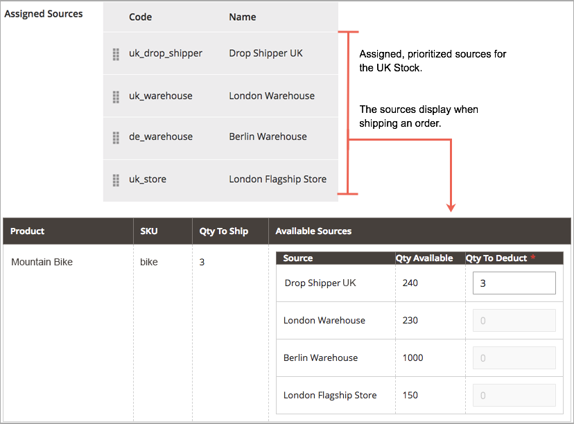

# Source演演算法和預訂

[!DNL Inventory Management]的核心會以虛擬方式追蹤您倉庫和商店中每一種可用的產品。 「Source選擇演演算法」與「預留量」系統在背景執行，可讓您隨時更新可銷售數量，結帳時不會發生衝突，並且會建議出貨選項。

>[!NOTE]
>
>如需以程式設計方式使用[!DNL Inventory Management]系統的相關資訊，請參閱[開發人員檔案](https://developer.adobe.com/commerce/php/development/framework/inventory-management/)。

## Source選擇演演算法

Source選擇演演算法(SSA)會使用存貨中設定的來源優先順序，分析並決定來源與出貨的最佳相符專案。 在訂單出貨期間，演演算法會提供建議的來源清單、可用數量以及根據所選演演算法扣除的金額。 [!DNL Inventory Management]提供優先順序演演算法，並支援新選項的延伸。

由於擁有多個來源地點、全球客戶及具有各種運送選項和費用的承運商，瞭解您實際的可用存貨並尋找最佳運送選項會相當困難。 SSA會協助您追蹤所有來源的存貨可銷售數量，以計算出貨並建議出貨。

**追蹤存貨** — 使用庫存和來源，SSA會檢查傳入產品請求的銷售管道，並決定可用的存貨：

- 計算各存貨中所有指定來源的彙總虛擬可銷售數量：彙總數量 — 各來源缺貨臨界值
- 從可銷售數量減去無庫存臨界值金額，以防止過度銷售
- 在訂單提交時預留存貨數量，在訂單處理和出貨時從庫存存貨中扣除
- 透過負臨界值的增強選項支援延期交貨

**管理出貨** — 當您處理和出貨訂單時，演演算法會有所幫助。 您可以執行演演算法，以取得運送產品的最佳來源建議，或覆寫選項至：

- 出貨部份出貨，只從特定地點傳送少數產品，並於稍後完成整份訂單
- 從單一來源出貨整份訂單
- 將多重來源的出貨以不同金額分攤，以保持所有倉庫與倉庫的庫存平衡

SSA可擴充至協力廠商支援和自訂演演算法，以建議符合成本效益的出貨。

>[!NOTE]
>
>SSA對虛擬與可下載產品的運作方式不同，這可能不會產生運費。 在這些情況下，系統會在建立商業發票時隱含地執行演演算法，並一律使用建議的結果。 您無法針對虛擬和可下載的產品調整這些結果。

### Source優先順序演演算法

自訂庫存包括指定的來源清單，以透過您的店面銷售及出貨可用的產品庫存。 「Source優先順序演演算法」會使用庫存中已指派來源的順序，在開立商業發票及出貨訂單時，建議每個來源的產品扣除額。

執行時，演演算法會：

- 從最上方開始，在庫存層級處理已設定的來源順序
- 根據清單中的訂單、可用數量及訂購數量，建議出貨數量及每項產品的來源
- 繼續往下清單，直到訂單出貨已滿
- 如果在清單中找到已停用的來源，則會略過

若要設定、指定自訂庫存的來源，並為其排序。 請參閱[排定庫存的來源優先順序](stocks-prioritize-sources.md)。

下列範例詳細列出訂單的對應來源、可用數量，以及要扣除與出貨的建議來源與金額。 最上層來源為英國的「製造商直接交貨」，可用數量為240。

{width="600" zoomable="yes"}

### 距離優先順序演演算法

「距離優先順序演演算法」會比較出貨目的地地址的地點與來源地點，以決定最接近完成出貨的來源。 這個距離可能取決於實際距離或從一個位置到另一個位置旅行的時間，使用匯入的資料庫位置或Google方向（駕駛、步行或騎腳踏車）。

您有兩個選項可以計算距離和時間，以找出最接近出貨履行情況的來源：

- **Google地圖** — 使用[Google地圖平台][1]服務來計算運送目的地地址與來源位置（地址與GPS座標）之間的距離和時間。 此選項會使用來源的經緯度。 必須有Google API金鑰，並啟用[地理編碼API][2]和[距離矩陣API][3]。 此選項需要Google計費計畫，並可能透過Google產生費用。

- **離線計算** — 使用下載和匯入的地理碼資料計算距離，以判斷最接近出貨目的地地址的來源。 此選項使用送貨地址與來源的國家/地區代碼。 若要設定此選項，您可能需要開發人員協助，才能使用命令列先下載及匯入地理代碼。

若要設定，請選取設定並完成其他步驟，例如Google API金鑰或下載送貨資料。 請參閱[設定距離優先順序演演算法](distance-priority-algorithm.md)。

### 自訂演演算法

[!DNL Commerce]支援自訂開發和擴充功能，以新增替代演演算法來排定來源的優先順序。 例如，您可以有一個根據地理的優先順序演演算法，另一個根據存貨或客戶屬性的費用演演算法。 當存貨成本變更時，您的實作可輕鬆變更演演算法，以確保成本最低。

## 預訂

預留不會立即扣除或新增產品存貨數量，而是保留存貨金額，直到訂單出貨或取消為止。 預留完全在後端運作，以自動更新存貨層次的可銷售數量。

>[!NOTE]
>
>[!BADGE 僅限PaaS]{type=Informative url="https://experienceleague.adobe.com/en/docs/commerce/user-guides/product-solutions" tooltip="僅適用於雲端專案(Adobe管理的PaaS基礎結構)和內部部署專案的Adobe Commerce 。"}保留功能需要`inventory.reservations.updateSalabilityStatus`訊息佇列消費者持續執行。 若要檢查它是否正在執行，請使用`bin/magento queue:consumers:list`命令。 如果未列出訊息佇列取用者，請啟動它： `bin/magento queue:consumers:start inventory.reservations.updateSalabilityStatus`。

### 訂單預訂

預留會在提交訂單時，保留從可銷售數量中扣除的存貨數量。 預留量在存貨層次，在開立商業發票與出貨、取消訂單等作業之前，會根據數量進行計數。 出貨訂單時，您可以使用SSA建議或手動輸入每個來源的數量扣減額。 出貨時，預留會自動結清，並扣除數量。 可銷售數量會針對更新數量與系統中剩餘預留金額的存貨，重新計算。

下列圖表可協助定義訂單期間及到出貨期間的預留處理。

{width="600" zoomable="yes"}

客戶提交訂單。 [!DNL Commerce]檢查目前的存貨可銷售數量。 如果存貨層次有足夠存貨可用，則預留會輸入產品SKU （針對該存貨）的暫時保留，並重新計算可銷售數量。

開立訂單商業發票之後，您可以決定從來源扣除與出貨的產品金額。 系統會處理出貨，並將出貨從一或多個選取的來源傳送給客戶。 數量會自動從來源存貨數量中扣除，而預留則會清除。 如需完整的詳細資訊和範例，請參閱[關於訂單狀態和預訂](order-status.md)。

## 預訂計算

發生下列事件時，系統會為每個產品建立預訂：

- 客戶或商家下訂單。
- 客戶或商家完全或部分取消訂單。
- 商家建立實體產品的出貨。
- 商家為虛擬或可下載的產品建立發票。
- 商家發出銷退折讓單。

預留是僅附加的作業，類似於事件記錄。 初始預留會指定負數量值。 處理訂單時建立的所有後續預留都是正值。 訂單完成時，產品的所有預留總和為0。

在系統發出保留以回應新訂單之前，它會判斷是否有足夠的銷售料號來履行訂單。 計算中會納入下列數量因子：

- **庫存專案數量**。 StockItem數量是來自目前銷售管道之所有實際來源的彙總存貨金額。 假設巴爾的摩來源有20單位產品，奧斯汀來源有25單位相同產品，而雷諾來源有10單位。 當所有這些來源連結至庫存A時，此產品的StockItem計數為55 (20 + 25 + 10)。 （當料號出貨時，「庫存管理系統」索引器會更新每個來源的可用數量。）

- **未完成的預留**。 系統會總計尚未補償的所有初始預留。 此數字一律為負數。 如果客戶A有十個料號的預訂，而客戶B有料號的預訂5，則產品總計的未結預訂–15。

因此，只要客戶訂購少於40 (55 + -15)件商品，商家就可以完成傳入的訂單。

當您完成處理訂單（完成、已取消、已關閉）時，該訂單範圍內的所有預留應解析為`0`。 這會清除所有可銷售數量保留。

>[!NOTE]
>
>延期交貨（「缺貨臨界值」）與「通知低於臨界值的數量」設定也會影響可銷售數量的計算，但超出本主題的範圍。 如需這些設定的詳細資訊，請參閱[設定 [!DNL Inventory Management]](./configuration.md)。

## 保留物件

預訂包含以下資訊：

| 引數 | 資料型別 | 說明 |
| --- | --- | --- |
| `reservation_id` | 整數 | 系統產生的ID |
| `stock_id` | 整數 | 產品被指派到的庫存ID |
| `sku` | 字串 | 產品的SKU |
| `quantity` | 浮點數 | 此預訂中的專案數 |
| `metadata` | 字串 | 此預訂的事件型別、物件型別和物件ID。 例如， `{"event_type":"order_placed","object_type":"order",| "object_id":"8"}` |

{style="table-layout:auto"}

中繼資料`event_type`可以有下列值：

- `order_placed`
- `order_canceled`
- `shipment_created`
- `creditmemo_created`
- `invoice_created`

目前，中繼資料物件型別必須是`order`，而物件識別碼是訂單識別碼。

在未來的版本中，當客戶將專案新增至購物車時，可能會建立預訂。 每個料號可以預留固定時間（例如15分鐘），讓客戶在繼續購物時預留料號。 啟用這類預訂時，中繼資料可能包含其他型別的資訊。

## 預訂生命週期

下列範例顯示針對簡單訂單產生的預留順序。

1. 客戶已針對25件產品`SKU-1`發出採購單。 此預訂包含下列資訊：

   ```text
   reservation_id = 1
   stock_id = 1
   sku = SKU-1
   quantity = -25
   event_type = order_placed
   ```

1. 客戶傳送了20個料號的商業發票，基本上取消了5個訂購單位。

   ```text
   reservation_id = 2
   stock_id = 1
   sku = SKU-1
   quantity = 5
   event_type = order_canceled
   ```

1. 商家會出貨購買的20件商品。

   ```text
   reservation_id = 3
   stock_id = 1
   sku = `SKU-1`
   quantity = 20
   event_type = shipment_created
   ```

三個`quantity`值的總和為0 (-25 + 5 + 20)。 系統不會修改任何現有的預留。

## 正在移除已處理的預留

`inventory_cleanup_reservations` cron作業會執行SQL查詢以清除保留資料庫表格。 預設會每天午夜執行，但您可以設定時間和頻率。 cron作業會執行指令碼，查詢資料庫以尋找數量值總和為0的完整預留序列。 當對同一天（或其他設定時間）產生的指定產品的所有預留獲得補償時，cron工作會一次刪除所有預留量。

`inventory_reservations_cleanup` cron工作與`inventory.reservations.cleanup`訊息佇列取用者不同。 在移除產品後，消費者會非同步刪除產品SKU的預留，而cron工作會清除整個預留表格。 當您啟用存放區組態中的&#x200B;[**與目錄**](../configuration-reference/catalog/inventory.md)&#x200B;庫存同步選項時，需要消費者。 請參閱&#x200B;_設定指南_&#x200B;中的[管理訊息佇列](https://experienceleague.adobe.com/docs/commerce-operations/configuration-guide/message-queues/manage-message-queues.html)。

通常，一天內產生的所有初始預留都無法於當天獲得補償。 當客戶在cron工作開始之前下訂單，或使用離線付款方法（例如銀行轉帳）進行購買時，可能會發生這種情況。 補償的預留序列會保留在資料庫中，直到它們都得到補償為止。 此做法不會影響預訂計算，因為每個預訂的總數為0。

>[!NOTE]
>
>有CLI命令可用來偵測和管理保留區不一致（請參閱[[!DNL Inventory Management] CLI參考](cli.md)）。

### 預訂更新

當訂單與產品金額的變更完成時，[!DNL Commerce]會自動輸入預留補償。 您不需要透過管理員或程式碼輸入補償，即可更新或清除這些保留。 預留僅受輸入的預留所影響，以保留數量或清除保留金額（補償預留）。

其工作方式如下：

- **已提交訂單** — 針對數個產品提交訂單時，會輸入該金額的預訂。 例如，從美國網站訂購五個揹包，會針對該SKU和存貨輸入`-5`的預訂。 可銷售數量會減少5。

- **已取消訂單** — 當訂單被取消（全部或部分）時，會進入補償預訂以清除該金額。 例如，取消三個揹包會針對該SKU和股票輸入+3保留，並清除保留。 可銷售數量會增加3。

- **已出貨訂單** — 當訂單出貨（全部或部分）時，會進入補償預訂以結清該金額。 例如，出貨兩個揹包會針對該SKU和存貨輸入+2預留，以清除保留。 出貨的產品數量會直接減少2。 也會針對減少的庫存量更新計算出的可銷售數量，但不再受預留的影響。

{width="600" zoomable="yes"}

當訂單完成履行、產品取消、發放銷退折讓單等時，所有預留都必須由補償清空。 如果補償沒有清除預留，您可能會有數量處於停頓狀態（無法銷售，且永遠不會出貨）。

>[!NOTE]
>
>如果您要複查預留，可使用一系列命令列選項。 您只能透過命令列介面複查預留。 使用CLI指令可能需要開發人員協助。 請參閱[[!DNL Inventory Management] CLI參考](cli.md)。

如果您從含有暫緩訂單之存貨的產品中移除所有來源，則可能已卡住預留。

{{$include /help/_includes/unassign-source.md}}

[1]: https://cloud.google.com/maps-platform/
[2]: https://developers.google.com/maps/documentation/geocoding/start
[3]: https://developers.google.com/maps/documentation/distance-matrix/start
