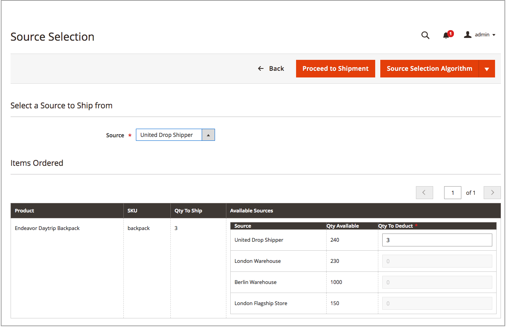

# 建立多來源出貨

替換為 [!DNL Inventory Management]，傳送一或多項出貨，因為您擁有詳細目錄。 若要視需要產生額外出貨，請使用建議的或手動輸入的數量與來源，重複這些指示。 這些指示詳細說明多來源商戶如何傳送出貨。 單一來源商戶傳送出貨時，不需要這些額外步驟(請參閱 [建立出貨](../stores-purchase/shipments.md#create-a-shipment){target="_blank"} （位於核心使用手冊中）。

建立出貨時，請針對已計算的建議使用「來源選取演演算法」。 遵循並使用這些建議，或設定每個來源的金額，以產生自訂出貨。 您可以控制每筆訂單的出貨存貨、設定要扣除的金額、傳送一或數筆出貨，以及當存貨可用時交貨存貨與延期交貨。 針對訂單中的每個明細行料號，輸入要從來源數量中扣除的金額。

您可能要將部份出貨傳送至：

- 存貨抵達時履行延期交貨

- 平衡各來源的存貨扣除額

當您輸入出貨時，您的庫存量會扣除輸入的金額。 實際上，預留會轉換為實際數量扣減。

## 建立出貨

1. 在 _管理員_ 側欄，前往 **[!UICONTROL Sales]** > **[!UICONTROL Orders]**.

1. 找到順序並以檢視模式開啟。

1. 如果訂單已付款且已開立商業發票，且已準備出貨，請按一下 **[!UICONTROL Ship]**.

1. 完成來源選擇，以根據來源傳送產品：

   - 若要檢視送貨建議，請按一下 **[!UICONTROL Source Selection Algorithm]** 並選取演演算法。

     | 演演算法 | 說明 |
     |--|--|
     | [來源優先順序](source-priority-algorithm.md) | 根據指定給存貨之來源的訂單，建議來源的出貨。 |
     | [距離優先順序](distance-priority-algorithm.md) | 建議根據實際距離或最短交貨時間，從最接近出貨地址的來源出貨。 |

     >[!IMPORTANT]
     >
     >針對出貨使用「距離優先順序」演演算法時，未針對選取的路線與資料傳回 [計算模式](distance-priority-algorithm.md) （駕駛、騎車或行走）對於出貨，SSA會預設為「來源優先順序」。 建議您最好也設定 [每庫存來源的優先順序](stocks-prioritize-sources.md).

   - 的  **[!UICONTROL Select a Source to Ship from]**，選取要傳送出貨的來源。

   - 對於每個明細專案，請保留建議的金額，或在 **[!UICONTROL Qty to Deduct]**. 此值會指定從所選來源之存貨中扣除的金額。

   - 按一下 **[!UICONTROL Proceed to Shipment]**.

     {width="350" zoomable="yes"}

1. 檢閱 _[!UICONTROL New Shipment]_頁面，並視需要輸入任何其他變更。

   此 _[!UICONTROL Inventory]_區段會顯示來源、產品出貨、訂購數量總計以及要出貨的數量。

   {width="350" zoomable="yes"}

1. 按一下 **[!UICONTROL Submit Shipment]** 完成。
