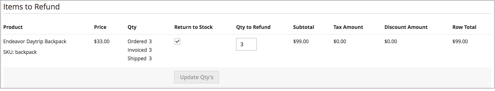

# 管理訂單與出貨

[!DNL Inventory Management] 包含透過出貨處理管理存貨數量的額外功能與選項。 當您複查與履行出貨、取消訂單及發出銷退折讓單時，產品可銷售量及庫存量會自動更新。

此資訊包含下列專案的細節： [!DNL Inventory Management]. 如需詳細資訊，請參閱 [訂購](../stores-purchase/orders.md){target="_blank"} 中的主題 _銷售和購買體驗指南_.

## 訂購

[!DNL Commerce] 可立即支援單一訂單和多位址訂單，不需要額外設定。 當客戶或員工輸入訂單時， [!DNL Inventory Management] 使用預留量來追蹤存貨，針對可銷售數量從已開立商業發票與已出貨產品的存貨數量中扣除。

### 多重地址訂單

針對多重地址訂單，會產生一連串單一訂單，每個輸入的目的地地址各一個。 結帳期間，客戶會選取結帳期間每個地址相關聯的每組產品，並根據目的地地址產生單一訂單。 每個訂單包含每個地址相關聯的產品。

[!DNL Commerce] 管理這些多重地址訂單的存貨，與單一訂單完全相同。 它允許「來源選取演演算法」在出貨期間、部份出貨、取消訂單，以及以存貨更新退款，提出建議或覆寫。

{width="350" zoomable="yes"}

### 退款

輸入 [銷退折讓單](../stores-purchase/credit-memo-create.md){target="_blank"} 若要發出退款，您可以將產品數量退回至已扣除的來源。 訂單資訊包含出貨產品的存貨來源。 當您收到退回的產品時，建議您透過銷退折讓單來授與退回的產品數量。

{width="350" zoomable="yes"}

### 取消未出貨的訂單

如果訂單尚未出貨且已取消（全部或部分）， [!DNL Inventory Management] 自動將產品庫存退回至可銷售數量。 在商業發票與出貨之前，購買的產品會根據可銷售數量預留，而不會從實際數量中扣除。 在開立商業發票與出貨訂單時，系統會將預留量轉換為存貨扣減量。

在幕後， [!DNL Inventory Management] 自動輸入補償預留，移除產品數量的保留。 數量會傳回至彙總的虛擬可銷售數量。

## 出貨

替換為 [!DNL Inventory Management] 啟用後，您可以從一或多個來源傳送部份或完整的出貨，以履行訂單。 您可以控制每筆訂單的出貨存貨、設定要扣除的金額、傳送一或數筆出貨，以及當存貨可用時交貨存貨與延期交貨。 針對訂單中的每個明細行料號，輸入要從來源數量中扣除的金額。 在履行整份訂單之前，依存貨存量產生各來源的出貨。

### 部分出貨

對於多來源商家， [!DNL Commerce] 為您選取的每個來源產生出貨。 一般工作流程可讓您選取來源、設定要扣除的產品數量以履行訂單，然後繼續出貨。 完成時，請為每個來源建立額外出貨，直到您完成訂單為止。

單一來源商戶也可能傳送部分出貨，以支援延期交貨，或當訂單進入常用料號時平衡存貨。

### Recommendations和來源選擇演演算法

此 [來源選擇演演算法](selection-reservations.md) (SSA)提供部份與完整出貨的建議。 在建立訂單的出貨商業發票時，您可以存取「來源選取演演算法」。 透過「出貨」頁面，隨時執行「來源優先順序」或「距離優先順序」演演算法，以決定比對訂購數量與可用來源的最佳選項。 系統支援從一個來源出貨完整訂單，並將訂單分割為跨多個來源的多個部份出貨。 您可以存取這些選項，以立即履行與交錯出貨，隨時間傳送較少的金額。

若要完成並出貨訂單，訂單必須已完成付款且已開立商業發票。 目前，您可以針對建議重新執行SSA，並從一或多個來源出貨，或以手動設定來源與數量來覆寫SSA建議，以履行出貨。

- 建議您重新執行SSA，以複查每次出貨的建議。

- 如果您想要變更選取專案，可以使用手動來源扣除來覆寫。

### 出貨與預留

出貨產生時，會清除產品的預留量，並扣除產品數量。 根據出貨詳細資訊，每庫存的庫存量會更新。 例如，如果您從兩個來源傳送十種產品的出貨，這些來源的數量會分別扣除10。 「可銷售數量」會自動重新整理相關存貨，為客戶和員工提供最新的產品金額。 而預留則完全清除，不再計算於「可銷售數量」。
