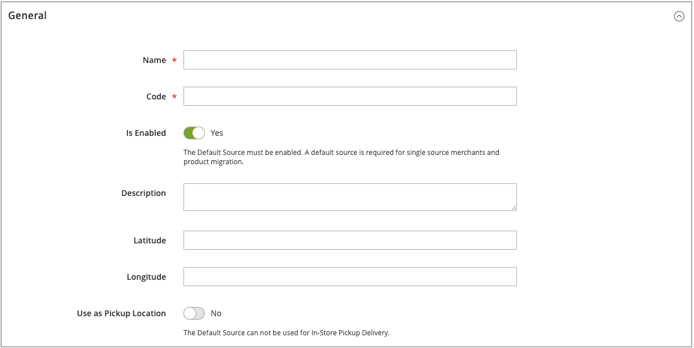
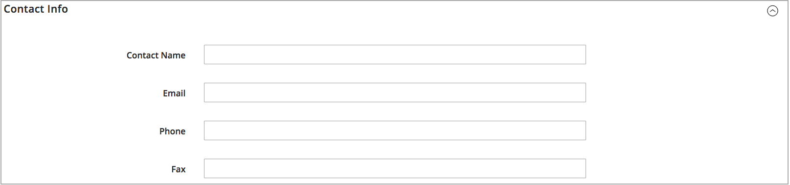
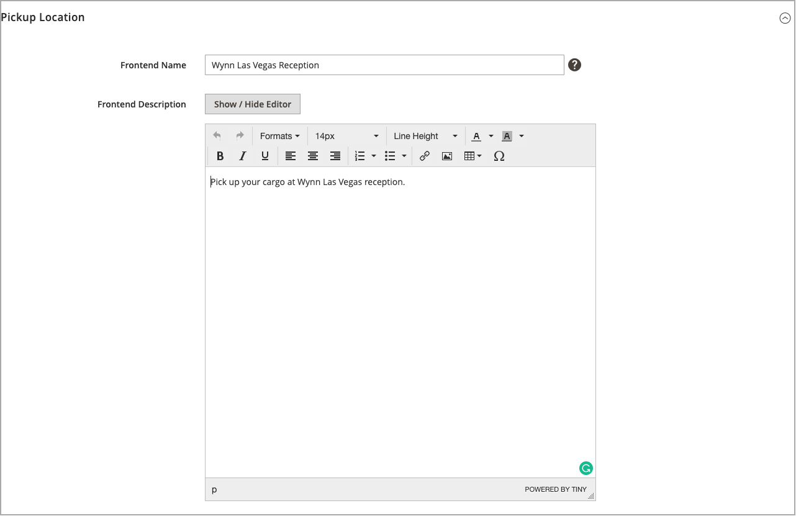

# 新增來源

使用自訂來源管理多個地點的存貨與訂單履行。 為每個地點（例如倉儲、實體店、配送中心及卸貨託運人）建立來源。 指定來源及更新每個產品的數量

如果編輯「預設來源」，您可以編輯所有配置，但名稱和代碼除外。 建議單一來源商家新增與其位置相符的資訊。

## 新增詳細目錄來源

1. 在 _管理員_ 側欄，前往 **[!UICONTROL Stores]** > _[!UICONTROL Inventory]_>**[!UICONTROL Sources]**.

1. 按一下 **[!UICONTROL Add New Source]**.

   

1. 展開  此 **[!UICONTROL General]** 並執行下列動作：

   - 若要識別存貨來源，請輸入唯一的 **[!UICONTROL Name]**.

   - 輸入唯一值 **[!UICONTROL Code]**.

     此程式碼支援大小寫字母、數字、破折號和底線。 此代碼是指派給庫存及匯出 — 匯入資料時使用的唯一ID。

   - 如果此清查來源準備就緒，請設定 **[!UICONTROL Is Enabled]** 至 `Yes`.

   - 輸入簡報 **[!UICONTROL Description]** 以取得此位置的參考資料或其他詳細資訊。

   - 的 **[!UICONTROL Latitude]** 和 **[!UICONTROL Longitude]**，請輸入設施位置的全球定位系統(GPS)座標。

     若要尋找GPS座標，請使用 [Google地圖][1]，請在搜尋方塊中輸入地址。 以滑鼠右鍵按一下地圖上的標籤，然後選擇 **[!UICONTROL What's here?]**. GPS座標會顯示在街道位址下方的詳細資訊方塊中。

     

   - 如果此存貨來源是取貨地點，請設定 **[!UICONTROL Use as Pickup Location]** 至 `Yes`.

     「預設來源」無法作為店內取貨訂單的取貨地點。

1. 展開  此 **[!UICONTROL Contact Info]** 並執行下列動作：

   - 的 **[!UICONTROL Contact Name]**，輸入地點主要連絡人的全名。

   - 輸入 **[!UICONTROL Email]** 連絡地點的地址。

   - 的 **[!UICONTROL Phone]**，輸入區碼和電話號碼。

   - 的 **[!UICONTROL Fax]**，輸入傳真的區碼和電話號碼（如果有的話）。

     

1. 展開  此 **[!UICONTROL Address Data]** 並執行下列動作：

   - 選擇 **[!UICONTROL Country]**.

   - 的 **[!UICONTROL State/Province]**，請輸入州或省的標準縮寫。

   - 輸入 **[!UICONTROL City]**.

   - 輸入實體 **[!UICONTROL Street]** 位址。

   - 的 **[!UICONTROL Postcode]**，輸入郵遞區號。

     

1. 如果您在先前的步驟中將來源設定為取車地點，請展開  此 **[!UICONTROL Pickup Location]** 區段，並提供有關位置的描述性資訊：

   - 輸入 **[!UICONTROL Frontend Name]** 取車地點的。

   - 輸入 **[!UICONTROL Frontend Description]** 取車地點的。 使用此文字方塊來顯示商店營業時間、與其他地標相關的位置，或其他有助於客戶選擇正確取貨地點的實用資訊。

     

   如需在使用來源作為收取地點時如何設定電子郵件通知的詳細資訊，請參閱 [銷售電子郵件](../configuration-reference/sales/sales-emails.md) 在 _設定參考指南_.

1. 若要儲存作業，請執行下列任一項作業：

   - 若要儲存您的工作並繼續編輯，請按一下 **[!UICONTROL Save & Continue]**.

   - 若要儲存作業並返回「管理來源」頁面，請按一下向下箭頭()並選擇 **[!UICONTROL Save & Close]**.

   - 若要儲存您對目前來源記錄所做的工作並輸入新的來源，請選擇 **[!UICONTROL Save & New]**.

## 按鈕列

| 按鈕 | 說明 |
|--|--|
| [!UICONTROL Back] | 返回「管理來源」頁面。 |
| [!UICONTROL Reset] | 將表單中的所有欄位恢復為上次儲存時的值。 |
| [!UICONTROL Save & Continue] | 儲存所有變更並保持表單開啟以供進一步編輯。 按一下向下箭頭以取得其他選項： **[!UICONTROL Save & Close]**— 儲存對目前記錄的變更、關閉表單，然後返回「管理來源」頁面。 **[!UICONTROL Save & New]**  — 儲存變更、關閉目前記錄，並開啟新的空白表單。 |

## 欄位說明

| 欄位 | 說明 |
|--|--|
| **[!UICONTROL General]** | |
| [!UICONTROL Name] | （必要）可識別管理員使用者之詳細目錄來源的唯一名稱。 |
| [!UICONTROL Code] | （必要）系統用來識別詳細目錄來源的唯一英數字元代碼。 以大寫或小寫字元和/或數字（不含空格）輸入代碼。 如有需要，可使用連字型大小或底線，而非空格。 建立來源後無法編輯程式碼。 這是您為庫存指派來源，以及匯出和/或匯入產品資料時使用的唯一ID。 |
| [!UICONTROL Is Enabled] | 決定存貨來源是否可供使用。 選項：是/否 |
| [!UICONTROL Description] | 存貨來源地點的簡短說明。 包含對您的管理員使用者有所幫助的詳細資料。 |
| [!UICONTROL Latitude] | 指定GPS詳細目錄來源的緯度座標。 以數字輸入值，視需要加上加號或減號。 不允許使用度符號和字母。 例如：Latitude 32.7555 |
| [!UICONTROL Longitude] | 指定GPS詳細目錄來源的經度座標。 以數字輸入值，視需要加上加號或減號。 不允許使用度符號和字母。 例如： `-97.3308` |
| **[!UICONTROL Contact Info]** | |
| [!UICONTROL Contact Name] | 存貨來源地點的主要聯絡人名稱。 |
| [!UICONTROL Email] | 主要連絡人的電子郵件。 |
| [!UICONTROL Phone] | 主要連絡人的區號和電話號碼，使用您偏好的格式。 例如： `(123) 456-7890` 或 `123-456-7890` |
| [!UICONTROL Fax] | 主要連絡人的區碼和傳真號碼。 |
| **[!UICONTROL Address Data]** | |
| [!UICONTROL Country] | （必要）存貨來源所在的國家/地區。 |
| [!UICONTROL State/Province] | 存貨來源所在的州或省。 |
| [!UICONTROL City] | 存貨來源所在的城市。 |
| [!UICONTROL Street] | 存貨來源的街道地址。 |
| [!UICONTROL Postcode] | （必要）詳細目錄來源的郵遞區號。 |
| **[!UICONTROL Pickup Location]** | |
| [!UICONTROL Frontend Name] | 顯示在店面之來源的取貨地點名稱。 |
| [!UICONTROL Frontend Description] | 顯示在店面之來源的取貨地點說明。 它可以包含附加的影像。 |

[1]: https://www.google.com/maps
