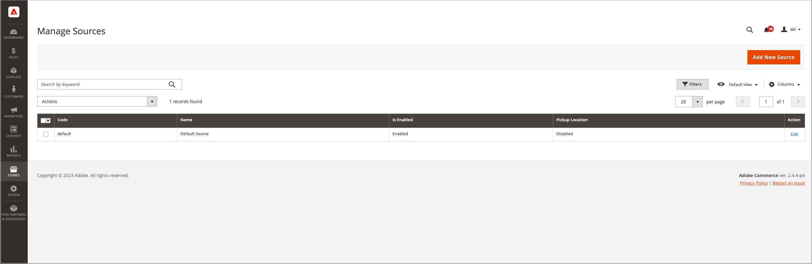
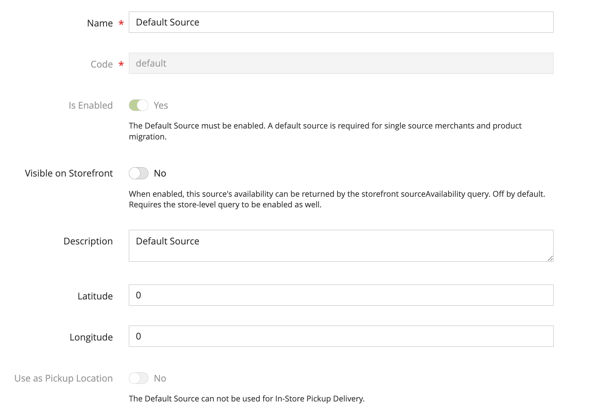
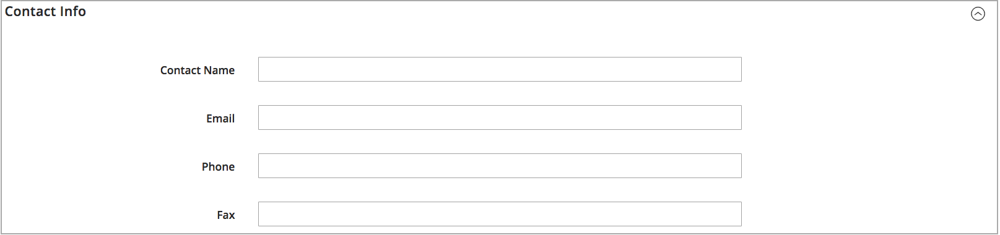
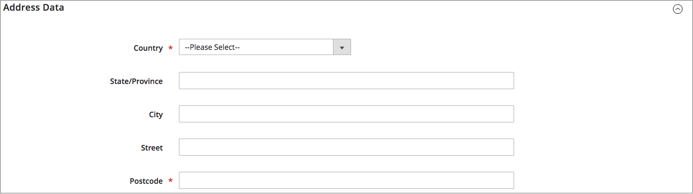
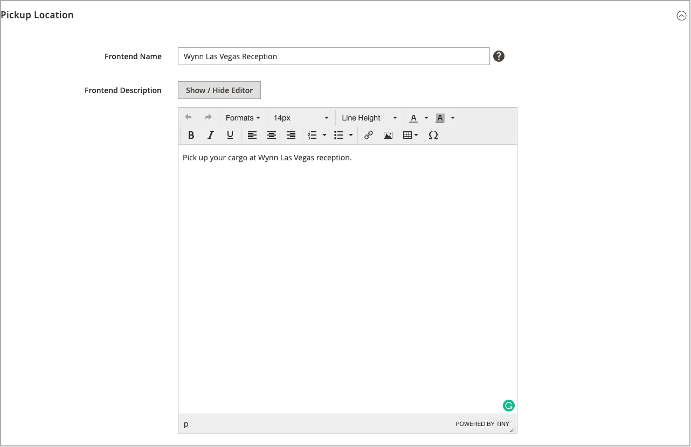

# 新增來源

使用自訂來源管理多個地點的存貨與訂單履行。 為每個地點（例如倉儲、實體店、配送中心及卸貨託運人）建立來源。 指定每個產品的來源與更新數量。

如果編輯預設Source，您可以編輯所有設定，但名稱和程式碼除外。 建議單一來源商家新增與其位置相符的資訊。

## 新增詳細目錄來源

1. 在&#x200B;_管理員_&#x200B;側邊欄上，移至&#x200B;**[!UICONTROL Stores]** > _[!UICONTROL Inventory]_>**[!UICONTROL Sources]**。

1. 按一下&#x200B;**[!UICONTROL Add New Source]**。

   

1. 展開 **[!UICONTROL General]**&#x200B;區段，然後執行下列動作：

   - 若要識別存貨來源，請輸入唯一的&#x200B;**[!UICONTROL Name]**。

   - 輸入唯一的&#x200B;**[!UICONTROL Code]**。

     此程式碼支援大小寫字母、數字、破折號和底線。 此代碼是指派給庫存及匯出 — 匯入資料時使用的唯一ID。

   - 如果此詳細目錄來源已可供使用，請將&#x200B;**[!UICONTROL Is Enabled]**&#x200B;設為`Yes`。

   - 若要將此來源的庫存公開至店面，請將&#x200B;**[!UICONTROL Visible on Storefront]**&#x200B;設定為`Yes`。 僅[!BADGE SaaS]{type=Positive url="https://experienceleague.adobe.com/zh-hant/docs/commerce/user-guides/product-solutions" tooltip="僅適用於Adobe Commerce as a Cloud Service和Adobe Commerce Optimizer專案（Adobe管理的SaaS基礎結構）。"}

     此選項預設為`No`。 如果您將其設為`Yes`，則來源最多可能需要查詢快取存留期才能顯示在結果中。 如果您接著將此選項設為`No`，會立即從查詢結果中移除來源。

     [`sourceAvailability`](https://developer.adobe.com/commerce/webapi/graphql/schema/products/queries/source-availability){target="_blank"} GraphQL查詢可讓您存取店面可見之來源的庫存資訊。 您必須在[全域選項](global-options.md)中啟用存放區檢視的`sourceAvailability`查詢。

   - 輸入此位置的簡短&#x200B;**[!UICONTROL Description]**，以快速參考或其他詳細資料。

   - 針對&#x200B;**[!UICONTROL Latitude]**&#x200B;和&#x200B;**[!UICONTROL Longitude]**，請輸入設施位置的全球定位系統(GPS)座標。

     若要使用[Google地圖](https://www.google.com/maps)尋找GPS座標，請在搜尋方塊中輸入地址。 在地圖上的標籤上按一下滑鼠右鍵，然後選擇&#x200B;**[!UICONTROL What's here?]**。 GPS座標會顯示在街道位址下方的詳細資訊方塊中。

     

   - 如果此存貨來源是取貨地點，請將&#x200B;**[!UICONTROL Use as Pickup Location]**&#x200B;設為`Yes`。

     預設Source無法當做店內取貨訂單的取貨地點。

1. 展開 **[!UICONTROL Contact Info]**&#x200B;區段，然後執行下列動作：

   - 針對&#x200B;**[!UICONTROL Contact Name]**，輸入該地點主要連絡人的全名。

   - 輸入連絡地點的&#x200B;**[!UICONTROL Email]**&#x200B;位址。

   - 針對&#x200B;**[!UICONTROL Phone]**，輸入區碼和電話號碼。

   - 針對&#x200B;**[!UICONTROL Fax]**，輸入傳真的區碼和電話號碼（如果有的話）。

     

1. 展開 **[!UICONTROL Address Data]**&#x200B;區段，然後執行下列動作：

   - 選擇&#x200B;**[!UICONTROL Country]**。

   - 針對&#x200B;**[!UICONTROL State/Province]**，請輸入州或省的標準縮寫。

   - 輸入&#x200B;**[!UICONTROL City]**。

   - 輸入實體&#x200B;**[!UICONTROL Street]**&#x200B;位址。

   - 針對&#x200B;**[!UICONTROL Postcode]**，輸入郵遞區號。

     

1. 如果您在先前的步驟中將來源設定為取車地點，請展開 **[!UICONTROL Pickup Location]**&#x200B;區段，並提供此地點的相關描述性資訊：

   - 輸入取車地點的&#x200B;**[!UICONTROL Frontend Name]**。

   - 輸入取車地點的&#x200B;**[!UICONTROL Frontend Description]**。 使用此文字方塊來顯示商店營業時間、與其他地標相關的位置，或其他有助於客戶選擇正確取貨地點的實用資訊。

     

   如需在使用來源做為收取地點時如何設定電子郵件通知的詳細資訊，請參閱&#x200B;_設定參考指南_&#x200B;中的[銷售電子郵件](../configuration-reference/sales/sales-emails.md)。

1. 若要儲存作業，請執行下列任一項作業：

   - 若要儲存您的工作並繼續編輯，請按一下&#x200B;**[!UICONTROL Save & Continue]**。

   - 若要儲存您的工作並返回[管理來源]頁面，請按一下向下箭頭（），然後選擇&#x200B;**[!UICONTROL Save & Close]**。

   - 若要儲存您目前來源記錄上的工作並輸入新的來源，請選擇&#x200B;**[!UICONTROL Save & New]**。

## 按鈕列

| 按鈕 | 說明 |
|--|--|
| [!UICONTROL Back] | 返回「管理來源」頁面。 |
| [!UICONTROL Reset] | 將表單中的所有欄位恢復為上次儲存時的值。 |
| [!UICONTROL Save & Continue] | 儲存所有變更並保持表單開啟以供進一步編輯。 按一下向下箭號以取得其他選項：  **[!UICONTROL Save & Close]**— 儲存對目前記錄的變更、關閉表單，然後返回[管理來源]頁面。 **[!UICONTROL Save & New]**  — 儲存變更、關閉目前記錄，並開啟新的空白表單。 |

## 欄位說明

| 欄位 | 說明 |
|--|--|
| **[!UICONTROL General]** | |
| [!UICONTROL Name] | （必要）可識別管理員使用者之詳細目錄來源的唯一名稱。 |
| [!UICONTROL Code] | （必要）系統用來識別詳細目錄來源的唯一英數字元代碼。 以大寫或小寫字元和/或數字（不含空格）輸入代碼。 如有需要，可使用連字型大小或底線，而非空格。 建立來源後無法編輯程式碼。 這是您為庫存指派來源，以及匯出和/或匯入產品資料時使用的唯一ID。 |
| [!UICONTROL Is Enabled] | 決定存貨來源是否可供使用。 選項：是/否 |
| [!UICONTROL Visible on Storefront]僅[!BADGE SaaS]{type=Positive url="https://experienceleague.adobe.com/zh-hant/docs/commerce/user-guides/product-solutions" tooltip="僅適用於Adobe Commerce as a Cloud Service和Adobe Commerce Optimizer專案（Adobe管理的SaaS基礎結構）。"} | 決定店面[`sourceAvailability`](https://developer.adobe.com/commerce/webapi/graphql/schema/products/queries/source-availability){target="_blank"} GraphQL查詢是否可傳回此存貨來源的存貨資訊。 |
| [!UICONTROL Description] | 存貨來源地點的簡短說明。 包含對您的管理員使用者有所幫助的詳細資料。 |
| [!UICONTROL Latitude] | 指定GPS詳細目錄來源的緯度座標。 以數字輸入值，視需要加上加號或減號。 不允許使用度符號和字母。 例如：Latitude 32.7555 |
| [!UICONTROL Longitude] | 指定GPS詳細目錄來源的經度座標。 以數字輸入值，視需要加上加號或減號。 不允許使用度符號和字母。 例如： `-97.3308` |
| **[!UICONTROL Contact Info]** | |
| [!UICONTROL Contact Name] | 存貨來源地點的主要聯絡人名稱。 |
| [!UICONTROL Email] | 主要連絡人的電子郵件。 |
| [!UICONTROL Phone] | 主要連絡人的區號和電話號碼，使用您偏好的格式。 例如： `(123) 456-7890`或`123-456-7890` |
| [!UICONTROL Fax] | 主要連絡人的區碼和傳真號碼。 |
| **[!UICONTROL Address Data]** | |
| [!UICONTROL Country] | （必要）存貨來源所在的國家/地區。 |
| [!UICONTROL State/Province] | 存貨來源所在的州或省。 |
| [!UICONTROL City] | 存貨來源所在的城市。 |
| [!UICONTROL Street] | 存貨來源的街道地址。 |
| [!UICONTROL Postcode] | （必要）詳細目錄來源的郵遞區號。 |
| **[!UICONTROL Pickup Location]** | |
| [!UICONTROL Frontend Name] | 顯示在店面之來源的取貨地點名稱。 |
| [!UICONTROL Frontend Description] | 顯示在店面之來源的取貨地點說明。 它可以包含附加的影像。 |
