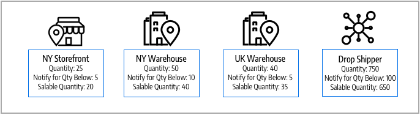

# 庫存和來源

管理您的存貨，無論倉儲位置、產品或服務型別或銷售管道為何。 完成來自多個倉庫、實體店、配送中心及製造商直接出貨的訂單及出貨產品，完成訂單，並著重於平衡的存貨、出貨成本等。

這些說明包括一家腳踏車公司的產品、來源和庫存，該公司在美國和歐洲擁有多個出貨地點和網站。

## 來源

[來源](sources-manage.md)是管理產品存貨並運送訂單履行或提供服務的實際地點。 這些地點可包括倉庫、實體店、配送中心和卸貨託運人。 [!DNL Commerce]會使用每個存貨的數量和可銷售數量，並自動管理受管理產品和訂單的存貨金額。 如果您有一個來源，則會將您視為&#x200B;_單一來源_&#x200B;模式。 如果您有多個來源，則會將您視為&#x200B;_多重來源_&#x200B;模式。

來源在一個倉儲中的存貨範圍內可以有優先權，但不一定在所有倉儲中都有優先權，因為來源可以在不同的存貨中重複使用。 庫存和來源的數量增加了決定履行訂單的最佳倉儲或存放區的複雜性。 例如，您的實體廠區可能提供有限數量的產品，而您的倉庫及主要地點的服務擁有大量庫存，但可用性有限。

在此範例中，商家有山地腳踏車，可從商店、倉庫和製造商出貨。

{width="600" zoomable="yes"}

## 庫存

[庫存](stocks-manage.md)代表可供銷售至銷售管道（網站）的虛擬彙總產品詳細目錄。 每個存貨都會將您的銷售管道與可用存貨和可銷售數量的來源對應。 根據您的網站組態，庫存可能會指派給一或多個銷售管道和來源。

Sales Channel代表銷售您詳細目錄的實體，包括網站、商店檢視、B2B客戶群組等。 銷售管道只能與一個庫存相關聯。 每個銷售管道只能指派單一庫存，且單一庫存可指派至多個網站。 透過庫存，您可以修改出貨訂單時及[Source選擇演演算法](selection-reservations.md)所使用的來源優先順序。

您一開始會使用指派了預設Source和您網站的「預設庫存」，最適合由單一來源商家使用。 只能將預設Source指派給此庫存。 多來源商家會視需要為自訂來源和網站建立自訂庫存。

{width="600" zoomable="yes"}

## 產品數量

數量是有效存貨中可供購買的產品數量。 當您完成出貨或調整存貨時，產品的數量會增加或減少。 新增產品至購物車不會影響此金額。 「可銷售數量」會追蹤銷售管道中產品的可用性，也會使用此值來決定可購買的存貨。 根據您的來源數量，您可以檢視並管理下列其中一項的產品數量：

- **數量** — 對於單一來源商家，_[!UICONTROL Quantity]_欄和值會追蹤可用的庫存量。
- **每個Source的數量** — 對於多來源商家，_[!UICONTROL Quantity per Source]_欄和值會追蹤依地點可用的庫存量。 如果您新增多個來源，此值會取代「數量」，並列出每個來源與指定數量。

預留追蹤整個購物流程的庫存請求 — 新增產品到購物車、完成結帳和管理退款。 針對可用存貨與存貨，預留會透過結帳處理保留每張訂單的存貨金額，並從可銷售數量中扣除。 開立商業發票與出貨產品時，預留會轉換為數量扣減。

「可銷售數量」會使用設定的臨界值、預留或售出的金額，以及每個來源的數量來計算產品（或可用性）的虛擬存貨。 對於每個存貨，[!DNL Commerce]會存取所有指定的來源，並彙總相關的產品數量。 然後使用此基礎值減去所有預留金額和&#x200B;_[!UICONTROL Notify for Quantity Below]_臨界值。

{width="600" zoomable="yes"}

## 詳細目錄設定

每個產品、來源和庫存都包括在全域、來源、庫存和產品層級為您的商店設定的數個選項。 如需這些選項的完整清單，請參閱[設定Inventory management](configuration.md)。

以下是[!DNL Inventory Management]的重要可瞭解選項：

- **[!UICONTROL Out-of-Stock Threshold]** — 設定要從「可銷售數量」中減去的金額。 如果您啟用「延期交貨」，此值不會從「可銷售數量」中扣除。
- **[!UICONTROL Backorders]** — 決定產品是否可在零存貨之外銷售，儲存訂單直到重新存貨。 啟用延期交貨時，建議設定[!UICONTROL Out-of-Stock Threshold]。

>[!NOTE]
>
>「無庫存臨界值」值支援負數與正數。 如果您啟用「延期交貨」，請在產品確實視為無存貨之前，針對可延期交貨的最大產品數量將此值設為負數。

## Inventory management示範

觀看此影片以瞭解Inventory management來源和庫存：

>[!VIDEO](https://video.tv.adobe.com/v/343748?quality=12)
