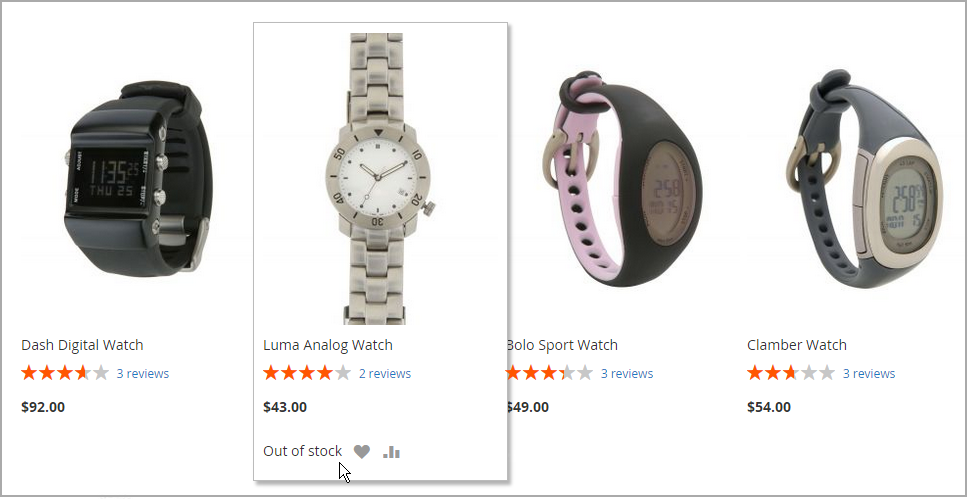

# 庫存訊息情境

您可以使用組態設定的組合，來控制產品頁面上以及目錄頁面上產品清單中的庫存可用性訊息。

{width="600" zoomable="yes"}

## 產品頁面庫存訊息

視管理庫存和庫存可用性設定的組合而定，產品頁面提供數種可用的傳訊方式。

### 範例1：顯示可用性訊息

#### 案例1

此設定組合會根據每個產品的庫存可用性，使可用性訊息顯示在產品頁面上。

| 股票期權 | 設定 | 訊息 |
|--|--|--|
| [!UICONTROL Display product availability in stock in the frontend] | `Yes` | |
| [!UICONTROL Manage Stock] | `Yes` | |
| [!UICONTROL Stock Availability] | `In Stock` | _[!UICONTROL Availability: In Stock]_ |
| | `Out of Stock` | _[!UICONTROL Availability: Out of Stock]_ |

#### 案例2

當未管理產品的庫存時，此設定組合可用於在產品頁面上顯示可用性訊息。

| 股票期權 | 設定 | 訊息 |
|--|--|--|
| [!UICONTROL Display product availability in stock in the frontend] | `Yes` |  |
| [!UICONTROL Manage Stock] | `No` | _[!UICONTROL Availability: In Stock]_ |

### 範例2：隱藏可用性訊息

#### 案例1

此設定和產品設定的組合可防止可用性訊息出現在產品頁面上。

| 股票期權 | 設定 | 訊息 |
|--|--|--|
| [!UICONTROL Display product availability in stock in the frontend] | `No` |  |
| [!UICONTROL Manage Stock] | `Yes` |  |
| [!UICONTROL Stock Availability] | `In Stock` | 無 |
|  | `Out of Stock` | 無 |

#### 案例2

當未管理產品的庫存時，此設定和產品設定的組合會防止可用性訊息出現在產品頁面上。

| 股票期權 | 設定 | 訊息 |
|--|--|--|
| [!UICONTROL Display product availability in stock in the frontend] | `No` |  |
| [!UICONTROL Manage Stock] | `No` | 無 |

## 目錄頁面庫存訊息

視產品可用性和組態設定而定，類別和搜尋結果清單可能會出現下列顯示選項。

{width="600" zoomable="yes"}

### 範例1：顯示帶有「無庫存」訊息的產品

組態設定的這個組合包括類別和搜尋結果清單中的無庫存產品，並顯示「無庫存」訊息。

| 股票期權 | 設定 | 訊息 |
|--|--|--|
| [!UICONTROL Display Out of Stock Products] | `Yes` |  |
| [!UICONTROL Display product availability in stock in the frontend] | `Yes` | _[!UICONTROL Out of stock]_ |
| [!UICONTROL Display Out of Stock Products] | `Yes` |  |
| [!UICONTROL Display product availability in stock in the frontend] | `No` | 無 |

### 範例2：顯示沒有「無庫存」訊息的產品

此組態設定組合包含類別和搜尋結果清單中的無庫存產品，但不顯示訊息。

| 股票期權 | 設定 | 訊息 |
|--|--|--|
| [!UICONTROL Display Out of Stock Products] | `Yes` | 無 |
| [!UICONTROL Display product availability in stock in the frontend] | `No` |  |

### 範例3：隱藏產品直到補貨為止

此組態設定會從類別和搜尋結果清單中完全省略無庫存的產品，直到這些產品重新補充庫存為止。

| 股票期權 | 設定 | 訊息 |
|--|--|--|
| [!UICONTROL Display Out of Stock Products] | `No` | 無 |
