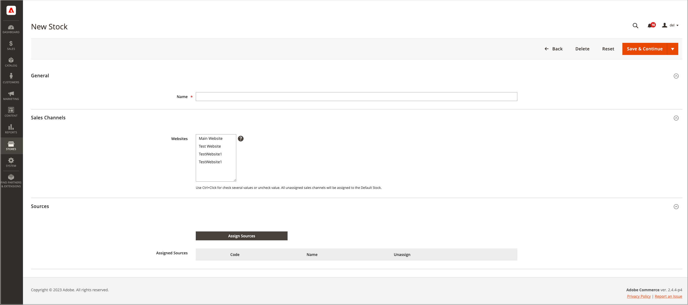
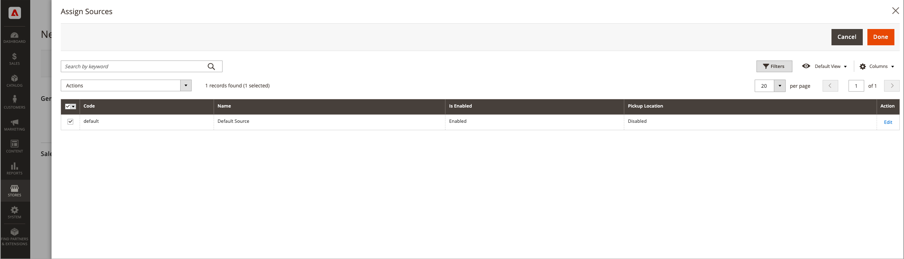

# 新增庫存

庫存將您的來源對應至銷售管道（或網站），提供可銷售數量和產品庫存的直接連結。

建立自訂庫存時，您會指派網站和來源。 來源可以包含已啟用和已停用的來源。 例如，您可以新增倉儲至存貨，準備開啟管理存貨與完成出貨的地點。

新增來源後，您必須排列來源從上（第一個）到下（最後一個）的優先順序。 此訂單會影響訂單出貨期間的建議。

{width="600" zoomable="yes"}

## 新增存貨量

1. 在&#x200B;_管理員_&#x200B;側邊欄上，移至&#x200B;**[!UICONTROL Stores]** > _[!UICONTROL Inventory]_>**[!UICONTROL Stock]**。

1. 按一下&#x200B;**[!UICONTROL Add New Stock]**。

1. 展開 **[!UICONTROL General]**&#x200B;區段，並輸入唯一的&#x200B;**[!UICONTROL Name]**&#x200B;以識別新庫存。

   {width="350" zoomable="yes"}

1. 展開 **[!UICONTROL Sales Channels]**&#x200B;區段，並選取可用此庫存的&#x200B;**[!UICONTROL Websites]**。

   若要進行多站台安裝，請按住Ctrl鍵(PC)或Command鍵(Mac)，然後按一下每個網站。

   >[!NOTE]
   >
   >如果您選取已指派給其他庫存的網站或銷售管道，該庫存便會取消指派。 所有未指派給自訂庫存的Sales Channel都會指派給「預設庫存」。

   庫存的{width="350" zoomable="yes"}

1. 展開 **[!UICONTROL Sources]**&#x200B;區段，並對預設以外的任何庫存執行下列動作：

   - 按一下&#x200B;**[!UICONTROL Assign Sources]**。

   {width="350" zoomable="yes"}

   - 選取您要指定給庫存的所有來源的核取方塊。

   >[!IMPORTANT]
   >
   >如果您將相同的來源指派給多個庫存，可能會導致指派給該來源的產品過度銷售。

   - 按一下&#x200B;**[!UICONTROL Done]**。

     新增的來源會顯示在「指派的來源」中。

     {width="600" zoomable="yes"}

1. 使用將來源拖放至優先順序(從上（第一個）到下（最後一個）。

   出貨訂單時，來源訂單很重要。

   {width="600" zoomable="yes"}

1. 在&#x200B;_[!UICONTROL Save]_（）功能表上，選擇&#x200B;**[!UICONTROL Save & Close]**。

## 欄位說明

| 欄位 | 說明 |
|--|--|
| **[!UICONTROL General]** | |
| [!UICONTROL Name] | 庫存名稱。 例如： `UK Stock`， `US Stock` |
| **[!UICONTROL Sales Channels]** | |
| [!UICONTROL Websites] | 將庫存指派給特定網站做為&#x200B;_銷售管道_，以定義庫存的[範圍](../getting-started/websites-stores-views.md#scope-settings)。 選取每隻股票一或多個網站。 每個網站只能指派給一種庫存。 |
| **[!UICONTROL Sources]** | |
| [!UICONTROL Assign Sources] | 指定存貨來源給此存貨。 無法將自訂來源指派給預設庫存。 |
| [!UICONTROL Assigned Sources] | 指派的來源清單。 使用將來源拖放至訂單履行與出貨的優先順序。  **[!UICONTROL Code]**— 來源的唯一程式碼識別碼。 **[!UICONTROL Name]** — 來源的名稱描述。 **[!UICONTROL Unassign]**— 使用從庫存中移除指派的來源。 |
