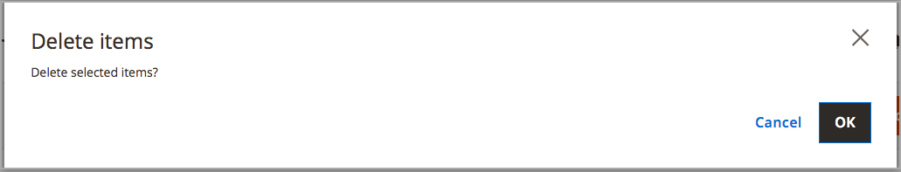

# 刪除庫存

當您刪除庫存時，所有指派的網站都會指派給「預設庫存」。 建議先將網站重新指派給其他庫存，然後再刪除。

>[!IMPORTANT]
>
>刪除[stock](stocks-manage.md)可能會影響銷售管道的可銷售數量與未處理的訂單。 如果您繼續使用銷售管道，請將銷售管道新增至其他現有或新庫存。

1. 在&#x200B;_管理員_&#x200B;側邊欄上，移至&#x200B;**[!UICONTROL Stores]** > _[!UICONTROL Inventory]_>**[!UICONTROL Stocks]**。

1. 選取一或多個要刪除的庫存。

   瀏覽或搜尋並選取您要刪除的庫存的核取方塊。

1. 從&#x200B;**[!UICONTROL Actions]**&#x200B;功能表選取&#x200B;**[!UICONTROL Delete]**。

   ![從[動作]功能表選取[刪除]](assets/inventory-stock-delete.png){width="350" zoomable="yes"}

1. 在確認對話方塊中，按一下&#x200B;**[!UICONTROL OK]**。

   庫存會遭到刪除，而所有指派的銷售管道都會取消對應。

   {width="350" zoomable="yes"}
