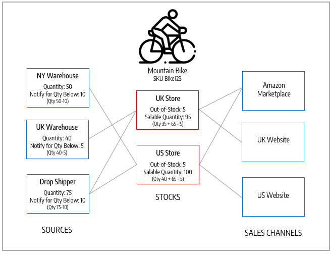

# 管理庫存

庫存代表您銷售管道（網站）來源的虛擬彙總產品詳細目錄。 根據您的網站組態，庫存可能會指派給一個或多個銷售管道。 每個銷售管道只能指派一個庫存，而且可以將單一庫存指派給多個銷售管道。 透過存貨，您可以修改當訂單通過銷售管道時所使用的來源優先順序。

您一開始會使用無法移除或停用的「預設庫存」。 您只能新增其他銷售管道到庫存。 唯一指派的來源是「預設來源」。 此庫存供單一來源商家、第三方整合和匯入的產品使用。

Sales Channel代表銷售您詳細目錄的實體。 根據預設， [!DNL Commerce] 將您的商店網站作為銷售管道提供。 銷售管道可延伸以支援其他管道，例如B2B客戶群組及商店檢視。 每個銷售管道只能與一個庫存相關聯。

- **Sales Channel支援**  — 銷售管道目前包含立即可用的網站。 您可以擴充銷售管道，以包含B2B客戶群組及商店檢視等自訂選項。 每個銷售管道只能指派單一存貨。 單一庫存可指派給多個銷售管道。
- **對應至來源**  — 每個存貨都可指定一或多個已啟用或已停用的來源，以計算每個產品的虛擬彙總存貨。
- **優先順序訂單履行**  — 完成訂單時，「來源選取演演算法」的現成「優先順序」演演算法會從上到下使用庫存的來源清單。

下圖可協助定義「庫存」如何與「腳踏車商店」商家的「來源」與「Sales Channel」相關運作。

{width="600" zoomable="yes"}

## 山地腳踏車和商店的庫存範例

所有商店都以預設庫存開始。 它必須保留 `Enabled` 基於下列原因：

- 它用於匯入新產品，自動將產品指定給預設來源和庫存，以便立即存取 [!DNL Inventory Management].
- 您無法將「預設來源」以外的其他來源新增至此庫存。
- 單一來源商家、套裝產品和群組產品都需要並使用它。

針對多來源商家，建立並設定庫存，以最符合您的商店和訂單履行。 當您為銷售管道指派新庫存時，該銷售管道中任何預先存在的庫存都會被取消指派。

對於多存放區安裝，「預設庫存」最初會指派給 [主要網站](../stores-purchase/stores.md#add-websites){target="_blank"} 和預設存放區。 對於啟用與停用的產品，正確的庫存與數量會顯示在 **[!UICONTROL Products]** 格點檢視。

{width="600" zoomable="yes"}

## 按鈕列

| 按鈕 | 說明 |
|--|--|
| [!UICONTROL Add New Stock] | 開啟 _[!UICONTROL New Stock]_用來輸入新存貨的表單，以將存貨對應至銷售管道。 |

## 管理Stock欄說明

| 欄 | 說明 |
|--|--|
| [!UICONTROL ID] | 為股票專案產生的唯一數值ID。 |
| [!UICONTROL Name] | 可識別庫存的唯一名稱。 |
| [!UICONTROL Sales Channels] | 透過將庫存指派給特定網站來定義庫存的範圍 _銷售管道_. |
| [!UICONTROL Assigned sources] | 指定給存貨的來源，可提供所有產品數量。 |
| [!UICONTROL Action] | **[!UICONTROL Edit]**  — 以編輯模式開啟存貨存量記錄。 |
