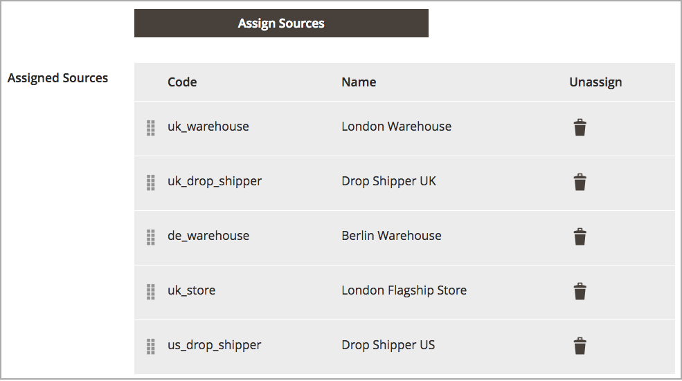

# 排定存貨來源的優先順序

將[來源](sources-manage.md)新增至[庫存](stocks-manage.md)後，請以由上到下的優先順序排列這些來源，以履行訂單。 Source選擇演演算法(SSA)在決定出貨與存貨扣除額時，會使用此訂單提供演演算法「優先順序」。

編輯產品存貨時，存貨的來源優先順序不會影響指定的來源。

在此範例中，UK Stock已將來源指定給倫敦的一個商店和兩個倉庫，以及柏林的一個倉庫。

優先順序設定前{width="350" zoomable="yes"}

商戶偏好從較大的柏林倉儲，然後是倫敦倉儲，最後是倫敦的店面，排定出貨優先順序。 若要變更順序，會將專案拖放至所需的順序。

1. 在&#x200B;_管理員_&#x200B;側邊欄上，移至&#x200B;**[!UICONTROL Stores]** > _[!UICONTROL Inventory]_>**[!UICONTROL Stocks]**。

1. 以&#x200B;_編輯_&#x200B;模式開啟庫存。

1. 如有需要，請展開&#x200B;_[!UICONTROL Sources]_標籤。

1. 使用將來源拖放至優先順序(從上（第一個）到下（最後一個）。

   此訂單在出貨訂單時很重要。 SSA會根據來源順序建議出貨

1. 按一下&#x200B;**[!UICONTROL Save & Continue]**&#x200B;以儲存變更。

優先順序設定後的{width="350" zoomable="yes"}
