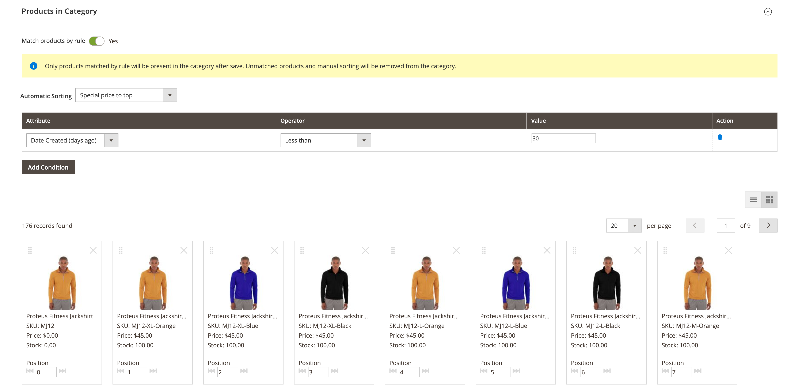

# 銷售類別規則

{{ee-feature}}

類別規則會根據一組條件動態變更產品選擇。 每個類別只能有一個類別規則，不過單一規則可以有多個條件。 例如，您可以為特定品牌建立類別規則。 即使相同品牌的產品未指派至相同類別，也會自動新增至清單。 您可以視需要在運算式中新增許多條件，以說明您要包含的產品。

>[!TIP]
>
>在類別規則設定期間，產品為 _已排序_， _相符_， _已指派_、和 _已取消指派_ 根據該規則 **_僅限_** 儲存此類別時。 例如，如果您將產品新增至目錄，並想根據規則將其指派，您可以 **必須重新儲存每個類別** 已設定為依規則比對產品。 此外，如果任何產品庫存狀態變更為 `In Stock` 或 `Out of Stock` 類別中的產品應該是 _已排序_ 根據 **[!UICONTROL Automatic Sorting]** 規則，您必須按一下 **[!UICONTROL Save Category]**.

每個條件都包含屬性、值和邏輯運運算元。 僅限具有下列專案的屬性： _[[!UICONTROL Use in Product Listing]](../catalog/attribute-product-create.md)_屬性設定為 `Yes` 可用於類別規則中。 如果您要使用未包含在產品清單中的屬性，則必須為屬性設定此屬性。 雖然不支援「日期」屬性，但您可以使用「建立日期」或「修改日期」屬性來定義日期或日期範圍。 例如，若只要包含過去一週內建立的產品，請將「建立日期」設為值 `<7`.

>[!NOTE]
>
>請務必將規則中使用的每個屬性設為 [_智慧_ 屬性](smart-attributes-configure.md).

{width="600" zoomable="yes"}

類別產品規則可以加速將特定產品指派至類別的過程，根據條件來決定哪些產品會出現在類別中。 可與類別產品規則搭配使用的「智慧」屬性是在 [Visual Merchandiser](visual-merchandiser.md) 設定。

>[!NOTE]
>
>套用類別產品規則時請務必小心，因為不符合條件的任何產品都會從類別中移除。 例如，如果您建立的規則僅包含紫色油箱頂端，則所有其他油箱頂端都會從類別中移除。

## 步驟1：設定 _智慧_ 屬性

1. 對於要用於規則中的每個屬性，請確定 [[!UICONTROL Use in Product Listing]](../catalog/product-attributes.md) storefront屬性設定為 `Yes`.

   >[!NOTE]
   >
   >確定您選取的屬性不是多選 _[!UICONTROL Input Type]_.

1. 完成 [設定](smart-attributes-configure.md) 以識別 _智慧_ 與Visual Merchandiser搭配使用的屬性。

## 步驟2：建立類別規則

1. 在類別樹狀結構中，開啟要編輯的類別。

1. 在 **[!UICONTROL Products in Category]** 部分，設定 **[!UICONTROL Match products by rule]** 至 `Yes`.

   自動排序和條件選項隨即顯示。

1. 按一下 **[!UICONTROL Add Condition]**.

1. 選擇 **[!UICONTROL Attribute]** 這是條件的基礎。

1. 設定 **[!UICONTROL Operator]** 變更為下列其中一項：

   - `Equal`
   - `Not equal`
   - `Greater than`
   - `Greater than or equal to`
   - `Less than`
   - `Less than or equal to`
   - `Contains`

1. 輸入 **[!UICONTROL Value]** 將進行比對。

   {width="500"}

1. 針對描述要符合的條件所需的每個屬性，重複此程式。

   例如，若要比對在7到30天前建立的產品，請執行下列動作：

   - 設定 **[!UICONTROL Date Created]** 至 `Less than 30`.

   - 設定 **[!UICONTROL Logic]** 至 `AND`.

     >[!NOTE]
     >
     >當您選擇 `AND`，此規則會套用至符合所有條件的產品。 您選擇什麼 `OR`，適用於至少符合一個條件的產品。

   - 設定 **[!UICONTROL Date Modified]** 至 `Greater than 7`.

1. 若要將排序順序自動套用至動態產生的產品清單，請設定 **[!UICONTROL Automatic Sorting]**.

   {width="600" zoomable="yes"}

   排序順序選項會全域定義，並根據目前條件套用。 您無法針對網站、商店或商店檢視層級設定不同的排序順序。

   | 排序選項 | 說明 |
   |-----------| -----------|
   | [!UICONTROL Stock quantity] | 根據庫存排序，從上到下： `Move low stock to top` 或 `Move out of stock to bottom` |
   | [!UICONTROL Special price] | 根據價格排序，從上到下： `Special price to top` 或 `Special price to bottom` |
   | [!UICONTROL New Products] | 列出最新產品： `Newest products first` |
   | [!UICONTROL Color] | 依色彩的字母順序排序： `Sort by color` |
   | [!UICONTROL Product Names] | 依名稱遞增或遞減順序排序： `Name A - Z` 或 `Name Z -A` |
   | [!UICONTROL SKU] | 依SKU以遞增或遞減順序排序： `SKU: Ascending` 或 `SKU: Descending` |
   | [!UICONTROL Price] | 依遞增或遞減順序的價格排序： `Price: High to low` 或 `Price: Low to high` |

   {style="table-layout:auto"}

1. 完成後，按一下 **[!UICONTROL Save Category]**.

>[!NOTE]
>
>設定類別規則時，會比對產品並在儲存類別時指派給規則。 如果您將產品新增至目錄，且想將其納入規則中，則必須重新儲存每個已設定為依規則比對產品的類別。 這可確保包含新產品。

### 功能表選項

- **[!UICONTROL Match products by rule]**  — 決定類別中的產品清單是否由類別規則動態產生。 選項： `Yes` / `No`

- **[!UICONTROL Automatic Sorting]**  — 自動將排序順序套用至類別產品清單。 選項： `None`， `Move low stock to top`， `Move low stock to bottom`， `Special price to top`， `Special price to bottom`， `Newest products first`， `Sort by color`， `Name: A - Z`， `Name: Z - A`， `SKU: Ascending`， `SKU: Descending`， `Price: High to Low`、和 `Price: Low to High`

  >[!NOTE]
  >
  >如果您有可設定產品與子產品，則父產品庫存會根據子產品庫存的總和來計算。 請考量您具有可設定產品的範例 _Proteus Fitness Shirt_ 橙色、紅色和黃色子產品，各有不同的庫存量。 上層產品庫存是根據橘色、紅色和黃色下層產品的庫存合併總和所計算的。 使用 `Move low stock to top` 選項，它會合併所有可銷售子產品庫存，並據此排序父產品的庫存。

- **[!UICONTROL Add Condition]**  — 將另一個條件新增至規則。

- **[!UICONTROL Attribute]**  — 決定作為條件基礎的屬性。 選項：

  | 選項 | 說明 |
  | ------ | ----------- |
  | `Clone Category ID(s)` | 根據類別ID從多個類別動態複製產品（無需排序和排序）。 |
  | `Color` | 包含以顏色為準的產品。 |
  | `Date Created (days ago)` | 包含以產品新增至目錄後間隔天數為基礎的產品。 |
  | `Date Modified (days ago)` | 包含以上次修改產品後間隔天數為基礎的產品。 |
  | `Name` | 包括以產品名稱為依據的產品。 |
  | `Price` | 包括以價格為準的產品。 這個屬性不適用於可設定的產品，因為這些產品沒有自己的價格。 |
  | `Quantity` | 包含以庫存數量為基準的產品。 |
  | `SKU` | 包括以SKU為依據的產品。 |

  {style="table-layout:auto"}

  >[!NOTE]
  >
  >可設定產品及其子項選項的數量是透過結合所有可銷售子項產品數量來計算。 請考量您具有可設定產品的範例 _基本健身背心_ 紫色、紅色和黃色選項，以及每種選項的不同數量。 在此案例中，父產品（基本健身背心）數量是紫色、紅色和黃色子產品的組合可銷售數量。

- **[!UICONTROL Operator]**  — 指定套用至屬性值以符合條件的運運算元。 除非指定運運算元， `Equal` 會使用作為預設值。 選項： `Equal`， `Not equal`， `Greater than`， `Greater than or equal to`， `Less than`， `Less than or equal to`、和 `Contains`

- **[!UICONTROL Value]**  — 指定屬性必須符合條件的值。

- **[!UICONTROL Logic]**  — 「邏輯」欄可用來定義多個條件，且只會在新增其他條件時顯示。 運運算元遵循MySQL的優先順序規則 [布林運運算元](https://dev.mysql.com/doc/refman/8.0/en/operator-precedence.html). 選項： `AND` / `OR`
