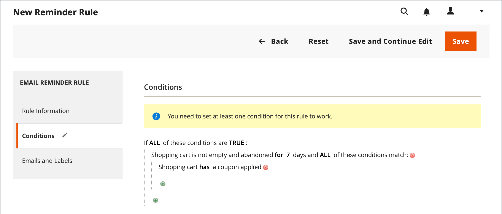

# 建立電子郵件提醒

設定電子郵件提醒規則之前，您必須先設定購物車價格規則，以定義正在提供的促銷活動。 觸發電子郵件提醒的規則條件可以根據購物車屬性、願望清單屬性或兩者。

>[!NOTE]
>
>電子郵件提醒可能會促銷包含或不包含抵用券的購物車價格規則。 定義自動產生抵用券的購物車價格規則，會為每個客戶產生隨機抵用券代碼。

1. 在 _管理員_ 側欄，前往 **[!UICONTROL Marketing]** > _[!UICONTROL Communications]_>**[!UICONTROL Email Reminder Rules]**.

1. 在右上角，按一下 **[!UICONTROL Add New Rule]**.

1. 完成 _[!UICONTROL Rule Information]_，如下所示：

   {width="700" zoomable="yes"}

   - 輸入 **[!UICONTROL Rule Name]** 以在內部識別規則。

   - 輸入簡報 **[!UICONTROL Description]** 規則的。

   - 若要選擇 **[!UICONTROL Cart Price Rule]** 此提醒要公告的促銷活動，請按一下 **[!UICONTROL Select Rule…]**，然後選取規則。

     {width="600" zoomable="yes"}

   - 若要讓規則立即生效，請設定 **[!UICONTROL Status]** 至 `Active`.

   - 若要設定規則生效的日期範圍，請輸入 **[!UICONTROL From]** 和 **[!UICONTROL To]** 日期。

     您也可以從行事曆中選擇日期(  )。

   - 若要傳送提醒多次，請在「 」中輸入下次傳送電子郵件前的天數 **[!UICONTROL Repeat Schedule]** 欄位。

1. 在左側的面板中，選擇 **[!UICONTROL Conditions]**.

   必須為規則定義至少一個條件。 此程式類似建置 [型錄價格規則。](price-rules-catalog.md)

   {width="600" zoomable="yes"}

   按一下 _新增_ ( )來顯示選項清單，然後選擇下列其中一個條件：

   - 希望清單
   - 購物車

   >[!NOTE]
   >
   >如果客戶有多個相符的放棄購物車、希望清單或兩者的組合，則只會為該客戶觸發一次電子郵件提醒。 若要再次觸發相同的電子郵件提醒，請使用 _[!UICONTROL Repeat Schedule]_欄位以設定電子郵件之間的天數。

   完成條件以說明觸發電子郵件提醒的情境。

   {width="600" zoomable="yes"}

1. 在左側的面板中，選擇 **[!UICONTROL Emails and Labels]**.

   {width="600" zoomable="yes"}

1. 在 **[!UICONTROL Email Templates]** 區段，選擇要用於您網站和商店檢視的電子郵件範本 [存放區階層](../getting-started/websites-stores-views.md).

   如果您不想要傳送提醒電子郵件給商店檢視的客戶，請保留值 `Not Selected`.

1. 在 _預設標題和說明_ 區段，請執行下列動作：

   - 輸入 **[!UICONTROL Rule Title for All Store Views]**.

     >[!NOTE]
     >
     >若要將此值納入電子郵件範本，請使用 `promotion_name` 變數中。

   - 輸入 **[!UICONTROL Rule Description for All Store Views]**.

     {width="500" zoomable="yes"}

   - 在 _[!UICONTROL Titles and Descriptions Per Store View]_區段，輸入&#x200B;**[!UICONTROL Rule Title]**和&#x200B;**[!UICONTROL Description]**針對_&#x200B;預設存放區檢視&#x200B;_. 針對多個商店檢視，輸入每個商店檢視的適當標題和說明。

     >[!NOTE]
     >
     >使用promotion_description變數可將說明併入電子郵件範本。

     {width="500" zoomable="yes"}

1. 完成後，按一下 **[!UICONTROL Save]**.

## 觸發條件

| 來源 | 觸發 |
|--- |--- |
| [!UICONTROL Wish List] | [!UICONTROL Conditions Combination] [!UICONTROL Sharing] [!UICONTROL Number of Items] [!UICONTROL Items Sub selection] |
| [!UICONTROL Shopping Cart] | [!UICONTROL Conditions Combination] [!UICONTROL Coupon Code] [!UICONTROL Cart Line Items] [!UICONTROL Items Quantity] [!UICONTROL Virtual Only] [!UICONTROL Total Amount] [!UICONTROL Items Subselection] |

{style="table-layout:auto"}

## 欄位說明

| 欄位 | 說明 |
|--- |--- |
| [!UICONTROL Rule Name] | 自動提醒規則的名稱，可在內部識別規則。 |
| [!UICONTROL Description] | 供內部參考的規則說明。 |
| [!UICONTROL Shopping Cart Price Rule] | 與此電子郵件提醒相關聯的購物車規則。 提醒電子郵件可促銷附有或不附贈券的購物車價格規則。 如果購物車價格規則包含自動產生的優惠券，則提醒規則會為每個客戶產生隨機、唯一的優惠券代碼。 |
| [!UICONTROL Assigned to Website] | 根據此規則接收自動提醒電子郵件的網站。 |
| [!UICONTROL Status] | 啟動規則。 如果狀態為非使用中，則會忽略所有其他設定，且不會觸發規則。 選項： `Active` / `Inactive` |
| [!UICONTROL From Date] | 此自動提醒規則的開始日期。 若未指定日期，規則會立即生效。 |
| [!UICONTROL To Date] | 此自動提醒規則的結束日期。 如果未指定日期，規則會無限期地啟用。 |
| [!UICONTROL Repeat Schedule] | 觸發規則前的天數，並在符合條件時再次傳送提醒電子郵件。 若要觸發規則多次，請輸入下次傳送電子郵件前的天數（以逗號分隔）。 例如，輸入 `7` 7天後再次觸發規則；請輸入 `7,14` 在七天內觸發規則，14天後再次觸發。 |
| [!UICONTROL Email Templates] | 決定用於每個商店檢視的電子郵件範本。 |
| [!UICONTROL Rule Title for All Store Views] | 決定每個存放區檢視的規則標題。 |
| [!UICONTROL Rule Description for All Store Views] | 決定每個存放區檢視的規則說明。 |

{style="table-layout:auto"}
