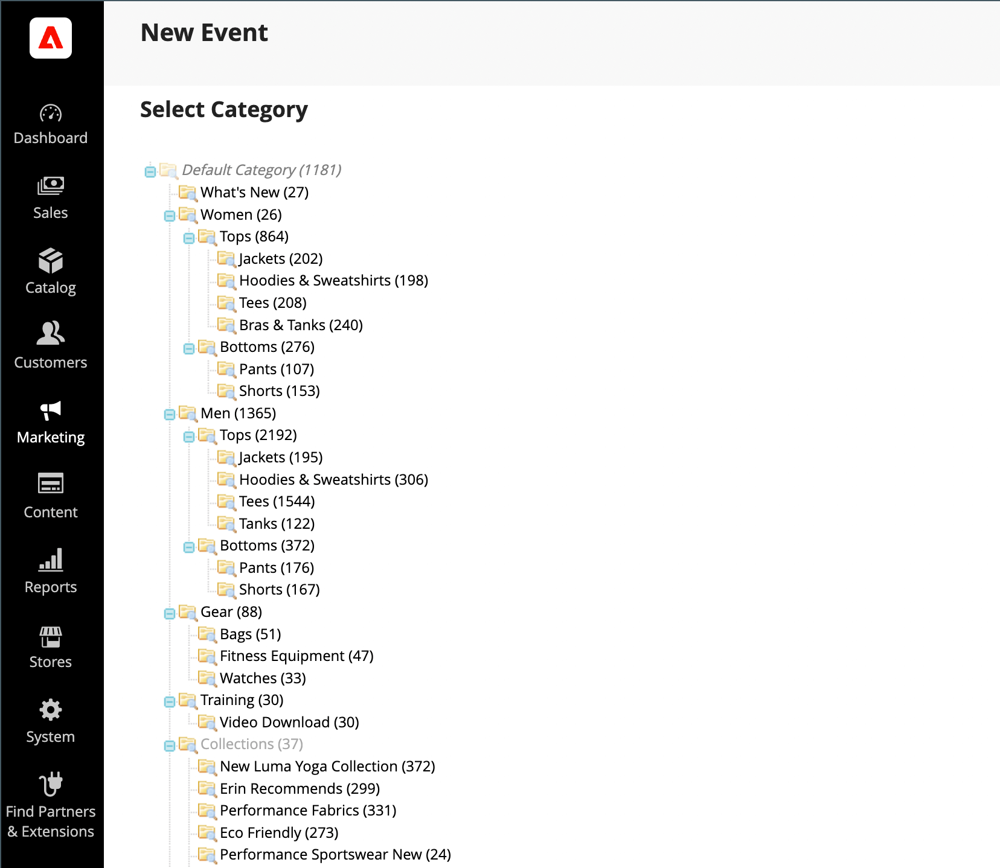

# 建立和更新事件

{{ee-feature}}

每個事件都與您目錄中的類別相關聯，一次只能有一個事件與任何指定類別相關聯。 若要顯示商店中即將舉辦之活動的清單，您也必須設定[目錄活動轉盤](../content-design/widget-event-carousel.md) Widget。

{width="700" zoomable="yes"}

## 建立事件

1. 在&#x200B;_管理員_&#x200B;側邊欄上，移至&#x200B;**[!UICONTROL Marketing]** > _[!UICONTROL Private Sales]_>**[!UICONTROL Events]**。

1. 按一下右上角的&#x200B;**[!UICONTROL Add Catalog Event]**。

1. 在類別樹狀結構中，選擇要與事件關聯的類別。

   由於每個類別一次只能有一個事件，因此已具有事件的任何類別都會停用。

   {width="500" zoomable="yes"}

1. 定義&#x200B;**[!UICONTROL Catalog Event Information]**：

   {width="700" zoomable="yes"}

   - 對於事件的&#x200B;**[!UICONTROL Start Date]**，請使用行事曆（）來選擇日期。 使用&#x200B;**[!UICONTROL Hour]**&#x200B;和&#x200B;**[!UICONTROL Minute]**&#x200B;滑桿來設定事件開始的時間。

   - 對於事件的&#x200B;**[!UICONTROL End Date]**，請使用行事曆（）來選擇日期。 使用&#x200B;**[!UICONTROL Hour]**&#x200B;和&#x200B;**[!UICONTROL Minute]**&#x200B;滑桿來設定事件結束的時間。

   - 若要上傳事件Widget的&#x200B;**[!UICONTROL Image]**，請按一下&#x200B;**[!UICONTROL Choose File]**&#x200B;並從目錄中選取影像檔案。

   - 在&#x200B;**[!UICONTROL Sort Order]**&#x200B;欄位中輸入數字，以表示此事件與其他事件一起列出時的顯示順序。

   - 選取您要顯示倒數計時器之每個頁面型別的核取方塊。

1. 完成時，按一下&#x200B;**[!UICONTROL Save]**。

## 更新事件

您可以從事件頁面或從與事件關聯的類別編輯事件。 當類別有關聯事件時，編輯事件按鈕會出現在右上角。

### 方法1：從「事件」頁面編輯事件

1. 在&#x200B;_管理員_&#x200B;側邊欄上，移至&#x200B;**[!UICONTROL Marketing]** > _[!UICONTROL Private Sales]_>**[!UICONTROL Events]**。

1. 在清單中尋找事件，並在編輯模式中開啟。

1. 對事件進行必要的變更。

1. 完成時，按一下&#x200B;**[!UICONTROL Save]**。

### 方法2：編輯類別中的事件

1. 在&#x200B;_管理員_&#x200B;側邊欄上，移至&#x200B;**[!UICONTROL Catalog]** > **[!UICONTROL Categories]**。

1. 在左側的類別樹狀結構中，選取與事件相關聯的類別。

1. 按一下右上角的&#x200B;**[!UICONTROL Edit Even]t**。

1. 對事件進行必要的變更。

1. 完成時，按一下&#x200B;**[!UICONTROL Save]**。

## 刪除事件

1. 在&#x200B;_管理員_&#x200B;側邊欄上，移至&#x200B;**[!UICONTROL Marketing]** > _[!UICONTROL Private Sales]_>**[!UICONTROL Events]**。

1. 在清單中尋找事件，並在編輯模式中開啟。

1. 按一下右上角的&#x200B;**[!UICONTROL Delete]**。

1. 若要確認動作，請按一下&#x200B;**[!UICONTROL OK]**。

## 欄位說明

| 欄位 | [領域](../getting-started/websites-stores-views.md#scope-settings) | 說明 |
|--- |--- |--- |
| [!UICONTROL Category] | 全域 | 建立事件時，此欄位會連結回類別樹狀結構。 編輯事件時，會連結至與事件相關的類別頁面。 |
| [!UICONTROL Start Date] | 全域 | 以`MMDDYYYY HH;MM`格式顯示之事件的開始日期和時間。 按一下日曆圖示以選取日期。 |
| [!DNL End Date] | 全域 | 以`MMDDYYYY HH;MM`格式顯示之事件的結束日期和時間。 按一下日曆圖示以選取日期。 |
| [!UICONTROL Image] | 存放區檢視 | 上傳出現在[目錄事件轉盤Widget](../content-design/widget-event-carousel.md)中的影像。 |
| [!UICONTROL Sort Order] | 全域 | 決定此事件與其他事件一起列出時的顯示順序。 |
| [!UICONTROL Display Countdown Ticker On] | 全域 | 在每個指定頁面的標頭中顯示倒數計時記號。 選項： `Category Page` / `Product Page` |
| [!UICONTROL Status] | 全域 | 根據開始日期和結束日期範圍指示事件的狀態。 狀態是唯讀值。 值： `Open` / `Closed` / `Upcoming` |

{style="table-layout:auto"}

## 按鈕列

| 按鈕 | 說明 |
|--- |--- |
| **[!UICONTROL Back]** | 返回「事件」頁面，不儲存新事件或現有事件中的變更。 |
| **[!UICONTROL Delete]** | 刪除事件。 |
| **[!UICONTROL Reset]** | 清除任何未儲存變更的形式，並還原原始事件資訊。 |
| **[!UICONTROL Save and Continue Edit]** | 儲存所有變更並保持表單在編輯模式中開啟。 |
| **[!UICONTROL Save]** | 儲存變更、關閉表單，然後返回「事件」頁面。 |

{style="table-layout:auto"}
