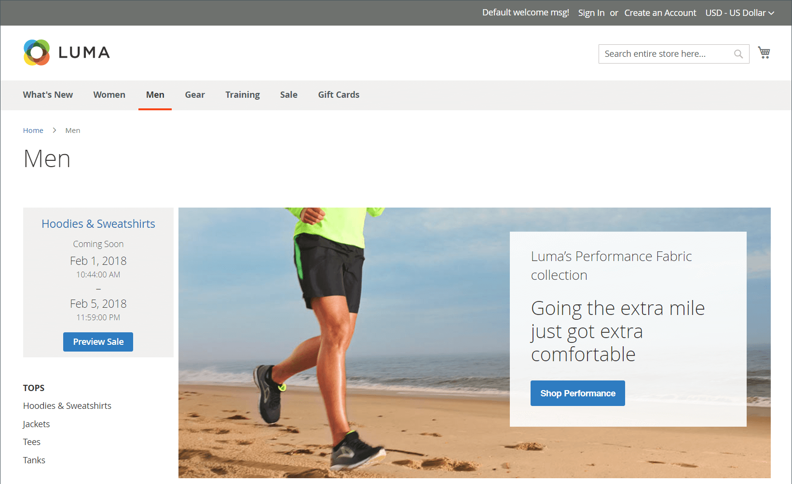

# 私人銷售和活動

{{ee-feature}}

私人銷售和其他型錄活動是您利用現有客戶群來產生熱點和新的銷售機會，或解除安裝剩餘存貨的絕佳方式。 您可以建立限時銷售、限制特定成員的銷售，或建立獨立的私人銷售頁面。 您也可以定義邀請和活動詳細資料。 為您的最佳客戶提供VIP待遇，以提高品牌忠誠度並引起轟動。 提供對僅限會員的銷售或私人銷售的獨佔存取權，以提高品牌忠誠度。 您也可以使用這些銷售來清算多餘的商品。 客戶群組對於僅設定這些型別的成員和VIP銷售非常有用。

{width="700" zoomable="yes"}

## 事件管理元件

- **類別** — 每個事件都與您目錄中的[類別](../catalog/category-create.md)相關聯。

- **事件** — 事件銷售是以開始和結束日期為基礎。 您可以使用[倒數計時記號](#event-ticker)來顯示剩餘時間。

- **目錄事件轉盤** — 在設定中啟用[目錄事件Widget](../content-design/widget-event-carousel.md)時，它可放置在商店頁面上，作為開啟和即將發生事件的清單，依結束日期排序。 如果兩個或更多事件的結束日期相同，事件會根據設定中指定的順序排序。

- **[!UICONTROL Websites]** — 類別許可權主要以[客戶群組](../customers/customer-groups.md)為基礎。

- **類別許可權** - [類別許可權](../catalog/category-permissions.md)可讓您完全控制特定類別中可能發生的特定活動。

- **存取限制** — 防止公開[存取](event-configure.md#restrict-access)網站，方法是重新導向至登陸頁面、登入頁面或註冊頁面。

- **邀請** — 傳送電子郵件訊息時，會附上在商店中建立帳戶的連結。 您可以將建立帳號的能力限製為僅接收[邀請](invitations.md)的使用者。

- **私人銷售報告** - [私人銷售報告](../getting-started/private-sales-reports.md)提供已傳送的邀請、已邀請的客戶和轉換的相關資訊。

## 事件提示

股票代碼區塊會顯示開啟事件的倒計時股票代碼，以及即將發生之事件的開始和結束日期。 如果事件已關閉，捲軸會顯示開始和結束日期。

{width="700" zoomable="yes"}

如果為事件啟用類別頁面提示字元，提示字元區塊會出現在類別清單的頂端。 如果已啟用產品頁面提示，則提示區塊也會出現在與類別相關聯之任何產品的產品頁面頂端。

當您[建立事件](event-create.md)時，可以啟用事件代號。

{width="700" zoomable="yes"}
