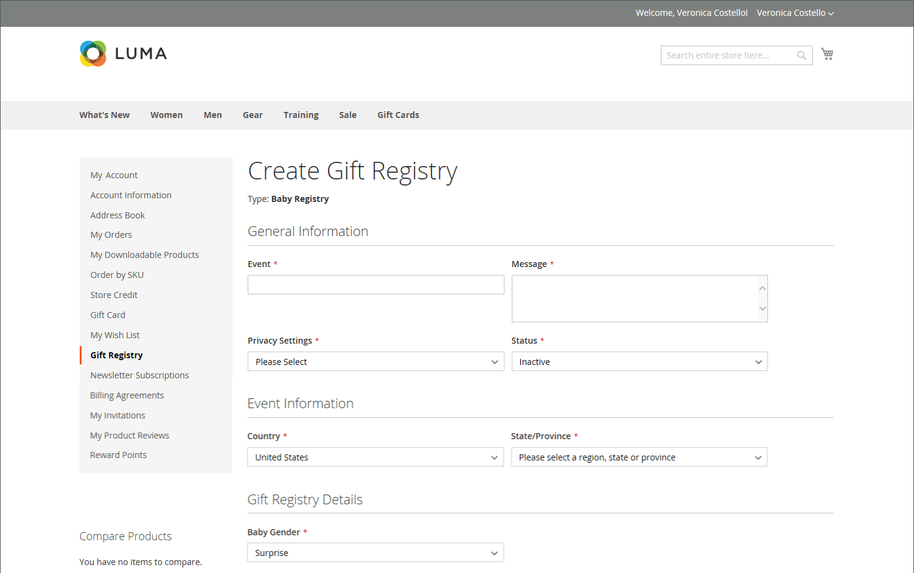

# 禮品登記簿

{{ee-feature}}

Adobe Commerce可讓您的客戶建立特殊場合的禮品註冊處，並邀請朋友和家人從禮品註冊處購買禮物。 Adobe Commerce會追蹤購買的專案和剩餘數量。

{width="700" zoomable="yes"}

贈品登入擁有者可以從他們的產品新增產品至登入 [客戶儀表板](gift-registry-storefront.md#gift-registry-information). 此外，產品可從願望清單或購物車中轉移。 身為商店管理員，您可以檢視並分享客戶禮品登記簿。 您也可以執行維護作業，例如從客戶的購物車新增料號、更新數量或刪除禮品登入。

若要存取贈品登入，收件者可以按一下所收到電子郵件中的連結，或依收件者的名稱、電子郵件或贈品登入ID進行搜尋。 在大多數商店中，每個頁面的頁尾都有贈品登入的連結，不過位置可能會因主題而異。 此外， [Widget](../content-design/widgets.md) 工具可用來放置 [禮品登入搜尋](gift-registry-search.md) 在商店中的任何地方。

想要購買的登入訪客可以直接從贈品登入新增專案至購物車。 下訂單時，會更新禮品註冊以反映購買。

## 禮品登入工作流程

1. **設定商店的禮品登入**. 商店管理員 [啟用贈品登入](gift-registry-configure.md)、和 [設定登入型別和屬性](gift-registry-create.md).

1. **客戶建立自己的登入**. A [客戶建立禮品登入](gift-registry-storefront.md#create-a-new-gift-registry) ，並完成贈品註冊每個區段中的必填欄位。 將專案新增至登入後，即可與親朋好友共用。

1. **客戶共用其登入**. 贈品登錄檔的連結包含在每個 [邀請](gift-registry-storefront.md#share-a-gift-registry). 如果 [禮品登入搜尋](gift-registry-search.md) 在商店中提供，客戶可以依名稱、電子郵件地址或禮品註冊識別碼來搜尋特定的禮品註冊處。

1. **邀請收件者下訂單**. 收到邀請或註冊資訊的人可以直接從贈品註冊處訂購任何專案。 當料號售出時，Adobe Commerce會更新禮品登入料號計數，並通知禮品登入擁有者。
