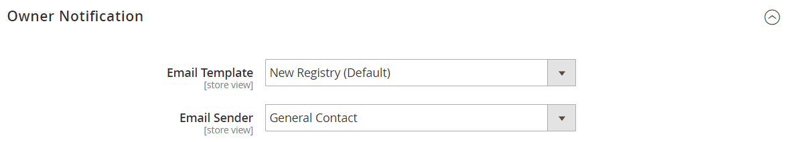
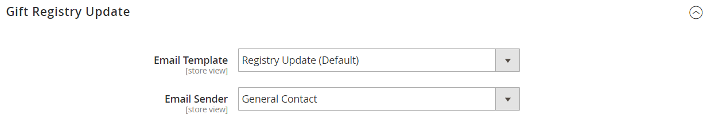

# 設定禮品登記簿

{{ee-feature}}

您必須先啟用禮品註冊並設定相關電子郵件通知，才能將禮品註冊提供給客戶。 Adobe Commerce會傳送下列電子郵件通知，以回應禮品登入工作流程中的事件。

- 建立新的贈品登入時，會傳送電子郵件給擁有者，其中包含可共用的登入連結。
- 或者，商店可以傳送包含贈品登入連結的通知，給贈品登入擁有者的朋友和家人。
- 從禮品註冊處購買物品時，系統會通知擁有者，但不會指出購買者。

Adobe Commerce針對這些可針對您的品牌自訂的電子郵件訊息，分別預先定義範本。

## 步驟1. 啟用贈品登記簿

1. 在&#x200B;_管理員_&#x200B;側邊欄上，移至&#x200B;**[!UICONTROL Stores]** > _[!UICONTROL Settings]_>**[!UICONTROL Configuration]**。

1. 在左側面板中，展開&#x200B;**[!UICONTROL Customers]**&#x200B;並選擇&#x200B;**[!UICONTROL Gift Registry]**

1. 展開 **[!UICONTROL General Options]**&#x200B;區段，然後執行下列動作：

   {width="600" zoomable="yes"}

   - 禮品登入預設為啟用。 如有必要，請將&#x200B;**[!UICONTROL Enable Gift Registry]**&#x200B;設為`Yes`。

   - 針對&#x200B;**[!UICONTROL Maximum Registrants]**，輸入可受邀參與贈品註冊活動的人數上限。

## 步驟2. 設定電子郵件通知

1. 展開 **[!UICONTROL Owner Notification]**&#x200B;區段，然後執行下列動作：

   {width="600" zoomable="yes"}

   - 選擇在建立禮品註冊時通知其擁有者的&#x200B;**[!UICONTROL Email Template]**。

   - 選擇顯示為郵件&#x200B;**[!UICONTROL Email Sender]**&#x200B;的[商店連絡人](../getting-started/store-details.md#store-email-addresses)。

1. 展開 **[!UICONTROL Gift Registry Sharing]**&#x200B;區段，然後執行下列動作：

   {width="600" zoomable="yes"}

   - 選擇在與贈品登入收件者共用登入時，通知贈品登入收件者的&#x200B;**[!UICONTROL Email Template]**。

   - 選擇顯示為郵件&#x200B;**[!UICONTROL Email Sender]**&#x200B;的存放區識別碼。

   - 針對&#x200B;**[!UICONTROL Maximum Sent Emails Threshold]**，輸入一次可傳送的最大電子郵件數量。

1. 展開 **[!UICONTROL Gift Registry Update]**&#x200B;區段，然後執行下列動作：

   {width="600" zoomable="yes"}

   - 選擇通知贈品登入擁有者登入變更的&#x200B;**[!UICONTROL Email Template]**。

   - 選擇顯示為郵件&#x200B;**[!UICONTROL Email Sender]**&#x200B;的存放區識別碼。

1. 完成時，按一下&#x200B;**[!UICONTROL Save Config]**。

1. 出現提示時，請更新快取。

   重新整理快取後，禮品註冊會顯示在「其他設定」下的「商店」功能表中，並可在客戶帳戶中使用。
