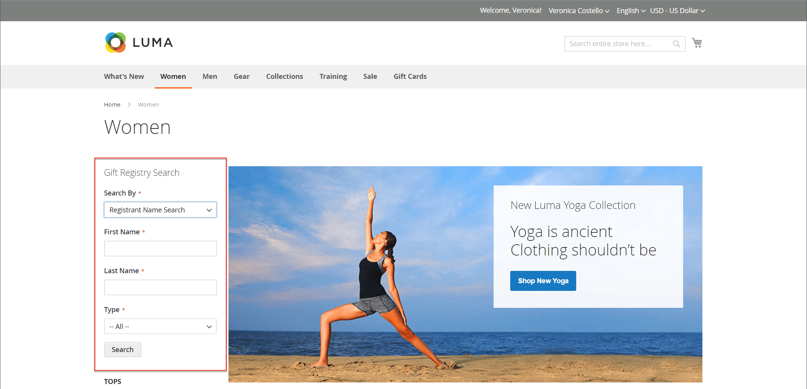
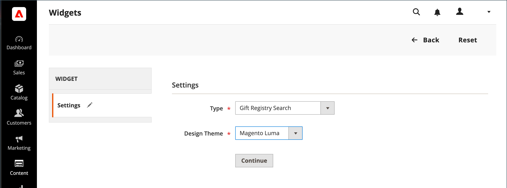

# 新增贈品登入搜尋

{{ee-feature}}

此 [Widget](../content-design/widgets.md) 工具可用來將禮品註冊搜尋方塊放置在商店中的大部分位置。 您可以指定可供客戶使用的搜尋選項，例如名稱、電子郵件地址及禮品註冊識別碼。 當客戶按一下「搜尋」按鈕時，結果會顯示在「贈品註冊搜尋」頁面上。 如果搜尋未傳回任何結果，客戶可以使用其他引數重試。

{width="700" zoomable="yes"}

## 設定禮品登入搜尋

1. 在 _管理員_ 側欄，前往 **[!UICONTROL Content]** > _[!UICONTROL Elements]_>**[!UICONTROL Widgets]**.

1. 在右上角，按一下 **[!UICONTROL Add Widget]**.

1. 選擇 **[!UICONTROL Settings]** 並執行下列動作：

   - 設定 **[!UICONTROL Type]** 至 `Gift Registry Search`.

   - 設定 **[!UICONTROL Design Theme]** 至商店使用的佈景主題。

   - 按一下 **[!UICONTROL Continue]**.

   {width="700" zoomable="yes"}

1. 在 _[!UICONTROL Storefront Properties]_區段，請執行下列動作：

   - 輸入 **[!UICONTROL Widget Title]** 以供內部參考。

   - 設定 **[!UICONTROL Assign to Store Views]** 前往可使用「禮品註冊搜尋」的商店檢視。

   - 設定 **[!UICONTROL Sort Order]** 當頁面上有其他區塊指派給相同位置時，決定禮品註冊搜尋區塊出現的順序。

   {width="700" zoomable="yes"}

1. 在 **[!UICONTROL Layout Updates]** 區段，按一下 **[!UICONTROL Add Layout Update]**.

1. 若要判斷禮品註冊搜尋出現在商店中的位置，請執行下列步驟：

   - 設定 **[!UICONTROL Display On]** 到您商店中要顯示禮品註冊搜尋區塊的頁面。

   - 如果適用，請選擇 **[!UICONTROL Categories]** 您希望它出現的位置。

   - 設定 **[!UICONTROL Container]** 到頁面上放置贈品註冊搜尋區塊的位置。

   {width="500" zoomable="yes"}

1. 在左側面板中，選擇 **[!UICONTROL Widget Options]**.

1. 若要決定網站訪客搜尋禮品註冊的方式，請選取下列符合條件的專案：

   - [!UICONTROL All Forms]
   - [!UICONTROL Registrant Name Search]
   - [!UICONTROL Registrant Email Search]
   - [!UICONTROL Gift Registry ID Search]

   {width="700" zoomable="yes"}

1. 完成後，按一下 **[!UICONTROL Save]**.

1. 當提示您重新整理頁面快取時，請按一下工作區頂端訊息中的連結，然後依照指示進行。

## 欄位說明

### [!UICONTROL Settings]

| 欄位 | 說明 |
|--- |--- |
| [!UICONTROL Type] | 識別 `Gift Registry Search` 作為Widget的型別。 |
| [!UICONTROL Design Theme] | 禮品註冊搜尋所在商店使用的佈景主題。 |

{style="table-layout:auto"}

### [!UICONTROL Storefront Properties]

| 欄位 | 說明 |
|--- |--- |
| [!UICONTROL Widget Title] | 內部參照的名稱。 |
| [!UICONTROL Assign to Store Views] | 識別可使用禮品註冊搜尋的存放區檢視。 |
| [!UICONTROL Sort Order] | 表示當有其他區塊指定出現在相同位置時，禮品註冊搜尋區塊出現的順序。 |

{style="table-layout:auto"}

### [!UICONTROL Layout Updates]

| 欄位 | 說明 |
|--- |--- |
| [!UICONTROL Display On] | 指示出現禮品註冊搜尋區塊的特定頁面或頁面型別。 |
| [!UICONTROL Categories] | 如果適用，會識別「禮品註冊搜尋」出現的類別頁面。 |
| [!UICONTROL Container] | 表示放置贈品登入搜尋的頁面配置區塊。 選項會因範本和主題而異。 |

{style="table-layout:auto"}

### [!UICONTROL Widget Options]

| 欄位 | 說明 |
|--- |--- |
| [!UICONTROL Quick Search Form Types] | 決定可用禮品註冊搜尋執行的搜尋型別。 選項： `All Forms` / `Registrant Name Search` /` Registrant Email Search` / `Gift Registry ID Search` |

{style="table-layout:auto"}
