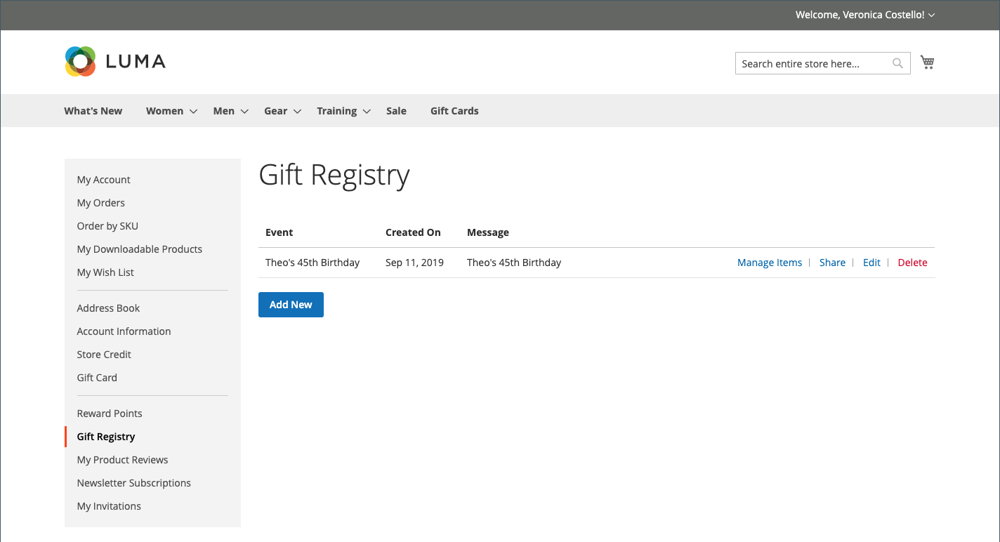

# 禮品登入店面體驗

{{ee-feature}}

此 [贈品登入](gift-registries.md) 「客戶帳戶」的區段會列出客戶目前的禮品登記處及相關事件。 客戶可以管理目前的註冊並新增新註冊。

{width="700" zoomable="yes"}

## 贈品登入資訊

客戶可以從其帳戶建立和管理禮品登記簿。 與每個登入型別相關的所有資訊都可從客戶帳戶取得。

{width="700" zoomable="yes"}

| 章節 | 說明 |
|--- |--- |
| [!UICONTROL General Information] | 此區段通常包含事件名稱、訊息或事件說明、隱私權設定以及事件狀態。 |
| [!UICONTROL Event Information] | 本節包含事件的位置和日期。 在婚禮上，可能也會包含每人可帶入的賓客數量。 |
| [!UICONTROL Gift Registry Details] | 這可能包括特定場合的其他資訊。 |
| [!UICONTROL Registrant Information] | 本區段包含每個將收到登入通知之人員的姓名和聯絡資訊。 對於婚禮登入，可以包含角色欄位，以將註冊者關聯為新娘或新郎的朋友。 |
| [!UICONTROL Shipping Address] | 本區段顯示送出禮品的位置，並包含電信業者遞送包裹所需的資訊。 |

{style="table-layout:auto"}

>[!NOTE]
>
>當贈品登入非使用中時，搜尋和連結無法用於登入。 如果稍後重新啟用登入，連結仍會中斷。

## 建立贈品登入

1. 客戶選擇 **[!UICONTROL Gift Registry]** 在其帳戶儀表板中。

1. 在 _贈品登入_ 頁面，點按 **[!UICONTROL Add New]**.

1. 選擇 **[!UICONTROL Gift Registry Type]**，例如：

   - 生日

   - Baby登入

   - 婚禮

1. 點擊數 **[!UICONTROL Next]**.

1. 輸入必要資訊，然後按一下 **[!UICONTROL Save]**.

## 將產品新增至登入

1. 客戶開啟要加入贈品註冊事件的產品。

1. 點擊數 **[!UICONTROL Add to Cart]**.

1. 點按次數 **[!UICONTROL View and Edit Cart]** 在迷你購物車上。

1. 在「購物車」頁面上，選取他們想要的事件，然後按一下/點選 **[!UICONTROL Add All To Gift Registry]**.

   專案會新增至所選事件的贈品登入。

## 共用贈品登入

1. 客戶從他們的帳戶控制面板，前往 **[!UICONTROL Gift Registry]**.

1. 尋找要管理的登入事件，然後按一下 **[!UICONTROL Share]**.

1. 輸入必要資訊並按一下 **[!UICONTROL Share Gift Registry]**.

## 編輯贈品登入

1. 客戶從他們的帳戶控制面板，前往 **[!UICONTROL Gift Registry]**.

1. 尋找要管理的登入事件，然後按一下 **[!UICONTROL Edit]**.

1. 視需要變更任何選項。

1. 編輯必要的選項並按一下 **[!UICONTROL Save]**.

## 管理禮品登入專案

1. 客戶從他們的帳戶控制面板，前往 **[!UICONTROL Gift Registry]**.

   {width="700" zoomable="yes"}

1. 尋找登入事件，選取要管理的專案，然後按一下 **[!DNL Manage Items]**.

1. 變更必要的選項，例如 **[!UICONTROL Note]** 和 **[!UICONTROL Qty]**.

1. 如有需要，請選取核取方塊，然後按一下「 」，將專案從贈品登錄檔中移除 **[!UICONTROL Delete]**.

1. 點按次數 **[!UICONTROL Update Gift Registry]** 以儲存變更。

## 刪除禮品登入

1. 客戶從他們的帳戶控制面板，前往 **[!UICONTROL Gift Registry]**.

1. 尋找要管理的登入事件，然後按一下 **[!UICONTROL Delete]**.

1. 點按次數 **[!UICONTROL OK]** 以確認。
