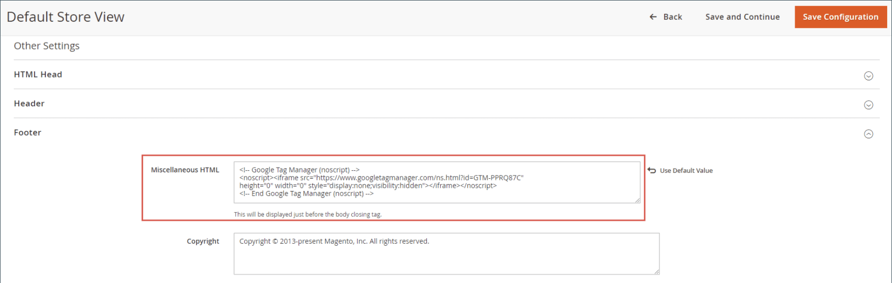

# [!DNL Google Tag Manager]

{{ee-feature}}

[!DNL Google Tag Manager]可協助您管理與行銷活動活動相關的許多標籤（程式碼片段）。 [!DNL Google Tag Manager]可讓您將追蹤標籤新增至您的網站，以測量對象，或個人化、重新鎖定目標或執行搜尋引擎行銷計畫。

[!DNL Google Tag Manager]會將資料和事件直接傳輸到[!DNL Google Analytics]、增強型電子商務和其他協力廠商分析解決方案，以清楚瞭解您的網站、產品和促銷活動的執行狀況。

您應該有[!DNL Google Analytics]和[!DNL Tag Manager]帳戶才能繼續此程式。 下列指示會逐步引導您完成設定Google帳戶、設定Commerce商店及建立標籤的程式。

>[!NOTE]
>
>如果您的企業受到隱私權法規的約束，例如[一般資料保護規範](../getting-started/compliance-gdpr.md)和/或[加州消費者隱私保護法](../getting-started/compliance-ccpa.md)，請參閱[Google隱私權設定](google-tools.md#google-privacy-settings)。

## 步驟1. 設定您的[!DNL Google Analytics]帳戶

請參閱Google說明中的[設定網站搜尋](https://support.google.com/analytics/answer/1012264)，瞭解開始使用所需的基礎知識。 另請參閱[Google Analytics](https://support.google.com/analytics/answer/9304153)和[Google Tag Manager](https://support.google.com/tagmanager/answer/6102821)的Google指南。

1. 登入您的[!DNL Google Analytics]帳戶。

1. 若要啟用&#x200B;**[!UICONTROL Internal Site Search Tracking]**，請執行下列動作：

   - 導覽至&#x200B;**[!UICONTROL Select View]** > **[!UICONTROL View Settings]**。

   - 將&#x200B;**[!UICONTROL Site Search Tracking]**&#x200B;設為`On`。

   - 將&#x200B;**[!UICONTROL Query]**&#x200B;引數設定為`q`。

   - 完成後，**[!UICONTROL Save]**&#x200B;設定。

1. 若要啟用顯示功能，請執行下列動作：

   - 選擇&#x200B;**[!UICONTROL Property Settings]**。

   - 在&#x200B;_[!UICONTROL Advertising Features]_底下，將&#x200B;**[!UICONTROL Enable Demographics and Interest Reports]**設定為`On`。

   - **[!UICONTROL Save]**&#x200B;設定。

1. 若要啟用電子商務追蹤，請執行以下操作：

   - 導覽至&#x200B;**[!UICONTROL Select View]** > **[!UICONTROL Ecommerce Settings]**。

   - 將&#x200B;**[!UICONTROL Enable Ecommerce]**&#x200B;設為`On`。

   - 將&#x200B;**[!UICONTROL Enable Enhanced Ecommerce Reporting]**&#x200B;設為`On`。

   - **[!UICONTROL Save]**&#x200B;設定。

1. 重新載入頁面，並確認所有設定仍為`On`。

   >[!NOTE]
   >
   >如果並非所有設定都是`On`，請重複先前的步驟、儲存並重新載入頁面。 重複此程式，直到所有設定皆設為`On`為止。

## 步驟2. 設定您的[!DNL Google Tag Manager]帳戶

下列指示顯示如何使用基本設定來設定新容器。 範例[Composer](https://developer.adobe.com/commerce/php/development/composer/)組態(.json)檔案可用來簡化程式，匯入可在新容器中產生標籤。 在此範例中，建議建立容器，而非修改現有容器。

>[!NOTE]
>
>如需詳細資訊，請參閱Google的[容器匯出與匯入](https://support.google.com/tagmanager/answer/6106997)。 這些指示會提供逐步解說，說明如何將JSON範例匯入新容器中。

1. 下載連結的檔案[GTM_M2_Config_json.txt](./assets/GTM_M2_Config_json.txt)，在編輯器中開啟該檔案，並將其儲存為`GTM_M2_Config.json`。

   json檔案已直接上傳至[!DNL Google Tag Manager]。

1. 導覽至&#x200B;**[!UICONTROL Admin]** > **[!UICONTROL Container]** > **[!UICONTROL Import Container]**。

1. 按一下&#x200B;**[!UICONTROL Choose container file]**&#x200B;並選取json檔案。

1. 在&#x200B;**[!UICONTROL Choose workspace]**&#x200B;底下，按一下&#x200B;**[!UICONTROL New]**。

1. 輸入標題和說明，然後按一下&#x200B;**[!UICONTROL Save]**。

1. 若要匯入檔案，請選取下列動作之一：

   - 應該為新容器選取&#x200B;**[!UICONTROL Overwrite]**&#x200B;選項。

   - 如果您使用現有容器，則應選取&#x200B;**[!UICONTROL Merge]**&#x200B;選項。

1. 按一下&#x200B;**[!UICONTROL Preview]**&#x200B;以檢閱標籤、觸發器和變數。

1. 若要編輯變數中參考的&#x200B;**[!UICONTROL Google Analytics ID]**，請執行下列動作：

   - 導覽至&#x200B;**[!UICONTROL Variables]** > **[!UICONTROL User-Defined Variables]**。

   - 選擇&#x200B;**[!UICONTROL Google Analytics]**&#x200B;並使用您自己的&#x200B;**[!UICONTROL GA ID]**&#x200B;更新預留位置(`UA-xxxxxx-x`)。

1. 依照Google的指示，將標籤、觸發器和變數新增至新容器。

   如果您在另一個要使用的容器中有設定，可將它們移至新容器。

1. 完成時，請按一下&#x200B;**[!UICONTROL Confirm]**。

1. 依照Google的指示發佈新容器。

## 步驟3. 設定您的商店

{{gtag-api-note}}

1. 登入Commerce商店的管理員。

1. 在&#x200B;_管理員_&#x200B;側邊欄上，移至&#x200B;**[!UICONTROL Stores]** > _[!UICONTROL Settings]_>**[!UICONTROL Configuration]**。

1. 在左側面板中，展開&#x200B;**[!UICONTROL Sales]**&#x200B;並選擇&#x200B;**[!UICONTROL Google API]**。

1. 展開 **[!UICONTROL Google Analytics]**&#x200B;區段並設定下列專案：

   {width="600" zoomable="yes"}

   - 將&#x200B;**[!UICONTROL Enable]**&#x200B;設為`Yes`。

   - 將&#x200B;**[!UICONTROL Account type]**&#x200B;設為`Google Tag Manager`。

   - 在&#x200B;**[!UICONTROL Container ID]**&#x200B;欄位中，輸入您的GTM ID (`GTM-xxxxxx`)。

   - 如果您也使用Google Analytics進行內容實驗，請將&#x200B;**啟用內容實驗**&#x200B;設定為`Yes`。

   - 對其餘欄位使用預設值。

1. 完成時，按一下&#x200B;**[!UICONTROL Save Config]**。

1. 測試您的[!DNL Google Tag Manager]設定，並確認一切正常運作。

>[!NOTE]
>
>每個容器都與一個網站相關聯，每個帳戶只需要一個容器。 如果您有多網站Commerce例項，則需要個別的容器。

## 步驟4. 將GTM程式碼新增至您的Adobe Commerce市集

1. 若要複製GTM程式碼，請移至&#x200B;**[!UICONTROL Admin]** > **[!UICONTROL Install Google Tag Manager]**。

   有兩種GTM程式碼片段要新增至您的Commerce網站： `<head>`標籤的第一個，以及`<body>`標籤的第二個。

1. 在Commerce Admin中，前往「**[!UICONTROL Content]** > _[!UICONTROL Design]_>**[!UICONTROL Configuration]**」並以編輯模式開啟商店檢視。

1. 在&#x200B;_[!UICONTROL Other Settings]_底下，展開&#x200B;**[!UICONTROL HTML Head]**並將您從GTM為&#x200B;**[!UICONTROL Scripts and Style Sheets]**欄位中的`<head>`標籤複製的程式碼貼上。

   {width="600" zoomable="yes"}

1. 展開&#x200B;**[!UICONTROL Footer]**&#x200B;並在&#x200B;**[!UICONTROL Miscellaneous HTML]**&#x200B;欄位中貼上`<body>`的GTM程式碼。

   {width="600" zoomable="yes"}

1. 完成時，按一下&#x200B;**[!UICONTROL Save Configuration]**。

## 欄位說明

| 欄位 | 範圍 | 說明 |
|--- |--- |--- |
| [!UICONTROL Enable] | 存放區檢視 | 決定Google Analytics Enhanced E-commerce是否可用來分析商店中的活動。 選項： `Yes` / `No` |
| [!UICONTROL Account type] | 存放區檢視 | 決定用來監控商店活動和流量的Google追蹤代碼。 選項： `Google Analytics` / `Google Tag Manager` |
| [!UICONTROL Anonymize IP] | 存放區檢視 | 決定是否從Google Analytics結果中顯示的IP位址中移除識別資訊。 |
| [!UICONTROL Enable Content Experiments] | 存放區檢視 | 啟用Google內容實驗，此實驗可用來測試最多十個相同頁面的不同版本。 選項： `Yes` / `No` |
| [!UICONTROL Container Id] | 存放區檢視 | 如果已為商店安裝和設定[!DNL Google Tag Manager]，則容器ID會自動出現在此欄位中。 |
| [!UICONTROL List property for the catalog page] | 存放區檢視 | 識別與目錄頁面相關聯的Tag Manager屬性。 預設值： `Catalog Page` |
| [!UICONTROL List property for the cross-sell block] | 存放區檢視 | 識別與交叉銷售區塊相關聯的Tag Manager屬性。 預設值： `Cross-sell` |
| [!UICONTROL List property for the up-sell block] | 存放區檢視 | 識別與向上銷售區塊相關聯的Tag Manager屬性。 預設值： `Up-sell` |
| [!UICONTROL List property for the related products block] | 存放區檢視 | 識別與相關產品區塊相關聯的Tag Manager屬性。 預設值： `Related Products` |
| [!UICONTROL List property for the search results page] | 存放區檢視 | 識別與搜尋結果頁面相關聯的Tag Manager屬性。 預設值： `Search Results` |
| [!UICONTROL "Internal Promotions" for promotions field "Label"] | 存放區檢視 | 識別與內部促銷活動標籤相關聯的Tag Manager屬性。 預設值： `Label` |

{style="table-layout:auto"}

## 建立標籤以追蹤轉換

如果您有Google AdWords帳戶，則可建立追蹤轉換的標籤。 下列範例說明如何使用[!DNL Google Tag Manager]和[!DNL Google Analytics]來建立會在您商店的轉換&#x200B;_成功_&#x200B;頁面上引發的標籤。

### 步驟1. 建立標籤

1. 登入您的[!DNL Google Tag Manager]帳戶，然後按一下您為商店建立的容器連結。

1. 在&#x200B;**[!UICONTROL New Tag]**&#x200B;方塊中，按一下&#x200B;**[!UICONTROL Add a new tag]**。

1. 從您的AdWords帳戶取得下列資訊：

   - 轉換ID
   - 轉換標籤

   若您需要協助，請造訪Google的[支援網站](https://support.google.com/tagmanager/answer/6105160)。

1. 從[!DNL Google Tag Manager]儀表板，按一下&#x200B;**[!UICONTROL Google AdWords]**&#x200B;並執行下列動作：

   - 按一下標題預留位置，然後輸入新標籤的名稱。

   - 在&#x200B;**[!UICONTROL Choose Product]**&#x200B;下，選取&#x200B;**[!UICONTROL Google AdWords]**。

   - 在&#x200B;_[!UICONTROL Choose a Tag Type]_下，選取&#x200B;**[!UICONTROL AdWords Conversion Tracking]**並按一下&#x200B;**[!UICONTROL Continue]**。

1. 從您的AdWords帳戶輸入&#x200B;**[!UICONTROL Conversion ID]**&#x200B;和&#x200B;**[!UICONTROL Conversion Label]**，然後按一下&#x200B;**[!UICONTROL Continue]**。

### 步驟2. 建立規則

繼續從[!DNL Google Tag Manager]儀表板，下一步是建立規則，在轉換頁面上觸發標籤。

1. 在&#x200B;**[!UICONTROL Fire On]**&#x200B;底下，按一下&#x200B;**[!UICONTROL Some Pages]**。

1. 在&#x200B;_[!UICONTROL Choose Pages]_區段中，完成下列設定：

   - **[!UICONTROL Name]** — 輸入頁面說明的名稱。

   - **[!UICONTROL Variable]** `url`

   - **作業** - `matches RegEx`

     若要深入瞭解，請參閱Google標籤管理員說明中的[Regex和CSS選取器運運算元](https://support.google.com/tagmanager/answer/7679109)。

   - **[!UICONTROL Value]** - `checkout/success.*`

1. 選取綠色核取方塊並按一下&#x200B;**[!UICONTROL Save]**。

   您設定的觸發程式會在「引發於」區段中顯示為藍色按鈕。

1. 完成時，按一下&#x200B;**[!UICONTROL Save Tag]**。

### 步驟3. 預覽和發佈

此程式的下一個步驟是預覽標籤。 每次預覽標籤時，都會儲存版本的快照。 當您對結果感到滿意時，請移至您要使用的版本，然後按一下&#x200B;**[!UICONTROL Publish]**。
