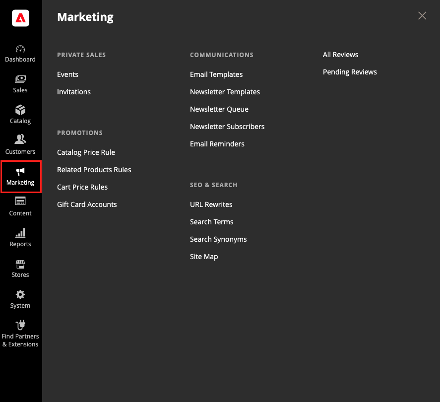

# [!UICONTROL Marketing] 功能表

此 [!UICONTROL Marketing] 功能表提供存取工具，用於管理促銷活動、通訊、SEO和使用者產生的內容。

{width="600" zoomable="yes"}

## 顯示 [!UICONTROL Marketing] 功能表

在 _管理員_ 側欄，按一下 **[!UICONTROL Marketing]**.

## 主要區段

### [!UICONTROL Promotions]

建立 [目錄](price-rules-catalog.md) 和 [購物車](price-rules-cart.md) 根據各種條件觸發折扣的價格規則。 設定 [促銷活動](introduction.md#promotions) 當滿足所需條件時，該動作就會開始執行。

 (僅限Adobe Commerce)建立 [相關產品規則](product-related-rules.md) 和管理 [禮品卡帳戶](../stores-purchase/product-gift-card-accounts.md).

### [!UICONTROL Private Sales]

{{ee-feature}}

私人銷售和其他型錄活動是您利用現有客戶群產生熱門話題和新潛在客戶（僅限成員獨佔存取，或透過邀請）的好方法。

### [!UICONTROL Channels]

透過擴大銷售至其他網路商店增加收入 [Amazon Marketplace整合](https://experienceleague.adobe.com/docs/commerce-channels/amazon/overview.html). 「色版」子選單只有在已設定AmazonSales Channel時才會出現。

>[!TIP]
>
>Channel Manager透過將Adobe Commerce或Magento Open Source產品目錄與沃爾瑪市集整合，協助商戶增加銷售、接觸新客戶、簡化銷售作業，並節省時間。 請參閱 [_Channel Manager指南_](https://experienceleague.adobe.com/docs/commerce-channels/channel-manager/intro-to-channel-manager/overview.html) 如需Channel Manager安裝、上線、設定和管理的詳細資訊。

### [!UICONTROL Communications]

自訂從您的商店傳送的所有通知。 建立 [電子報](newsletters.md) 並發佈 [RSS](social-rss.md#rss-feeds) 摘要。

 (僅限Adobe Commerce)設定會傳送的規則 [電子郵件提醒](email-reminder-rules.md) 當符合條件時提供給客戶。

### [!UICONTROL SEO & Search]

分析 [搜尋詞](../catalog/search-terms.md) 和 [同義字](../catalog/search-terms.md#search-synonyms) 若要協助客戶在商店中尋找產品，請管理 [中繼資料](meta-data.md)，並建立 [網站地圖](sitemap-xml.md). 使用 [重新導向](url-rewrite.md) 管理URL變更並避免連結損毀。

### [!UICONTROL User Content]

合併使用者產生的專案 [產品評論](product-reviews.md) 營造社群意識，提升銷售額。
