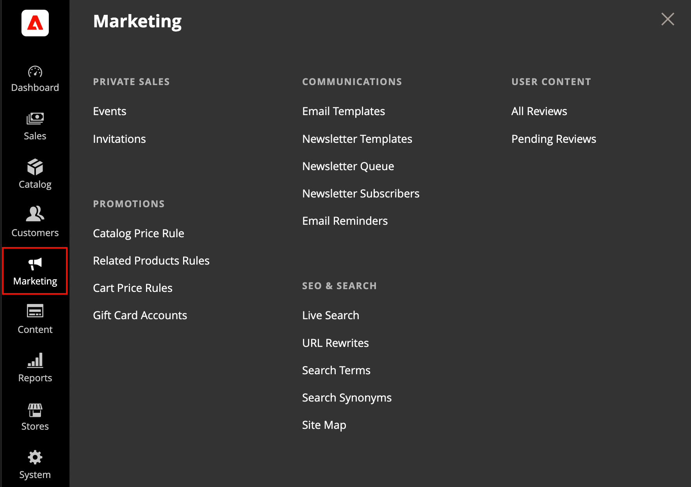

# [!UICONTROL Marketing]功能表

[!UICONTROL Marketing]功能表提供存取工具，用於管理促銷活動、通訊、SEO和使用者產生的內容。

>[!BEGINTABS]

>[!TAB Adobe Commerce]

僅[!BADGE 個PaaS]{type=Informative url="https://experienceleague.adobe.com/zh-hant/docs/commerce/user-guides/product-solutions" tooltip="僅適用於雲端專案（Adobe管理的PaaS基礎結構）和內部部署專案的Adobe Commerce 。"}

{width="600" zoomable="yes"}

>[!TAB Adobe Commerce as a Cloud Service]

僅[!BADGE SaaS]{type=Positive url="https://experienceleague.adobe.com/zh-hant/docs/commerce/user-guides/product-solutions" tooltip="僅適用於Adobe Commerce as a Cloud Service和Adobe Commerce Optimizer專案（Adobe管理的SaaS基礎結構）。"}

{width="600" zoomable="yes"}

>[!ENDTABS]

## 顯示[!UICONTROL Marketing]功能表

在&#x200B;_管理員_&#x200B;側邊欄上，按一下&#x200B;**[!UICONTROL Marketing]**。

## 主要區段

### [!UICONTROL Promotions]

建立根據各種條件觸發折扣的[目錄](price-rules-catalog.md)和[購物車](price-rules-cart.md)價格規則。 設定[促銷活動](introduction.md#promotions)，當符合必要的條件時，便會開始執行。

 （僅限Adobe Commerce）建立[相關產品規則](product-related-rules.md)並管理[禮卡帳戶](../stores-purchase/product-gift-card-accounts.md)。

### [!UICONTROL Private Sales]

僅[!BADGE 個PaaS]{type=Informative url="https://experienceleague.adobe.com/zh-hant/docs/commerce/user-guides/product-solutions" tooltip="僅適用於雲端專案（Adobe管理的PaaS基礎結構）和內部部署專案的Adobe Commerce 。"}

{{ee-feature}}

私人銷售和其他型錄活動是您利用現有客戶群產生熱門話題和新潛在客戶（僅限成員獨佔存取，或透過邀請）的好方法。

### [!UICONTROL Communications]

自訂從您的商店傳送的所有通知。 建立[電子報](newsletters.md)並發佈[RSS](social-rss.md#rss-feeds)摘要。

 （僅限Adobe Commerce）設定當符合條件時傳送[電子郵件提醒](email-reminder-rules.md)給客戶的規則。

### [!UICONTROL SEO & Search]

分析[搜尋詞](../catalog/search-terms.md)和[同義字](../catalog/search-terms.md#search-synonyms)以協助客戶尋找商店中的產品、管理[中繼資料](meta-data.md)以及建立[網站地圖](sitemap-xml.md)。 使用[重新導向](url-rewrite.md)管理URL變更並避免連結損毀。

### [!UICONTROL User Content]

僅[!BADGE 個PaaS]{type=Informative url="https://experienceleague.adobe.com/zh-hant/docs/commerce/user-guides/product-solutions" tooltip="僅適用於雲端專案（Adobe管理的PaaS基礎結構）和內部部署專案的Adobe Commerce 。"}

合併使用者產生的[產品評論](product-reviews.md)，以建立社群意識並提高銷售量。
