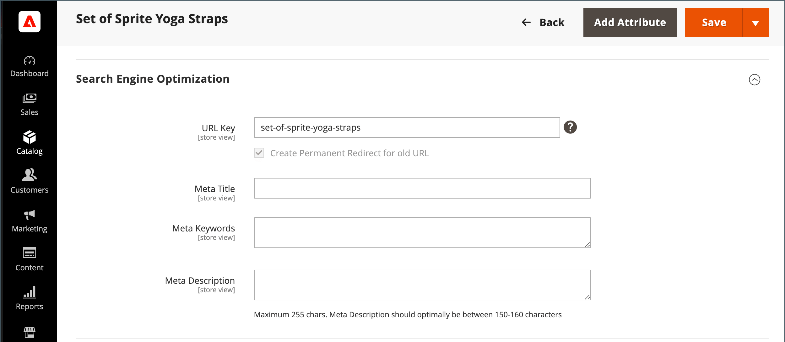

# 中繼資料

您的商店會載入您可輸入關鍵字豐富中繼資料的位置，以改善搜尋引擎為您的網站編制索引的方式。 在設定存放區時，您可能會輸入初步中繼資料，並打算稍後完成。 您可以長期微調中繼資料，以鎖定客戶的購買模式和偏好設定。

{width="700" zoomable="yes"}

## 中繼標題

中繼標題會顯示在瀏覽器和搜尋結果清單的標題列和標籤中。 中繼標題應為頁面唯一的，且長度應小於70個字元。

{width="600"}

## 中繼關鍵字

雖然有些搜尋引擎會忽略中繼關鍵字，有些仍會繼續使用。 目前的最佳實務是在中繼標題和中繼說明中加入高值關鍵字。

{width="500"}

## 中繼說明

中繼說明提供搜尋結果清單頁面的簡短概觀。 在理想的情況下，中繼說明的長度應介於150到160個字元之間，不過欄位可接受最多255個字元。

## 豐富的程式碼片段

豐富的程式碼片段提供搜尋結果清單和其他應用程式的詳細資訊。 依照預設，以[schema.org][1]標準為基礎的結構化資料標籤會新增到您商店的產品範本。 因此，搜尋引擎有更多資訊可在產品清單中當作&#x200B;_豐富的程式碼片段_。

## 規範Meta標籤

有些搜尋引擎會懲罰具有多個URL且指向相同內容的網站。 標準meta標籤會告訴搜尋引擎，當多個URL具有相同或類似內容時，要索引哪個頁面。 使用標準中繼標籤可以改善您的網站排名和彙總頁面檢視。 標準Meta標籤放置在產品或類別頁面的`<head>`區塊中。 它會提供您偏好URL的連結，因此搜尋引擎會賦予該URL更大的權重。

### 範例1：類別路徑會建立重複的URL

例如，如果您的目錄設定為在產品URL中包含類別路徑，則您的商店會產生多個指向相同產品頁面的URL。

    http://mystore.com/gear/bags/driven-backpack.html
    http://mystore.com/driven-backpack.html

### 範例2：類別頁面完整URL

啟用類別的規範meta標籤後，您商店的類別頁面會包含通往完整類別URL的規範URL：

    http://mystore.com/gear/bags/

### 範例3：產品頁面完整URL

啟用產品的規範中繼標籤時，產品頁面會包含連線至網域名稱/產品URL金鑰的規範URL，因為產品URL金鑰是全域唯一的。

    http://mystore.com/driven-backpack.html

如果您也要將類別路徑納入產品URL中，標準URL會保留網域名稱/產品URL金鑰。 不過，您也可以使用完整URL （包含類別）存取產品。 例如，如果產品URL金鑰是`driven-backpack`並且指派給Gear > Bag類別，則可以使用其中一個URL存取產品。

您可以省略URL中的類別，或使用canonical meta標籤將搜尋引擎導向到依產品或類別編制索引，藉此避免受到搜尋引擎的懲罰。 建議您為類別和產品啟用標準中繼標籤，此為最佳作法。

### 啟用規範meta標籤

1. 在&#x200B;_管理員_&#x200B;側邊欄上，移至&#x200B;**[!UICONTROL Stores]** > _[!UICONTROL Settings]_>**[!UICONTROL Configuration]**。

1. 在左側面板中，展開&#x200B;**[!UICONTROL Catalog]**&#x200B;並在下方選擇&#x200B;**[!UICONTROL Catalog]**。

1. 展開&#x200B;**搜尋引擎最佳化**&#x200B;區段的。

   若要變更任何欄位值，您必須先清除每個欄位後面的&#x200B;**使用系統值**&#x200B;核取方塊。

   {width="600" zoomable="yes"}

1. 如果您希望搜尋引擎僅使用完整類別路徑來索引類別頁面，請執行下列動作：

   - 將&#x200B;**類別**&#x200B;的`Yes`使用標準連結中繼標籤。

   - 將產品&#x200B;**的**&#x200B;使用標準連結中繼標籤`No`設定為。

1. 如果您希望搜尋引擎只使用網域名稱/product-url-key格式來索引產品頁面，請執行下列動作：

   - 將產品&#x200B;**的**&#x200B;使用標準連結中繼標籤`Yes`設定為。

   - 將&#x200B;**類別**&#x200B;的`No`使用標準連結中繼標籤。

1. 完成時，按一下&#x200B;**[!UICONTROL Save Config]**。

## 中繼資料示範

觀看此影片以瞭解如何管理SEO中繼資料：

>[!VIDEO](https://video.tv.adobe.com/v/343750?quality=12)

[1]: https://schema.org/
