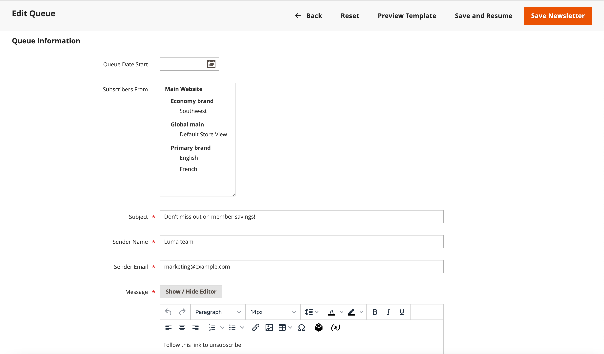

# Newsletter佇列

為了管理伺服器上的負載，含有許多訂閱者的電子報會以多個批次的佇列傳送。 您可以定期檢查Newsletter佇列以檢查狀態，並檢視已處理的數量。 傳輸期間發生的任何問題都會顯示在&#x200B;_Newsletter問題_&#x200B;報告中。

## 傳送Newsletter

1. 在&#x200B;_管理員_&#x200B;功能表中，前往&#x200B;**[!UICONTROL Marketing]** > _[!UICONTROL Communications]_>**[!UICONTROL Newsletter Template]**。

1. 在網格中，尋找要傳送的[電子報範本](newsletter-template.md)，並將&#x200B;**[!UICONTROL Action]**&#x200B;欄設定為`Queue Newsletter`。

1. 針對&#x200B;**[!UICONTROL Queue Date Start]**，從行事曆（）選取傳輸開始日期。

1. 針對&#x200B;**[!UICONTROL Subscribers From]**，選取要包含在電子郵件爆炸中的每個商店檢視。

1. 填妥電子郵件標題資訊：

   - 為電子郵件標題的&#x200B;**[!UICONTROL Subject]**&#x200B;行輸入電子報的簡短說明。

   - 輸入&#x200B;**[!UICONTROL Sender Name]**。

   - 針對&#x200B;**[!UICONTROL Sender Email]**，輸入寄件者的電子郵件地址。

     寄件者的預設名稱和電子郵件地址在設定中指定。

     {width="600" zoomable="yes"}

1. 如果適用，請在指示上方的&#x200B;**[!UICONTROL Message]**&#x200B;方塊中輸入取消訂閱的備註。

   >[!NOTE]
   >
   >請勿移除許多司法管轄區法律要求的指示。

1. 若要將自訂樣式套用至Newsletter，請將它們新增至「**[!UICONTROL Newsletter Styles]**」欄位。

1. 完成時，按一下&#x200B;**[!UICONTROL Save and Resume]**。

   Newsletter會出現在等待處理的佇列中。

## 檢查問題

在&#x200B;_管理員_&#x200B;功能表中，前往&#x200B;**[!UICONTROL Reports]** > _[!UICONTROL Marketing]_>**[!UICONTROL Newsletter Problem Reports]**。

## 按鈕列

| 按鈕 | 說明 |
|--- |--- |
| **[!UICONTROL Back]** | 返回「Newsletter範本」頁面而不儲存變更。 |
| **[!UICONTROL Reset]** | 將佇列資訊表單中未儲存的任何變更重設為先前的值。 |
| **[!UICONTROL Preview Template]** | 在個別標籤中開啟預覽頁面。 |
| **[!UICONTROL Save and Resume]** | 儲存所有所做的變更。 將Newsletter放入佇列。 |
| **[!UICONTROL Save Newsletter]** | 儲存所有所做的變更。 將Newsletter放入佇列。 |

{style="table-layout:auto"}

## 欄

| 欄 | 說明 |
|--- |--- |
| [!UICONTROL ID] | 指派給每個Newsletter範本的唯一數值識別碼。 |
| [!UICONTROL Queue Start] | 電子報的寄出日期。 |
| [!UICONTROL Queue End] | 電子報完成傳送的日期。 |
| [!UICONTROL Subject] | Newsletter範本的主題。 |
| [!UICONTROL Status] | 表示Newsletter郵件的狀態。 可能的值： `Sent`、`Canceled`、`Not Sent`、`Sending`或`Paused`。 |
| [!UICONTROL Processed] | 表示已傳送多少電子報。 |
| [!UICONTROL Recipients] | 表示訂閱者已收到多少電子報。 |
| [!UICONTROL Actions] | **[!UICONTROL Preview]**：開啟個別視窗以預覽範本。 |

{style="table-layout:auto"}
