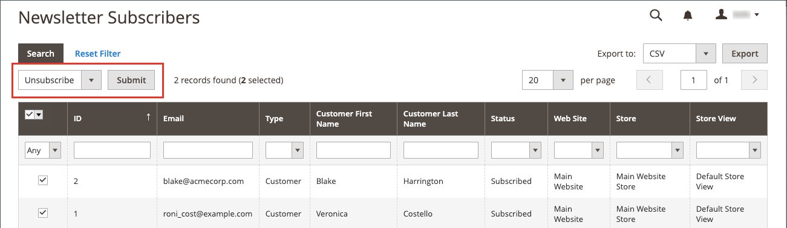
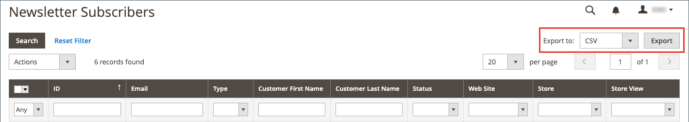

# 管理Newsletter訂閱者

您應定期管理訂閱清單，並確保處理任何取消訂閱的請求，此為最佳作法。 在某些司法權區，法律規定在特定期間內處理取消訂閱的請求。

您可以使用作用中訂閱的簡單清單，輕鬆管理訂閱者。 當客戶提交取消訂閱請求時，您只需套用 _取消訂閱_ 一個或多個選定訂閱的動作。

在具有多個商店檢視的單一網站設定中，客戶帳戶訂閱可以與特定商店檢視相關聯。

使用全域進行多商店和多網站設定 [客戶帳戶範圍](../customers/customer-account-scope.md)，客戶帳戶可以訂閱多個網站/商店的商務通訊。 在這種情況下，您可能想要編輯客戶帳戶以管理訂閱群組，或取消特定網站/商店的訂閱以履行請求。

如果您想要使用協力廠商服務來傳送電子報，可以將訂閱清單匯出為CSV或XML檔案。

## 管理客戶的訂閱

1. 在 _管理員_ 側欄，前往 **[!UICONTROL Customers]** > **[!UICONTROL All Customers]**.

1. 在格線中尋找客戶，然後按一下 **[!UICONTROL Edit]** 在 _[!UICONTROL Action]_欄。

1. 按一下 **[!UICONTROL Newsletter]** 在左側面板中。

1. 根據您的網站/商店設定修改客戶的訂閱。

   若為單一網站/單一商店設定，您只需選取或清除 **[!UICONTROL Subscribed to Newsletter]** 核取方塊。

   {width="500" zoomable="yes"}

   若為單一網站/多商店設定，您可以選取或清除 **[!UICONTROL Subscribed to Newsletter]** 核取方塊並設定 **[!UICONTROL Subscribed on Store View]** 以取得正確的商店檢視。

   {width="500" zoomable="yes"}

   針對具有全域客戶帳戶範圍的多地點/多商店設定，頁面會顯示所有地點的訂閱狀態。 您可以選取或清除 **[!UICONTROL Subscribed]** 核取方塊及/或變更 **[!UICONTROL Store View]** 以取得訂閱。

   {width="500" zoomable="yes"}

1. 按一下 **[!UICONTROL Save Customer]**.

## 從訂閱者清單取消訂閱

1. 在 _管理員_ 側欄，前往 **[!UICONTROL Marketing]** > _[!UICONTROL Communications]_>**[!UICONTROL Newsletter Subscribers]**.

   針對部分客戶有多個網站訂閱的多網站設定，每個訂閱都會顯示為格線中的條列專案。

1. 在網格中尋找訂戶，並選取第一欄中的核取方塊。

   >[!NOTE]
   >
   >若要大量取消訂閱，請選取您要取消之每個訂閱者的核取方塊。

1. 設定 _[!UICONTROL Action]_控制項至&#x200B;**[!UICONTROL Unsubscribe]**並按一下&#x200B;**[!UICONTROL Submit]**.

   {width="600" zoomable="yes"}

   記錄的狀態變更為 `Unsubscribed`.

## 匯出訂閱者清單

1. 從 _[!UICONTROL Newsletter Subscribers]_清單，使用篩選控制項僅包含具有下列條件的記錄：_&#x200B;狀態&#x200B;_之 `Subscribed` 和以取得適當的網站、商店或商店檢視。

1. 設定 **[!UICONTROL Export to]** 控制下列其中一項：

   - `CSV`
   - `XML`

1. 按一下 **[!UICONTROL Export]** 並尋找熒幕底部的提示，然後儲存檔案。

   {width="600" zoomable="yes"}

## 從訂閱者清單中刪除訂閱者

1. 在 _管理員_ 側欄，前往 **[!UICONTROL Marketing]** > _[!UICONTROL Communications]_>**[!UICONTROL Newsletter Subscribers]**.

1. 在網格中尋找訂戶，並選取第一欄中的核取方塊。

1. 設定 _[!UICONTROL Action]_控制項至&#x200B;**[!UICONTROL Delete]**並按一下&#x200B;**[!UICONTROL Submit]**.

1. 提示確認時，按一下 **[!UICONTROL OK]**.
