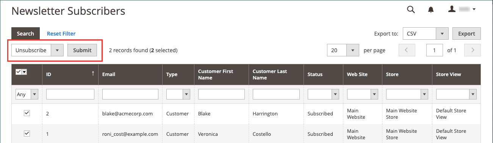

# 管理Newsletter訂閱者

您應定期管理訂閱清單，並確保處理任何取消訂閱的請求，此為最佳作法。 在某些司法權區，法律規定在特定期間內處理取消訂閱的請求。

您可以使用作用中訂閱的簡單清單，輕鬆管理訂閱者。 當客戶提交取消訂閱請求時，您只需將&#x200B;_取消訂閱_&#x200B;動作套用至一或多個選取的訂閱即可。

在具有多個商店檢視的單一網站設定中，客戶帳戶訂閱可以與特定商店檢視相關聯。

在具有全域[客戶帳戶範圍](../customers/customer-account-scope.md)的多存放區和多網站設定中，客戶帳戶可以訂閱多個網站/存放區的電子報。 在這種情況下，您可能想要編輯客戶帳戶以管理訂閱群組，或取消特定網站/商店的訂閱以履行請求。

如果您想要使用協力廠商服務來傳送電子報，可以將訂閱清單匯出為CSV或XML檔案。

## 管理客戶的訂閱

1. 在&#x200B;_管理員_&#x200B;側邊欄上，移至&#x200B;**[!UICONTROL Customers]** > **[!UICONTROL All Customers]**。

1. 在格線中尋找客戶，然後按一下&#x200B;_[!UICONTROL Action]_&#x200B;欄中的&#x200B;**[!UICONTROL Edit]**。

1. 按一下左側面板中的&#x200B;**[!UICONTROL Newsletter]**。

1. 根據您的網站/商店設定修改客戶的訂閱。

   若是單一網站/單一商店設定，您只需選取或清除「**[!UICONTROL Subscribed to Newsletter]**」核取方塊即可。

   {width="500" zoomable="yes"}

   若是單一網站/多存放區設定，您可以選取或清除&#x200B;**[!UICONTROL Subscribed to Newsletter]**&#x200B;核取方塊，並將&#x200B;**[!UICONTROL Subscribed on Store View]**&#x200B;設定為訂閱的正確存放區檢視。

   {width="500" zoomable="yes"}

   針對具有全域客戶帳戶範圍的多地點/多商店設定，頁面會顯示所有地點的訂閱狀態。 您可以選取或清除「**[!UICONTROL Subscribed]**」核取方塊及/或變更訂閱的&#x200B;**[!UICONTROL Store View]**。

   {width="500" zoomable="yes"}

1. 按一下&#x200B;**[!UICONTROL Save Customer]**。

## 從訂閱者清單取消訂閱

1. 在&#x200B;_管理員_&#x200B;側邊欄上，移至&#x200B;**[!UICONTROL Marketing]** > _[!UICONTROL Communications]_>**[!UICONTROL Newsletter Subscribers]**。

   針對部分客戶有多個網站訂閱的多網站設定，每個訂閱都會顯示為格線中的條列專案。

1. 在網格中尋找訂戶，並選取第一欄中的核取方塊。

   >[!NOTE]
   >
   >若要大量取消訂閱，請選取您要取消之每個訂閱者的核取方塊。

1. 將&#x200B;_[!UICONTROL Action]_&#x200B;控制項設為&#x200B;**[!UICONTROL Unsubscribe]**&#x200B;並按一下&#x200B;**[!UICONTROL Submit]**。

   {width="600" zoomable="yes"}

   記錄的狀態變更為`Unsubscribed`。

## 匯出訂閱者清單

1. 從&#x200B;_[!UICONTROL Newsletter Subscribers]_&#x200B;清單中，使用篩選器控制項僅包含具有_&#x200B;狀態&#x200B;_（共`Subscribed`個）的記錄，並用於適當的網站、商店或商店檢視。

1. 將&#x200B;**[!UICONTROL Export to]**&#x200B;控制項設定為下列其中一項：

   - `CSV`
   - `XML`

1. 按一下&#x200B;**[!UICONTROL Export]**，然後在熒幕底部尋找提示並儲存檔案。

   {width="600" zoomable="yes"}

## 從訂閱者清單中刪除訂閱者

1. 在&#x200B;_管理員_&#x200B;側邊欄上，移至&#x200B;**[!UICONTROL Marketing]** > _[!UICONTROL Communications]_>**[!UICONTROL Newsletter Subscribers]**。

1. 在網格中尋找訂戶，並選取第一欄中的核取方塊。

1. 將&#x200B;_[!UICONTROL Action]_&#x200B;控制項設為&#x200B;**[!UICONTROL Delete]**&#x200B;並按一下&#x200B;**[!UICONTROL Submit]**。

1. 提示確認時，按一下&#x200B;**[!UICONTROL OK]**。
