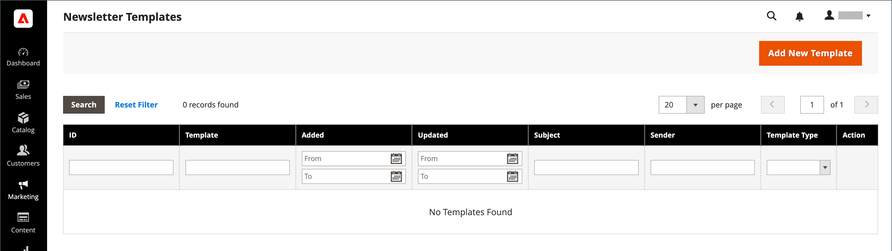

# Newsletter範本

您可以視需要建立多個電子報範本，以用於不同的用途。 您可以傳送每週產品更新、每月電子報或年度假日電子報。 新聞稿範本可以用HTML標籤或純文字來準備。 與HTML不同，純文字電子報不包含影像、RTF文字或格式化的連結。 在網格中，「範本型別」欄會指出範本是HTML還是文字。

{width="700" zoomable="yes"}

## 建立電子報範本

1. 在管理員側邊欄上，前往&#x200B;**[!UICONTROL Marketing]** > _[!UICONTROL Communications]_>**[!UICONTROL Newsletter Template]**。

1. 若要新增範本，請按一下&#x200B;**[!UICONTROL Add New Template]**。

1. 完成範本設定：

   - 針對&#x200B;**[!UICONTROL Template Name]**，輸入內部參考的名稱。

   - 針對&#x200B;**[!UICONTROL Template Subject]**，說明電子報的用途。

   - 針對&#x200B;**[!UICONTROL Sender Name]**，輸入要顯示為Newsletter寄件者之人員的姓名。

   - 針對&#x200B;**[!UICONTROL Sender Email]**，輸入電子報寄件者的電子郵件地址。

   {width="600" zoomable="yes"}

   - 針對&#x200B;**[!UICONTROL Template Content]**，按一下&#x200B;**[!UICONTROL Show / Hide Editor]**&#x200B;以顯示WYSIWYG編輯器並視需要更新內容。

     若要深入瞭解，請參閱[使用編輯器](../content-design/editor.md)。

     >[!NOTE]
     >
     >請勿移除範本內容底部的取消訂閱連結。 在某些司法管轄區，法律規定需要連結。

   - 針對&#x200B;**[!UICONTROL Template Styles]**，輸入格式化內容所需的CSS宣告。

1. 按一下&#x200B;**[!UICONTROL Preview Template]**&#x200B;檢視其外觀並進行任何需要的變更。

1. 完成時，按一下&#x200B;**[!UICONTROL Save Template]**。

   儲存範本後，下次編輯範本時就會顯示&#x200B;**[!UICONTROL Save As]**。 它可用來儲存範本的變數而不覆寫原始範本。

## 將範本轉換為純文字

1. 在頁面頂端按一下&#x200B;**[!UICONTROL Convert to Plain Text]**，然後在提示時按一下&#x200B;**[!UICONTROL OK]**。

1. 若要預覽範本的純文字版本，請按一下&#x200B;**[!UICONTROL Preview Template]**。

   預覽會在新的瀏覽器標籤中開啟。

1. 若要儲存純文字版本，請按一下&#x200B;**[!UICONTROL Save Template]**。

## 還原HTML

1. 按一下頁面頂端的&#x200B;**[!UICONTROL Return HTML Version]**。  

1. 若要預覽範本的HTML版本，請按一下&#x200B;**[!UICONTROL Preview Template]**。

   預覽會在新的瀏覽器標籤中開啟。

1. 若要儲存HTML版本，請按一下&#x200B;**[!UICONTROL Save Template]**。

## 刪除電子報範本

1. 在&#x200B;_管理員_&#x200B;側邊欄上，移至&#x200B;**[!UICONTROL Marketing]** > _[!UICONTROL Communications]_>**[!UICONTROL Newsletter Template]**。

1. 找到要刪除的Newsletter範本，並在編輯模式中開啟。

1. 在功能表列中，按一下&#x200B;**[!UICONTROL Delete Template]**&#x200B;按鈕。

1. 若要確認動作，請按一下&#x200B;**[!UICONTROL OK]**。

## 格線欄

| 欄 | 說明 |
|--- |--- |
| [!UICONTROL ID] | 指派給每個電子報範本的唯一數值識別碼 |
| [!UICONTROL Template] | 範本實體的名稱 |
| [!UICONTROL Added] | 範本實體的建立日期 |
| [!UICONTROL Updated] | 範本實體上次更新的日期 |
| [!UICONTROL Subject] | Newsletter範本的主題 |
| [!UICONTROL Sender] | 寄件者的連絡資訊 |
| [!UICONTROL Template Type] | 範本型別： `html`或`text` |
| [!UICONTROL Actions] | **[!UICONTROL Preview]**：開啟個別視窗以預覽範本&#x200B; **[!UICONTROL Queue Newsletter]**：將Newsletter範本放入傳送佇列。 |

{style="table-layout:auto"}
