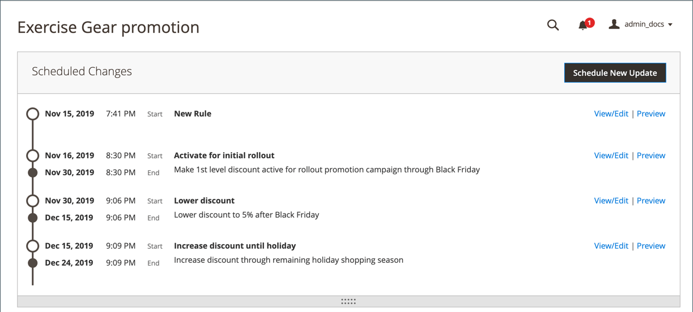

# 型錄價格規則的排程變更

{{ee-feature}}

儲存或更新新價格規則時，「排定變更」方塊會顯示在頁面頂端。 型錄價格規則可以排程套用為促銷活動的一部分，並和其他內容變更一起分組。 您可以根據價格規則的排程變更來建立行銷活動，或將變更套用至現有行銷活動。

>[!NOTE]
>
>[!UICONTROL From]和[!UICONTROL To]欄位已在 Adobe Commerce中移除，無法直接在目錄價格規則上修改。 您必須為這些啟用建立排定的更新。

>[!NOTE]
>
>所有排定的更新都會連續套用。 這表示任何實體在某個時間點只能有一個排程更新。 任何排定的更新都會套用至其時間範圍內的所有存放區檢視。 因此，一個實體無法同時擁有不同存放區檢視的不同排程更新。 所有存放區檢視中的所有實體屬性值（不受目前排程更新影響）都是從預設值取得，而不是從先前的排程更新取得。

如果相同促銷活動中執行了多個價格規則，則價格規則的「優先順序」設定會決定哪一個規則優先。 若要深入瞭解，請參閱[內容暫存](../content-design/content-staging.md)。

>[!IMPORTANT]
>
>如果最初建立的有效行銷活動沒有結束日期，則無法在稍後編輯行銷活動以包含結束日期。 在這種情況下，必須建立重複的行銷活動並輸入所需的結束日期。

{width="600" zoomable="yes"}

## 排程型錄價格規則的更新

1. 在&#x200B;_管理員_&#x200B;側邊欄上，前往&#x200B;**[!UICONTROL Marketing]** > _[!UICONTROL Promotions]_>**目錄價格規則**。

1. 在編輯模式中開啟規則。

1. 在頁面頂端的&#x200B;**[!UICONTROL Scheduled Changes]**&#x200B;方塊中，按一下&#x200B;**[!UICONTROL Schedule New Update]**。

1. 選取&#x200B;**[!UICONTROL Save as a New Update]**&#x200B;選項後，執行下列動作：

   - 針對&#x200B;**[!UICONTROL Update Name]**，輸入規則更新的名稱。

   - 輸入簡短的更新&#x200B;**[!UICONTROL Description]**，包括套用的方式或原因。

   - 使用&#x200B;_行事曆_ （）選擇&#x200B;**[!DNL Start Date]**&#x200B;和&#x200B;**[!UICONTROL End Date]**，讓排程變更生效。 若要建立未完成的變更，請將結束日期保留空白。

   {width="600" zoomable="yes"}

   >[!NOTE]
   >
   >開始和結束日期/時間由預設的「管理員」面板日期/時間和時區決定，而不是由特定網站的時區決定。 考量網站的時區，正確判斷開始和結束時間。 針對位於不同時區、需要在特定本機時間啟動和/或停止的網站，建立個別規則。

1. 向下捲動至&#x200B;**[!UICONTROL Rule Information]**&#x200B;區段，並視需要變更規則。

   您可以排程任何規則引數的變更，包括規則的網站（範圍）/客戶群組、規則的條件，以及規則套用的動作。 如需詳細資訊，請參閱[建立目錄價格規則](price-rules-catalog-create.md)。

   >[!NOTE]
   >
   >如果您變更任何規則資訊引數，請確定&#x200B;_[!UICONTROL Status]_設定正確。 如果您希望變更產生主動套用的規則，狀態應該是`Active`。

1. 完成時，按一下&#x200B;**[!UICONTROL Save]**。

   排程變更會顯示在頁面頂端，其中包含行銷活動的開始和結束日期。

## 編輯排定的規則變更

1. 在頁面頂端的&#x200B;**[!UICONTROL Scheduled Changes]**&#x200B;方塊中，按一下&#x200B;**[!UICONTROL View/Edit]**。

1. 進行排程更新所需的任何變更。

   >[!NOTE]
   >
   >如果行銷活動連結到多個目錄價格規則，則只能從[內容測試儀表板](../content-design/content-staging-dashboard.md)編輯行銷活動。

1. 按一下&#x200B;**[!UICONTROL Save]**。

## 預覽排定的規則變更

1. 在頁面頂端的&#x200B;**[!UICONTROL Scheduled Changes]**&#x200B;方塊中，按一下&#x200B;**[!UICONTROL Preview]**。

   「預覽」會開啟新的瀏覽器標籤，載入已套用排程變更的店面。 導覽至受變更影響的產品。

   {width="600" zoomable="yes"}

1. 在[預覽]視窗的左上角，按一下&#x200B;**[!UICONTROL Calendar]**。

   行事曆詳細資料會顯示排程在同一天的其他行銷活動。 清單中的每個記錄都是個別的規則更新。

   {width="600" zoomable="yes"}

1. 若要預覽不同的日期或時間，請按一下&#x200B;**[!UICONTROL Date & Time]**&#x200B;行事曆並執行下列動作：

   - 選擇不同的日期和/或時間。

   - 按一下&#x200B;**[!UICONTROL Preview]**。

1. 若要返回行事曆，請按一下預覽頁面標頭中的&#x200B;**[!UICONTROL Calendar]**。

   從這裡，您可以進行以下操作：

   **分享預覽連結**

   若要與同事共用商店預覽的連結，請按一下&#x200B;**[!UICONTROL Share]**。 將連結複製到剪貼簿，然後貼到電子郵件內文中。

   >[!NOTE]
   >
   >必須有Admin使用者帳戶才能檢視共用預覽。 如果您的[角色具有建立Admin使用者帳戶的存取權](../systems/permissions-user-roles.md)，您必須在共用之前先為新使用者建立帳戶。

   **變更預覽範圍**

   若要檢視不同商店檢視的已排程變更，請按一下[預覽]頁面標頭中的&#x200B;**[!UICONTROL Scope]**。 選擇您要預覽的網站、商店或商店檢視。

1. 如有必要，請返回行事曆並按一下&#x200B;_[!UICONTROL Action]_欄中的&#x200B;**[!UICONTROL View/Edit]**以開啟另一個排定的更新。
