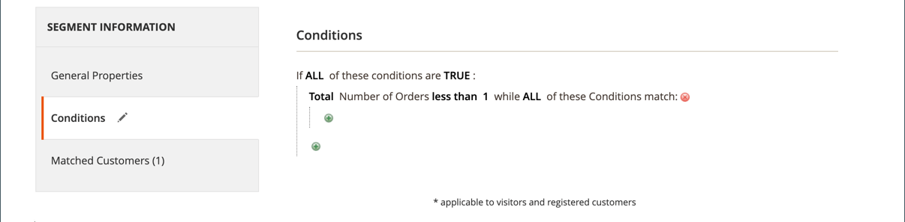
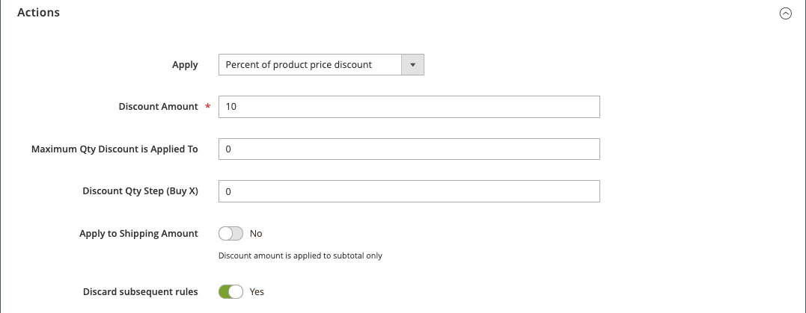

# 購物車價格規則範例 — 首次購買折扣

{{ee-feature}}

購物車價格規則可用於在客戶首次購買時自動提供折扣，而不需要優惠券。

若要提供針對首次客戶的折扣，您可以：

- 建立定義為&#x200B;_沒有訂單的買家_&#x200B;的客戶區段，然後
- 建立鎖定新客戶區段的購物車價格規則。

>[!NOTE]
>
>確認已啟用客戶區段功能。 請參閱[建立客戶區段](../customers/customer-segment-create.md)。

## 步驟1. 建立客戶區段

1. 在&#x200B;_管理員_&#x200B;側邊欄上，移至&#x200B;**[!UICONTROL Customers]** > **[!UICONTROL Segments]**。

1. 按一下右上角的&#x200B;**[!UICONTROL Add Segment]**。

1. 定義&#x200B;**[!UICONTROL General Properties]**。

   - 輸入&#x200B;**[!UICONTROL Segment Name]**&#x200B;以識別客戶區段（範例： _首次客戶_）。

   - 針對&#x200B;**[!UICONTROL Assigned to Website]**，選取可以使用客戶區段的網站。

   - 針對&#x200B;**[!UICONTROL Status]**，選取`Active`。

   - 針對&#x200B;**[!UICONTROL Apply to]**，選取`Visitors and Registered Customers`。

   - 完成時，按一下&#x200B;**[!UICONTROL Save and Continue Edit]**。

     左側面板中會顯示其他選項。

   {width="600" zoomable="yes"}

1. 定義&#x200B;**[!UICONTROL Conditions]**。

   在此範例中，條件的目標為&#x200B;_訂單總數小於1_&#x200B;的客戶為True。

   - 在左側的面板中，選擇&#x200B;**[!UICONTROL Conditions]**。

     預設條件會開始：「如果所有這些條件均為TRUE：」

   - 按一下&#x200B;_新增_ （）並選取`Number of Orders`。

   - 按一下&#x200B;**[!UICONTROL is]**&#x200B;並選取`less than`。

   - 按一下&#x200B;**...**，然後在欄位中輸入`1`。

   - 按一下綠色核取記號（  ）以儲存條件設定。

   {width="600" zoomable="yes"}

1. 按一下&#x200B;**[!UICONTROL Save]**。

客戶區段會建立並顯示在&#x200B;_[!UICONTROL Customer Segments]_&#x200B;格線中。

>[!TIP]
>
>記下區段ID。 您可以使用此ID號碼建立購物車價格規則。

## 步驟2. 建立購物車價格規則

1. 在&#x200B;_管理員_&#x200B;側邊欄上，移至&#x200B;**[!UICONTROL Marketing]** > _[!UICONTROL Promotions]_>**[!UICONTROL Cart Price Rule]**。

1. 按一下右上角的&#x200B;**[!UICONTROL Add New Rule]**。

   預設會顯示&#x200B;**[!UICONTROL Rule Information]**&#x200B;區段，**[!UICONTROL Conditions]**&#x200B;和&#x200B;**[!UICONTROL Conditions]**&#x200B;的可展開區段。

1. 定義&#x200B;**[!UICONTROL Rule Information]**。

   - 完成&#x200B;**[!UICONTROL Rule Name]**&#x200B;和&#x200B;**[!UICONTROL Description]**&#x200B;欄位。 這些欄位僅供內部參考。

   - 針對&#x200B;**[!UICONTROL Websites]**，選取要提供規則的網站。

   - 針對&#x200B;**[!UICONTROL Customer Groups]**，選取此規則套用的客戶群組。

     若要選取多個群組，請按住Ctrl鍵(PC)或Command鍵(Mac)，然後按一下每個選項。

     >[!NOTE]
     >
     >此清單中的選項取決於在&#x200B;**[!UICONTROL Customers]** > **[!UICONTROL Customer Groups]**&#x200B;中建立和管理的客戶群組。

   - 針對&#x200B;**[!UICONTROL Coupon]**，選取`No Coupon`。

   - 針對&#x200B;**[!UICONTROL Uses per Customer]**，輸入`1`。

   - 針對&#x200B;**[!UICONTROL Priority]**，輸入數字，以建立此規則相對於其他規則的優先順序。

     >[!NOTE]
     >
     >當相同的目錄產品符合為多個價格規則設定的條件時，「優先順序」設定很重要。 具有最高優先順序設定的規則會針對客戶啟用。 最高優先順序為1。 在此範例中，輸入`1`表示此規則優先於任何其他價格規則套用。 此值由&#x200B;**[!UICONTROL Action]**&#x200B;區段中的&#x200B;**[!UICONTROL Discard Subsequent Rules]**&#x200B;設定使用。

   - 完成時，按一下&#x200B;**[!UICONTROL Save and Continue Edit]**。

     左側面板中會顯示其他選項。

   {width="600" zoomable="yes"}

1. 定義&#x200B;**[!UICONTROL Conditions]**。

   - 向下捲動並展開 **[!UICONTROL Conditions]**&#x200B;區段。

     預設規則會以「如果所有這些條件皆為TRUE：」開始。

   - 按一下&#x200B;_新增_ （）並選取`Customer Segment`。

     辨識符號欄位預設為`matches`。

   - 按一下&#x200B;**...**，然後輸入您要鎖定的客戶區段的區段識別碼。

     在此範例中，在步驟1建立的新區段的區段ID為`2`。

     >[!NOTE]
     >
     >如果您不知道區段ID，請按一下選擇器圖示（  ）以顯示「客戶區段」清單。 您可以在欄位中手動輸入ID，或選取所需區段的核取方塊以自動填入欄位。

   - 按一下綠色核取記號（  ）以儲存條件設定。

   - 完成時，按一下&#x200B;**[!UICONTROL Save and Continue Edit]**。

     此規則行適用於符合客戶區段ID 2的所有客戶。

   {width="400"}

1. 向下捲動並展開 **[!UICONTROL Conditions]**&#x200B;區段，並定義規則的動作。

   在本節中，您定義您要針對首次客戶套用的折扣型別和折扣值/金額。 此範例為所有符合已定義條件的客戶定義10%的折扣。 如需其他可用選項的詳細資訊，請參閱[建立購物車價格規則](price-rules-cart-create.md)。

   - 針對&#x200B;**[!UICONTROL Apply]**，選取產品價格折扣的百分比。

   - 針對&#x200B;**[!UICONTROL Discount Amount]**，輸入`10`。

   - 若要將此價格規則僅套用至產品金額，請將&#x200B;**[!UICONTROL Apply to Shipping Amount]**&#x200B;設為`No`。

   - 若要防止系統套用多個價格規則至相同的產品，請將&#x200B;**[!UICONTROL Discard Subsequent Rules]**&#x200B;設為`Yes`。

   - 完成時，按一下&#x200B;**[!UICONTROL Save]**。

   {width="600" zoomable="yes"}

新規則通常在一小時內即可使用。 測試規則，確保它能如您定義般運作。

## 步驟3：儲存並測試規則

{{new-price-rule}}

1. 當您的規則完成時，按一下&#x200B;**[!UICONTROL Save Rule]**。

1. 測試規則以確保其正常運作。
