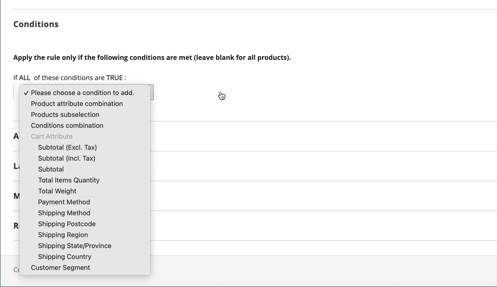
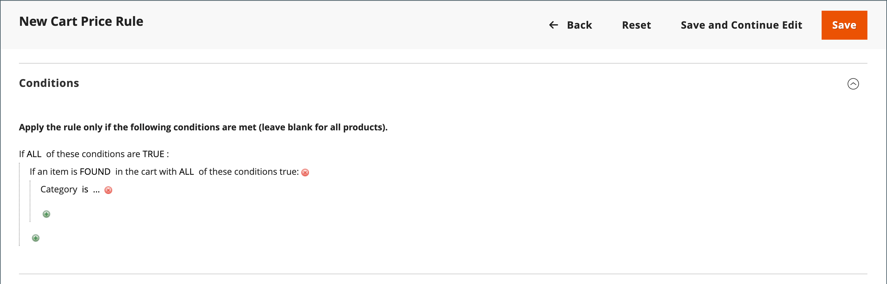

# 購物車價格規則範例 — 最低購買折扣

購物車價格規則可用於根據最低購買提供百分比折扣。 在下列範例中，25%的折扣適用於特定類別中超過$200.00的所有購買。 折扣格式如下：

所有Y （類別）有X%折扣超過$Z美元

## 步驟1. 建立購物車規則

依照基本[指示](price-rules-cart.md)建立購物車規則。

## 步驟2. 定義條件

1. 向下捲動並展開 **[!UICONTROL Conditions]**&#x200B;區段。

1. 按一下&#x200B;_新增_ （）並選擇&#x200B;**[!UICONTROL Product Attribute Combination]**。

   {width="500" zoomable="yes"}

1. 在下一行的開頭按一下&#x200B;_新增_ （），並在&#x200B;**[!UICONTROL Product Attribute]**&#x200B;下的清單中選擇&#x200B;**[!UICONTROL Category]**。

   - 按一下(**...**) _更多_&#x200B;連結以顯示其他選項。

     {width="600" zoomable="yes"}

   - 按一下&#x200B;_選擇器_ （）圖示以檢視可用的類別。 在類別樹狀結構中，選取每個要包含的類別的核取方塊。 按一下核取圖示以接受類別選擇。

     {width="600" zoomable="yes"}

1. 在下一行的開頭按一下&#x200B;_新增_ （），然後執行下列動作：

   - 在&#x200B;**[!UICONTROL Cart Item Attribute]**&#x200B;下的清單中，選擇&#x200B;**[!UICONTROL Price in cart]**。

     {width="500"}

   - 按一下&#x200B;**是**&#x200B;並選擇`equals or greater than`。

   - 按一下&#x200B;**...**，然後輸入購物車中的價格必須符合條件的金額。 例如，輸入`30`。

     {width="500"}

1. 按一下&#x200B;**[!UICONTROL Save and Continue Edit]**。

## 步驟3. 定義動作

1. 展開 **[!UICONTROL Actions]**&#x200B;區段，然後執行下列動作：

   {width="600" zoomable="yes"}

   - 將&#x200B;**[!UICONTROL Apply]**&#x200B;設為`Percent of product price discount`。

   - 輸入&#x200B;**[!UICONTROL Discount Amount]**。 例如，輸入`10`以取得10%的折扣。

   - 若要避免將其他促銷活動套用至購買，請將&#x200B;**[!UICONTROL Discard subsequent rules]**&#x200B;設為`Yes`。

1. 按一下&#x200B;**[!UICONTROL Save and Continue Edit]**&#x200B;並視需要完成規則。

## 步驟4. 完成標籤

完成購物車價格規則指示的[步驟4](price-rules-cart.md)，以輸入結帳期間出現的任何標籤。

## 步驟5：儲存並測試規則

{{new-price-rule}}

1. 當您的規則完成時，按一下&#x200B;**[!UICONTROL Save Rule]**。

1. 測試規則以確保其正常運作。
