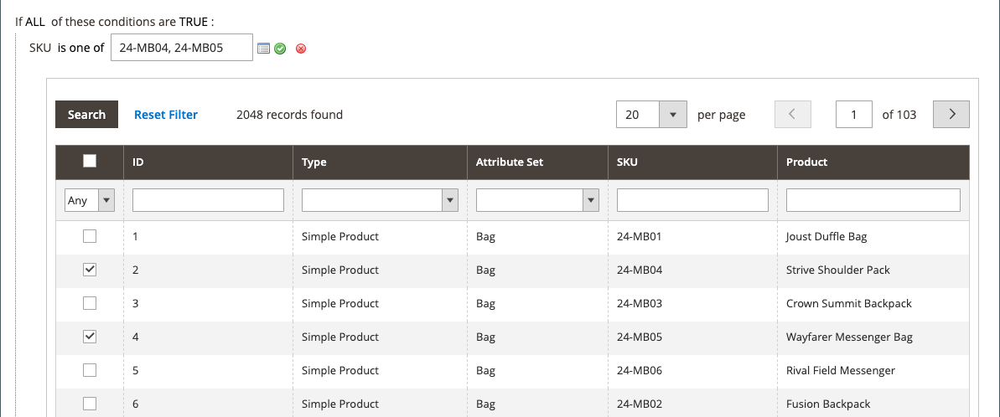
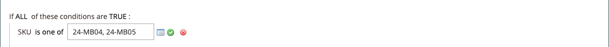

# 具有多個SKU的目錄價格規則

單一目錄價格規則可套用至多個SKU，因此可以根據產品、品牌或類別建立各種促銷活動。 建立此規則時，您想要設定符合所選SKU的條件。 建立規則時，您可以輕鬆地瀏覽並從格線選取SKU。

## 步驟1. 驗證產品屬性的店面屬性

開始之前，請確定 [店面屬性](../catalog/attribute-product-create.md#step-4-describe-the-storefront-properties) 的 `sku` 屬性已設定為 `Use in Promo Rules`.

1. 在 _管理員_ 側欄，前往 **[!UICONTROL Stores]** > _[!UICONTROL Attributes]_>**[!UICONTROL Product]**.

1. 在頂端搜尋篩選條件中 _[!UICONTROL Attribute Code]_欄，輸入 `sku` 並按一下&#x200B;**[!UICONTROL Search]**.

1. 按一下以開啟 `sku` 編輯模式中的屬性。

1. 在左側面板中，按一下 **[!UICONTROL Storefront Properties]** 並確定 **[!UICONTROL Use for Promo Rule Conditions]** 設為 `Yes`.

1. 如果您變更了屬性的值，請按一下 **[!UICONTROL Save Attribute]**.

## 步驟2. 將價格規則套用至多個SKU

1. 在 _管理員_ 側欄，前往 **[!UICONTROL Marketing]** > _[!UICONTROL Promotions]_>**[!UICONTROL Catalog Price Rules]**.

1. 執行下列任一項作業：

   - 依照指示建立 [型錄價格規則](price-rules-catalog.md).
   - 開啟現有的型錄價格規則。

1. 展開  此 **[!UICONTROL Conditions]** 的部分，並執行下列動作：

   - 在第一行中，將第一個引數設為 `ANY`.

     {width="600" zoomable="yes"}

   - 按一下 _新增_ ()在下一行的開頭並在下的清單中 **[!UICONTROL Product Attribute]**，按一下 `SKU`.

     {width="600" zoomable="yes"}

   - 您可以透過選項進行比較。 如果您想從SKU清單中至少找出一個， `select is one of`. 如果您想要找出所有必須找到以套用的SKU群組，請選取 `is`. 我們建議選取 `is one of`.

     {width="600" zoomable="yes"}

   - 若要完成條件，請按一下更多(**...**)連結，然後按一下 _選擇器_ ()圖示以取得可用的產品清單。

     {width="600" zoomable="yes"}

   - 瀏覽、篩選或搜尋以尋找您要新增的SKU。 在清單中，選取每個要納入之產品的核取方塊。

   - 按一下 **[!UICONTROL Save and Apply]** 以將SKU新增至條件。

     {width="600" zoomable="yes"}

1. 完成規則，包括任何 [動作](price-rules-catalog.md) 當滿足條件時要採取的動作。

1. 規則完成後，按一下 **[!UICONTROL Save]**.

{{new-price-rule}}
