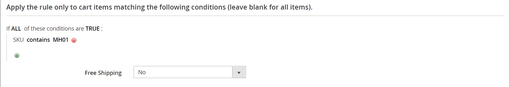

# 購物車價格規則範例 — 買這個就得到那個

此範例說明如何設定 [購物車價格規則](price-rules-cart.md) 針對 _買這個，免費取得_ 促銷活動。 折扣格式如下：

_購買X數量的產品，免費取得Y數量_

## 步驟1. 建立購物車價格規則

完成 [步驟1](price-rules-cart.md) ，以完成規則資訊。

## 步驟2. 定義條件

完成 [步驟2](price-rules-cart.md) ，以定義價格規則的條件。 這是可新增至規則的兩個條件中的第一個，並決定何時觸發規則。 此維度可能以下列專案組合為基礎：

- 產品屬性
- 產品
- 購物車屬性
-  (僅限Adobe Commerce)客戶區段

如果保留為空白，系統會為每個購物車觸發規則。

{width="600" zoomable="yes"}

## 步驟3. 定義動作

1. 展開  此 **[!UICONTROL Actions]** 並執行下列動作：

   - 設定 **[!UICONTROL Apply]** 至 `Buy X get Y free (_[!UICONTROL _[!UICONTROL Discount Amount]_]_ is Y)`.

   - 設定 **[!UICONTROL Discount Amount]** 至 `1`. 這是客戶免費收到的數量。

   - 若要限制符合條件時可套用的折扣數，請在 **[!UICONTROL Maximum Qty Discount is Applied To]** 欄位。 使用下列方式計算 [公式](#maximum-quantity-discount).

   - 的 **[!UICONTROL Discount Qty Step (Buy X)]**，輸入客戶必須購買的數量，才符合折扣資格。 在此範例中，客戶必須購買三個。

   - 如果您不想將其他折扣套用至購買，請設定 **[!UICONTROL Discard subsequent rules]** 至 `Yes`.

   {width="600" zoomable="yes"}

1. 若要僅將規則套用至購物車中的特定專案，請完成條件以說明促銷所需的購物車專案及/或產品屬性。

   以下範例使用SKU將規則套用至可設定產品的所有相關變數。

   {width="600" zoomable="yes"}

1. 要包含 **[!UICONTROL Free Shipping]**，選擇 `For matching items only`.

1. 按一下 **[!UICONTROL Save and Continue Edit]** 並視需要完成規則的其餘部分。

## 步驟4. 完成標籤

完成 [步驟4](price-rules-cart.md) ，以輸入結帳時顯示的標籤。

## 步驟5：儲存並測試規則

{{new-price-rule}}

1. 規則完成後，按一下 **[!UICONTROL Save Rule]**.

1. 測試規則以確保其正常運作。

## 變數

購買X獲取Y免費會以單一動作處理，具有 _列總計_ 相依性。 所有專案都必須來自相同的SKU，才符合促銷資格。 例如：

從類別A購買X數量的產品，免費取得相同產品的Y數量。

若要將自由產品限制在類別A、B和C，請依照下列方式設定動作：

如果所有這些條件都為TRUE：類別是A、B、C其中之一

若要限制任何類別（A、B或C）的可用料號，並從SKU （D123、E123或F123）接收Y，請依照下列方式設定動作：

如果上述條件皆為TRUE： SKU為D123、E123、F123其中之一

## 最大數量折扣

請使用下列公式來決定「最大數量折扣」的正確值：

公式= `(X+Y) * (M/Y)`
位置
`X` =購買的專案數
`Y` =可用專案數
`M` =允許的最大可用專案數

例如：

購買五件可免費購買兩件，最多允許四個免費專案。

    位置
    X = 5
    Y = 2
    M = 4
    最大數量折扣= (5+2)*(4/2)=(7)*(2)=14

購買五件可免費購買三件，最多允許九件免費專案。

    位置
    X = 5
    Y = 3
    M = 9
    最大數量折扣= (5+3)*(9/3)=24

購買20件即可免費購買兩件，最多允許20件免費商品。

    位置
    X = 20
    Y = 2
    M = 20
    最大數量折扣= (20+2)*(20/2)=(22)*(10)=220
