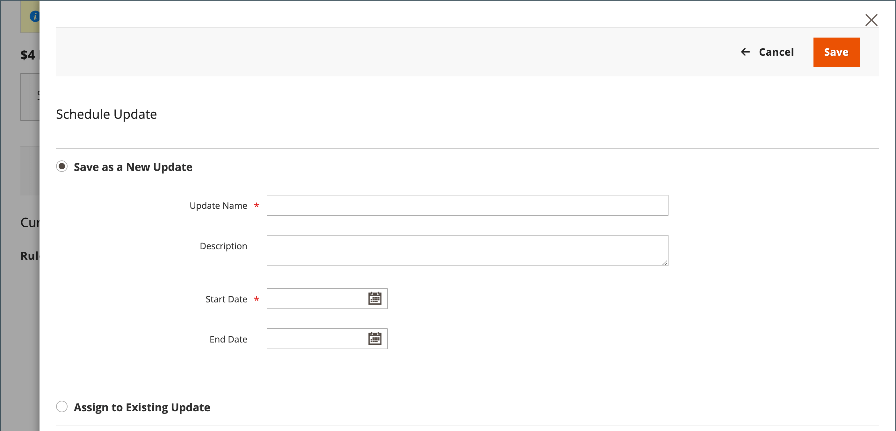
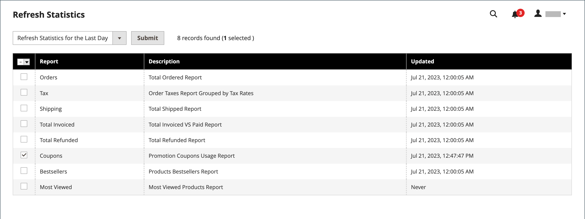
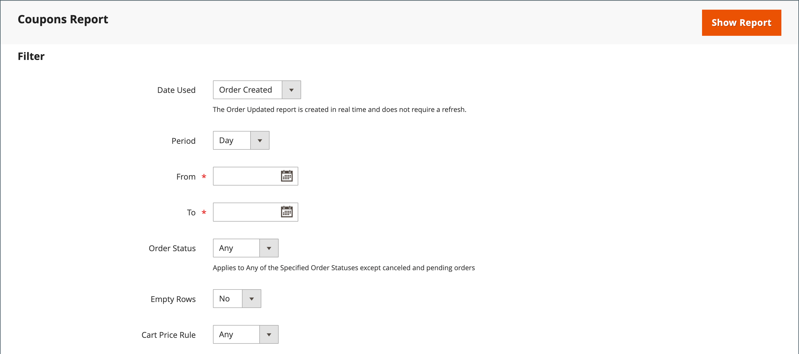

# 優惠券代碼

優惠券代碼用於 [購物車價格規則](price-rules-cart.md) 在符合一組條件時套用折扣。 例如，您可為特定客戶群組或購買超過特定金額的任何人建立優惠券代碼。 若要將優惠券套用至購買，客戶可以在購物車中輸入優惠券代碼，或可能在您的收銀機中輸入優惠券代碼。 _實體建築_ 商店。 以下是一些可在商店中使用抵用券的方式：

- 以電子郵件傳送優惠券給客戶
- 產生列印的優惠券
- 為行動使用者建立店內優惠券

優惠券代碼可以透過電子郵件傳送，或納入電子報、目錄和廣告中。 優惠券代碼清單可匯出並傳送至商業印表機。 您也可以使用快速回應代碼來建立店內優惠券，讓購物者可以用智慧型手機掃描這些代碼。 QR碼可連結至網站上包含促銷活動詳細資訊的頁面。

截至Commerce 2.4.7，購物者可對購物車套用多張優惠券。 商戶也可以使用購物協助來套用多張優惠券。

## 設定優惠券代碼

自動產生的優惠券代碼的長度和格式由設定控制。 這些字元可以設定為所有數字、所有字母或組合。 您可以在設定的間隔處插入破折號，以方便閱讀，並新增首碼和尾碼以將程式碼與特定行銷活動或方案建立關聯。

1. 在 _管理員_ 側欄，前往 **[!UICONTROL Stores]** > _[!UICONTROL Settings]_>**[!UICONTROL Configuration]**.

1. 在左側面板中，展開 **[!UICONTROL Customers]** 並選擇 **[!UICONTROL Promotions]**.

   {width="600" zoomable="yes"}

1. 展開 **[!UICONTROL Auto Generated Specific Coupon Codes]** 區段。

   {width="600" zoomable="yes"}

1. 輸入 **[!UICONTROL Code Length]**，包括首碼、尾碼和分隔符號。

1. 設定 **[!UICONTROL Code Format]** 變更為下列其中一項：

   - `Alphanumeric`
   - `Alphabetical`
   - `Numeric`

1. 的 **[!UICONTROL Code Prefix]**，輸入您要在所有抵用券代碼開頭顯示的值。

1. 的 **[!UICONTROL Code Suffix]**，輸入您要在所有抵用券代碼結尾顯示的值。

1. 的 **[!UICONTROL Dash Every X Characters]**，輸入每個破折號之間的字元數。

   即使數字相同，使用不同破折號模式的抵用券代碼也會被視為不同的代碼。

1. 完成後，按一下 **[!UICONTROL Save Config]**.

## 建立優惠券

>[!NOTE]
>
>建立優惠券之前，請先使用 `bin/magento cron:run` 命令以驗證cron是否正在執行。 另請參閱 [從命令列執行cron](https://experienceleague.adobe.com/docs/commerce-operations/configuration-guide/cli/configure-cron-jobs.html#run-cron-from-the-command-line) 在 _設定指南_ 以取得詳細資訊。

### 方法1：建立特定抵用券

1. 依照指示建立 [購物車價格規則](price-rules-cart.md).

1. 在 **[!UICONTROL Rule Information]** 部分，設定 **[!UICONTROL Coupon]** 至 `Specific Coupon`.

1. 輸入 **[!UICONTROL Coupon Code]** 與促銷活動搭配使用。

   程式碼的格式（數字、英數字元或字母順序）由以下決定 [設定](#configure-coupon-codes).

1. 若要限制抵用券的使用次數，請執行下列動作：

   - 輸入數字 **[!UICONTROL Uses per Coupon]**.
   - 輸入數字 **[!UICONTROL Uses per Customer]**.

   如需無限制使用，請將這些欄位留空。

   {width="600" zoomable="yes"}

   >[!NOTE]
   >
   >如果多個客戶同時使用相同的優惠券，則由於優惠券處理延遲，可能會超過設定的使用量限制。

1. 若要讓抵用券在某個時段內有效，請執行下列步驟：

   -  (僅限Magento Open Source)完成 **從** 和 **至** 日期。 若要選取日期，請按一下 **行事曆** ()圖示加以依循。 如果您將日期範圍保留為空白，則規則不會過期。

   -  (僅限Adobe Commerce)執行下列任一項作業：

     **選項1：** 排程新的更新

      - 按一下 **[!UICONTROL Schedule New Update]** 在頁面的右上角。

        {width="600" zoomable="yes"}

      - 輸入 **[!UICONTROL Update Name]** 和 **[!UICONTROL Description]**.

      - 選擇 **開始日期** 和 **[!UICONTROL End Date]** 從行事曆(  )。 如果您將日期範圍保留為空白，則規則不會過期。

      - 完成後，按一下 **[!UICONTROL Save]**.

        {width="600" zoomable="yes"}

     **選項2：** 指派給現有更新：

      - 選取 **[!UICONTROL Assign to Another Update]**.

      - 在清單中找到更新，然後按一下 **[!UICONTROL Select]**.

1. 完成 [購物車價格規則](price-rules-cart.md) 視需要。

### 方法2：產生優惠券批次

產生折扣券是非同步操作，會在背景執行，因此您可以繼續在Admin中工作，而不需要等候操作完成。 當工作完成時，系統會顯示訊息。

1. 依照指示建立 [購物車價格規則](price-rules-cart.md).

1. 在 **[!UICONTROL Coupon Code]**，選取 **[!UICONTROL Use Auto Generation]** 核取方塊。

1. 若要限制每位客戶可使用抵用券的次數，請輸入 **[!UICONTROL Uses per Customer]**.

   {width="600" zoomable="yes"}

   >[!NOTE]
   >
   >如果多個客戶同時使用相同的優惠券，則由於優惠券處理延遲，可能會超過設定的使用量限制。

1. 向下捲動並展開  此 **[!UICONTROL Manage Coupon Codes]** 並執行下列動作：

   {width="600" zoomable="yes"}

   - 的 **[!UICONTROL Coupons Qty]**，輸入您要產生的抵用券數目。

   - 輸入 **[!UICONTROL Code Length]**，不包括前置詞、尾碼或分隔符號。

   - 設定 **[!UICONTROL Code Format]** 變更為下列其中一項：

      - `Alphanumeric`
      - `Alphabetical`
      - `Numeric`

   - （選擇性）輸入 **[!UICONTROL Code Prefix]** 將新增至程式碼的開頭處。

   - （選擇性）輸入 **[!UICONTROL Code Suffix]** 將新增至程式碼結尾處。

   - （選用） For **[!UICONTROL Dash Every X Characters]**，輸入每個破折號之間的字元數。 例如，如果程式碼長度為12個字元，而且每4個字元各有一個破折號，則它看起來會像 `xxxx-xxxx-xxxx`. 破折號讓程式碼更容易閱讀和輸入。

1. 完成後，按一下 **[!UICONTROL Generate]**.

   系統隨即顯示 `Message is added to queue, wait to get your coupons soon`.

   cron作業完成後，將顯示產生的代碼清單。

   | 欄位 | 說明 |
   |-------------|-------------|
   | [!UICONTROL Coupon Code] | 已建立且可用於接收特殊條件的唯一優惠券代碼。 |
   | [!UICONTROL Created] | 抵用券代碼的建立日期。 |
   | [!UICONTROL Used] | 表示是否已使用抵用券。 |
   | [!UICONTROL Times Used] | 表示使用抵用券代碼的次數。 |

   {style="table-layout:auto"}

您可以選取檔案格式並按一下 **[!UICONTROL Export]**.

若要刪除優惠券代碼，請從清單中選取一或多個代碼。 選取 `Delete` 從 **[!UICONTROL Actions]**  選擇器，然後按一下 **[!UICONTROL Submit]**.

>[!NOTE]
>
>雖然Commerce可設定多個優惠券代碼，但客戶在購物車中只能使用一個優惠券代碼。 若要允許在購物車中同時使用多個抵用券代碼，您可以考慮使用來自的對應擴充功能 [Commerce Marketplace](https://marketplace.magento.com/).

## 優惠券報告

此 _優惠券_ 報表會彙總特定日期範圍內使用的每個優惠券資料。 由於優惠券是從購物車套用的，因此報表會包含所有已兌換優惠券的資料，無論是否套用 [訂單狀態](../stores-purchase/order-status.md). 因此，報表可能同時包含預計和實際總計。 您可針對特定商店檢視、時段、訂單狀態和購物車價格規則來篩選報表。

在下列範例中，兩個客戶使用了抵用券代碼「H20」。 其中一個訂單已開立商業發票，但另一個訂單仍為 _擱置中_. 「預估銷售小計」、「銷售折扣」及「銷售總計」欄位會顯示這兩個訂單的彙總金額，但「小計」、「折扣」及「總計」欄位中只會顯示實際開立商業發票的訂單。 報表中的每一列代表單一優惠券促銷活動。

{width="600" zoomable="yes"}

### 執行報告

1. 在 _管理員_ 側欄，前往 **[!UICONTROL Reports]** > _[!UICONTROL Sales]_>**[!UICONTROL Coupons]**.

1. 如果您有多個商店檢視，請設定 **[!DNL Store View]** 以建立報表的範圍。

1. 若要重新整理銷售 [統計資料](../getting-started/sales-reports.md#refresh-statistics) 在當天按一下 _上次更新時間_ 工作區頂端的訊息。

   接著，按一下以選取 **[!UICONTROL Coupons]** 核取方塊並按一下 **[!UICONTROL Refresh]**.

   {width="600" zoomable="yes"}

1. 若要篩選資料，請執行下列動作：

   {width="600" zoomable="yes"}

   - 設定 **[!UICONTROL Date Used]** 變更為下列其中一項：

      - `Order Created`
      - `Order Updated`

     此 _已更新訂單_ 報告是即時建立的，不需要重新整理。

   - 若要定義報告所涵蓋的時間期間，請設定 **[!UICONTROL Period]** 變更為下列其中一項：

      - `Day`
      - `Month`
      - `Year`

   - 若要定義報表的日期範圍，請輸入 **從** 和 **至** 日期（M/D/YY格式）。

   - 若要列印特定報表 [訂單狀態](../stores-purchase/order-status.md)，設定 **[!UICONTROL Order Status]** 至 `Specified` 並從清單中選擇訂單狀態。

   - 若要忽略報表中無資料的列，請設定 **[!UICONTROL Empty Rows]** 至 `No`.

   - 若要定義報表中包含的抵用券活動，請執行下列任一項作業：

      - 若要納入所有價格規則的所有優惠券作業，請設定 **[!UICONTROL Cart Price Rule]** 至 `Any`.
      - 若只要包含與特定價格規則相關的作業，請設定 **[!UICONTROL Cart Price Rule]** 至 `Specified` 並在清單中選取購物車價格規則。

1. 準備執行報告時，按一下 **[!UICONTROL Show Report]**.

   報表會顯示在頁面底部。

### 篩選器選項

| 欄位 | 說明 |
|--- |--- |
| [!UICONTROL Date Used] | 識別當作報表基礎的日期欄位。 選項： **[!UICONTROL Order Created]**：根據客戶下訂單的日期產生報表。 若要確保包含最新的資料，請按一下訊息中的連結，重新整理統計資料。 **[!UICONTROL Order Updated]**：根據上次更新訂單的日期產生報表。 此報告使用即時資料，不需要重新整理統計資料。 |
| [!UICONTROL Period] | 決定用於報表的日期範圍型別。 選項： `Day` / `Month` / `Year` |
| [!UICONTROL From] | 表示報表所包含訂單資料範圍內的第一個日期。 |
| [!UICONTROL To] | 表示報表所包含訂單資料範圍中的最後日期。 |
| [!UICONTROL Order Status] | 依訂單狀態篩選報表。 報表可針對所有訂單產生，或可限製為特定訂單狀態。 選項：  **[!UICONTROL Any]**：包含所有訂單，無論狀態為何。 **[!UICONTROL Specified]**：僅包含具有指定狀態的訂單。 報表中不包含已取消的訂單。 |
| [!UICONTROL Empty Rows] | 決定報表是否包含可擷取的任何空白資料列。 選項： `Yes` / `No` |
| [!UICONTROL Cart Price Rules] | 決定報表要包含哪些優惠券促銷活動。 選項： **[!UICONTROL Any]**：包含在指定日期範圍內使用的任何優惠券促銷的訂單資訊。 **[!UICONTROL Specified]**：僅包含在指定日期範圍內所選優惠券促銷的訂單資訊。 |

{style="table-layout:auto"}

### 報表欄

| 欄 | 說明 |
|--- |--- |
| [!UICONTROL Interval] | 表示報表中要包含的優惠券使用日期範圍。 間隔可以是特定的日、月、年或日期範圍。 間隔日期的格式如下所示，請根據中設定的值 **[!UICONTROL Period]** 設定： `Day`： 2019年6月21日 `Month`： 2019年6月 `Year`：2019年 |
| [!UICONTROL Coupon Code] | 客戶在購物車中輸入折扣代碼以取得折扣。 |
| [!UICONTROL Price Rule] | 與抵用券相關聯的價格規則名稱。 |
| [!UICONTROL Uses] | 在報表指定的日期範圍內使用抵用券的次數。 |
| [!UICONTROL Sales Subtotal] | 所有與抵用券一起下訂單的預計小計。  銷售小計代表所有合格訂單的彙總小計，並包括 `Pending` 尚未開立商業發票的銷售訂單。 |
| [!UICONTROL Sales Discount] | 所有與優惠券一起下訂單的預計折扣金額。  此折扣代表所有合格訂單的彙總折扣金額，並包括 `Pending` 尚未開立商業發票的銷售訂單。 |
| [!UICONTROL Sales Total] | 所有與優惠券一起下單的訂單的預計總計。 「銷售總額」包含任何運費和手續費，減去折扣金額。  「銷售總計」代表所有合格訂單的彙總總金額，並包含 `Pending` 尚未開立商業發票的銷售訂單。 值包括「小計」加上「送貨與處理」，再減去「折扣」加上「稅捐」。   計算方式： `((Subtotal + Shipping & Handling) - Discount) + Tax` |
| [!UICONTROL Subtotal] | 使用抵用券之所有已開立商業發票訂單的彙總小計。 |
| [!UICONTROL Discount] | 使用抵用券之所有已開立商業發票訂單的彙總折扣。 |
| [!UICONTROL Total] | 使用抵用券之所有已開立商業發票訂單的彙總訂單總計。 |

{style="table-layout:auto"}
