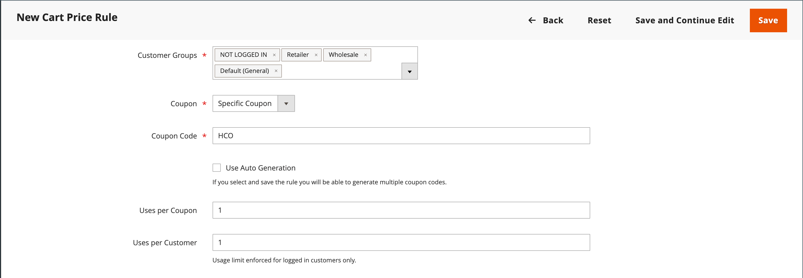
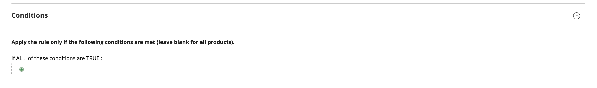
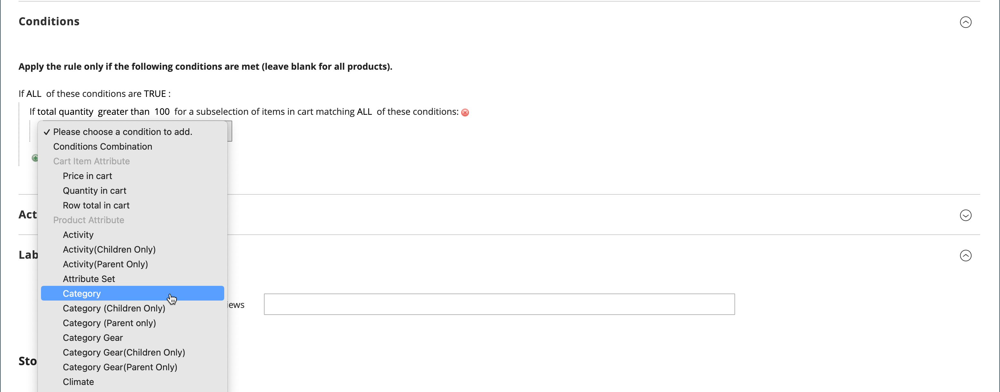
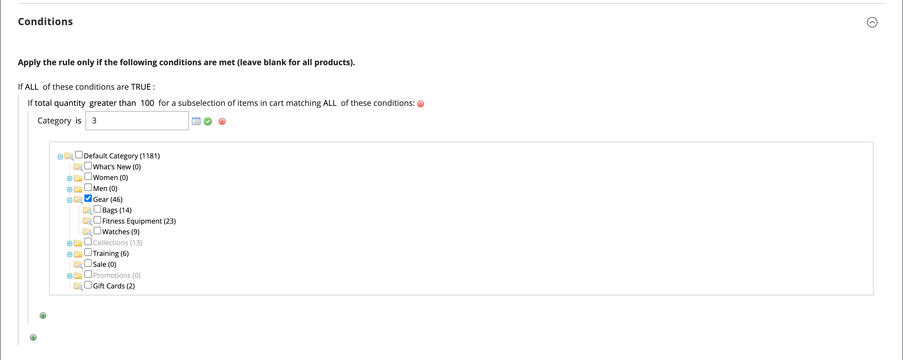

# 建立購物車價格規則

完成下列步驟以新增規則、說明條件並定義動作。 同時完成標籤並測試規則。 價格規則條件可以根據購物車或[產品屬性](../catalog/product-attributes.md)或[Real-Time CDP對象](#use-real-time-cdp-audiences-to-set-a-condition)，但不可以[可自訂選項](../catalog/settings-advanced-custom-options.md)為基礎。

## 步驟1：新增規則

1. 在&#x200B;_管理員_&#x200B;側邊欄上，移至&#x200B;**[!UICONTROL Marketing]** > _[!UICONTROL Promotions]_>**[!UICONTROL Cart Price Rules]**。

1. 按一下&#x200B;**[!UICONTROL Add New Rule]**&#x200B;並執行下列動作：

   - 在&#x200B;_[!UICONTROL Rule Information]_&#x200B;底下，完成&#x200B;**[!UICONTROL Rule Name]**&#x200B;和&#x200B;**[!UICONTROL Description]**。

   - 如果您不希望規則立即生效，請將&#x200B;**[!UICONTROL Active]**&#x200B;設為`No`。

   {width="600" zoomable="yes"}

1. 若要建立規則的[範圍](../getting-started/websites-stores-views.md#scope-settings)，請執行下列動作：

   - 選取要提供促銷的&#x200B;**[!UICONTROL Websites]**。

   - 選取促銷套用的&#x200B;**[!UICONTROL Customer Groups]**。

     如果您希望促銷活動僅供註冊客戶使用，請&#x200B;**_不要_**&#x200B;選擇`NOT LOGGED IN`選項。

1. 設定要套用的規則，無論是否有[抵用券](price-rules-cart-coupon.md)，如下所示：

   - 若要在不使用抵用券代碼的情況下套用購物車規則，請將&#x200B;**[!UICONTROL Coupon]**&#x200B;設為`No Coupon`並跳至步驟5。

   - 若要將抵用券與價格規則產生關聯，請將&#x200B;**[!UICONTROL Coupon]**&#x200B;設為`Specific Coupon`並執行下列動作：

      - 輸入客戶必須輸入以接收折扣的自由文字&#x200B;**[!UICONTROL Coupon Code]**。

      - 若要設定抵用券的使用次數限制，請完成下列選項：

     | 選項 | 說明 |
     |------|-----------|
     | `Uses per Coupon` | 決定抵用券代碼可以使用的次數。 如果沒有限制，則將此欄位留空。 |
     | `Uses per Customer` | 決定屬於任何所選客戶群組的相同註冊客戶可以使用購物車價格規則的次數。 此設定不適用於身為NOT LOGGED IN客戶群組成員的訪客購物者，或是在未登入帳戶的情況下購物的客戶。 如果沒有限制，則將此欄位留空。 |

     {style="table-layout:auto"}

     若要深入瞭解，請參閱[優惠券代碼](price-rules-cart-coupon.md)。

     {width="600" zoomable="yes"}

   -  (僅限Magento Open Source)使用&#x200B;_行事曆_ （）來選擇促銷的&#x200B;**[!UICONTROL From]**&#x200B;和&#x200B;**[!UICONTROL To]**&#x200B;日期範圍。

1. 輸入數字，以定義此價格規則的&#x200B;**[!UICONTROL Priority]**&#x200B;與其他同時生效之價格規則的「動作」設定相關。

   >[!NOTE]
   >
   >當兩個購物車規則或優惠券代碼對同一個產品同時生效時，_[!UICONTROL Priority]_&#x200B;設定很重要。 控制購物車動作且具有最高[!UICONTROL Priority]設定的規則。  從最高到最低的優先順序為`0,1,2,3...`。 請參閱_[&#x200B;定義動作&#x200B;](#step-3-define-the-actions)_步驟中的_&#x200B;捨棄後續價格規則&#x200B;_。

   >[!NOTE]
   >
   >具有相同優先順序的購物車價格規則不會產生合併折扣。 每個規則（抵用券）會根據資料庫中的購物車價格規則ID逐一套用至相符的產品。 為了控制套用折扣的順序，Adobe建議為每個新增的購物車價格規則設定不同的優先順序。

1. 若要將規則套用至已發佈的[RSS摘要](social-rss.md#rss-feeds)，請將RSS摘要&#x200B;**中的** Public設定為`Yes`。

1. 按一下&#x200B;**[!UICONTROL Save and Continue Edit]**。

   -  (僅限Magento Open Source)儲存規則後，購物車價格規則的名稱會顯示在頁面頂端。

   -  (僅限Adobe Commerce)儲存規則後，購物車價格規則的名稱和[排程變更](price-rule-cart-scheduled-changes.md)方塊會顯示在頁面頂端。

     {width="600" zoomable="yes"}

## 步驟2：說明條件

在此步驟中，會說明訂單必須符合的條件，才能符合促銷資格。 每當滿足一組條件時，規則就會執行動作。

如果您使用的對象來自Real-Time CDP，請跳至[本節](#use-real-time-cdp-audiences-to-set-a-condition)。

>[!NOTE]
>
>當符合&#x200B;_[!UICONTROL Conditions]_&#x200B;索引標籤中的條件集時，購物車價格規則會套用至購物車中的每個&#x200B;**_個_**&#x200B;產品。 在&#x200B;_[!UICONTROL Actions]_&#x200B;索引標籤中新增條件，以限制受購物車價格規則影響的產品數量。

>[!NOTE]
>
>如果至少一個條件產品屬性具有空值，則購物車價格規則不會套用至產品。

1. 在左側面板中，選取&#x200B;**[!UICONTROL Conditions]**。

   {width="600" zoomable="yes"}

   預設會顯示第一個條件，其狀態為：

   `If **ALL** of these conditions are **TRUE**:`

   陳述式有兩個粗體連結，您可以按一下這些連結，以顯示陳述式該部分的選項選項。 您可以變更這些值的組合，以建立不同的條件。 執行下列任一項作業：

   - 按一下&#x200B;**[!UICONTROL ALL]**&#x200B;並選取`ALL`或`ANY`。
   - 按一下&#x200B;**[!UICONTROL TRUE]**&#x200B;並選取`TRUE`或`FALSE`。
   - 維持條件不變，將規則套用至所有產品。

1. 在下一行的開頭按一下&#x200B;_新增_ （），並選取條件的選項，例如購物車屬性、產品子選項或組合。

   在此範例中，請完成條件的下一部分，如下所示：

   - 當系統提示&#x200B;**[!UICONTROL Choose the condition to add]**&#x200B;時，請選擇`Products Subselection`。

     {width="600" zoomable="yes"}

   - 在條件陳述式中，按一下&#x200B;**[!UICONTROL total quantity]**&#x200B;並選取`total quantity`或`total amount`。

   >[!IMPORTANT]
   >
   >[!UICONTROL Total amount]為列總計，因此對於[!UICONTROL Products Subselection]購物車價格規則條件，稅費不包含在`total amount`中。 使用[!UICONTROL Subtotal (Incl. Tax)]條件來包含稅捐。

   - 在條件陳述式中，按一下&#x200B;**[!UICONTROL is]**&#x200B;並選取`greater than`。

1. 當條件的下一部分出現時，請按一下陳述式的元素，以便檢視每個具有變數值的連結的位置。

1. 按一下[更多] (...)連結，然後輸入`100`。

   此條件要求購物車的總數量為`101`或以上。

   {width="600" zoomable="yes"}

1. 在下一行的開頭按一下&#x200B;**新增** （），然後新增以&#x200B;**類別**&#x200B;為基礎的條件。

   {width="600" zoomable="yes"}

1. 在條件的下一部分，按一下&#x200B;_更多_ (**...**)連結以顯示輸入欄位，然後開啟&#x200B;_選擇器_ （）以顯示類別樹狀結構。

1. 選取您要用作價格規則條件的類別核取方塊，然後按一下圖示以接受類別選擇。

   條件可以是以屬於商店[根類別](../catalog/category-root.md)之子類別的任何類別為基礎。

   {width="600" zoomable="yes"}

1. 若要新增更多條件，請按一下&#x200B;_新增_ （）並定義其他條件。

   您可以視需要重複處理多次，以說明價格規則必須符合的條件。 以下是一些範例：

   **範例1：**&#x200B;地區價格規則

   若要建立地區價格規則，請使用下列其中一個購物車屬性：

   - `Shipping Postcode`
   - `Shipping Region`
   - `Shipping State/Province`
   - `Shipping Country`

   **範例2：**&#x200B;購物車總計

   若要讓條件以購物車總計為依據，請使用下列其中一個購物車屬性：

   - `Subtotal`
   - `Total Items Quantity`
   - `Total Weight`

>[!NOTE]
>
>如果有多項平行促銷活動，則會將&#x200B;_小計_&#x200B;條件套用至&#x200B;_基本_&#x200B;購物車小計&#x200B;**_，再套用_**&#x200B;任何折扣。

>[!IMPORTANT]
>
>**僅針對採購單**：當購物車價格規則是根據一或多個特定付款方式設定時，折扣會套用至建立採購單時的總計。 建立採購單之後，如果付款方式變更為購物車價格規則未涵蓋的付款方式，則折扣仍會套用至總計。

### 將產品屬性新增至購物車價格規則

1. 前往「**[!UICONTROL Stores]** > _[!UICONTROL Attributes]_>**[!UICONTROL Product]**」並開啟產品屬性。

1. 在左側面板中，選取&#x200B;**[!UICONTROL Storefront Properties]**。

1. 將&#x200B;**[!UICONTROL Use for Promo Rule Conditions]**&#x200B;設為`Yes`。

1. 按一下&#x200B;**[!UICONTROL Save Attribute]**。

1. 前往&#x200B;**[!UICONTROL Marketing]** > **[!UICONTROL Cart Price Rules]**&#x200B;並開啟必要的購物車價格規則。

1. 展開 **[!UICONTROL Condition]**&#x200B;區段並選取&#x200B;**[!UICONTROL Product attribute combination]**。

1. 將此條件設為下列其中一個值：

   - 按一下&#x200B;**[!UICONTROL FOUND]**&#x200B;並選取`FOUND`或`NOT FOUND`。

   - 按一下&#x200B;**[!UICONTROL ALL]**&#x200B;並選取`ALL`或`ANY`。

1. 按一下&#x200B;_新增_ （）圖示，然後選取您為促銷規則條件設定的&#x200B;**[!UICONTROL Product Attribute]**。

1. 按一下&#x200B;**[!UICONTROL Save]**。

>[!NOTE]
>
>搭配&#x200B;_SKU_&#x200B;產品屬性與可設定產品使用`is not one of`條件時，必須同時選取父項與子項產品SKU。 若要避免在規則中列出所有子SKU，您可以針對可設定產品及其子產品的通用SKU部分使用`does not contain`條件。

### 使用Real-Time CDP受眾來設定條件

您可以根據Real-Time CDP [對象](../customers/audience-activation.md)來設定購物車價格規則的條件。

1. 展開&#x200B;**[!UICONTROL Conditions]**，按一下「+」圖示，然後從清單中選取&#x200B;**[!UICONTROL Real-Time CDP Audience]**。

   {width="300"}

1. 選取&#x200B;_更多_ (**...**)圖示，按一下&#x200B;**[!UICONTROL Open Chooser]**，然後檢視所有可用的Real-Time CDP對象。

   {width="600" zoomable="yes"}

1. 選取您要用於購物車價格規則的Real-Time CDP對象。

   | 選項 | 說明 |
   |------|-----------|
   | `ID` | 在管理員內使用的對象內部識別碼 |
   | `Real-Time CDP Audience ID` | 在Experience Platform中建立對象時的唯一識別碼 |
   | `Name` | 對象名稱，例如`Orders over $50` |
   | `Description` | 對象的說明，例如`People who placed an order over $50 in the last month.`。 |
   | `Source` | 指出對象的來源，例如`Experience Platform`。 |
   | `Website` | 指出您已連結至包含對象之資料流的網站。 當您透過[[!DNL Data Connection]](https://experienceleague.adobe.com/docs/commerce/data-connection/fundamentals/connect-data.html?lang=zh-Hant)擴充功能將Commerce執行個體連結至Experience Platform時，就會建立此連結。 |

   {style="table-layout:auto"}

在下一步中，您會定義當符合條件時要發生的動作。

## 步驟3：定義動作

購物車價格規則動作會說明當符合條件時如何更新價格。

1. 向下捲動至&#x200B;**[!UICONTROL Actions]**，並展開區段。

   {width="600" zoomable="yes"}

1. 將&#x200B;**[!UICONTROL Apply]**&#x200B;設為下列其中一個折扣選項：

   | 選項 | 說明 |
   |------|-----------|
   | `Percent of product price discount` | 從原始價格減去百分比，以折扣料號。 折扣適用於購物車中的每個合格專案。 例如：在[!UICONTROL Discount Amount]中輸入`10`，所更新價格會比原始價格低10%。 |
   | `Fixed amount discount` | 從購物車中每個合格專案的原始價格減去固定金額，以折扣專案。 例如：在[!UICONTROL Discount Amount]中輸入`10`，更新後的價格即比原始價格低$10。 |
   | 整個購物車的固定金額折扣 | 從購物車總計中減去固定金額，即可折扣整個購物車。 例如：在[!UICONTROL Discount Amount]中輸入10，從購物車總計中減去$10。 依預設，折扣僅適用於購物車小計。 若要將折扣分別套用至小計和運費，請使用&#x200B;_[!UICONTROL Apply to Shipping Amount]_&#x200B;選項。 |
   | `Buy X get Y free` | 定義客戶必須購買的數量X，以免費接收相同產品/變數&#x200B;**的數量Y**。 （[!UICONTROL Discount Amount]為Y。）該相同專案的X+Y總數量必須存在於購物車中/新增到購物車中，才能套用折扣。 |

   {style="table-layout:auto"}

   - 將&#x200B;**[!UICONTROL Discount Amount]**&#x200B;輸入為不含符號的數字。 例如，根據選取的折扣選項，數字10可能表示百分比、固定金額或料號數量。

   - 針對&#x200B;_購買X可獲得Y免費_&#x200B;折扣，請在單一產品/SKU/明細專案的&#x200B;**[!UICONTROL Discount Qty Step (Buy X)]**&#x200B;欄位中輸入數量，客戶必須購買該數量才能獲得Y數量的折扣。 X和Y都代表相同SKU的數量，而且必須手動將專案的特定數量（可設定產品的變化分別計算）新增到購物車中。

   - 在&#x200B;**[!UICONTROL Maximum Qty Discount is Applied To]**&#x200B;欄位中，輸入相同購買中符合折扣條件的相同產品最大數量。

   - 設定&#x200B;**[!UICONTROL Apply to Shipping Amount]** （），如下所示：

     | 選項 | 說明 |
     |------|-----------|
     | `Yes` | 將折扣金額分別套用至小計與出貨金額。 |
     | `No` | 只將折扣金額套用至小計。 |

     {style="table-layout:auto"}

   - 若要在套用此規則後停止處理其他規則，請將&#x200B;**[!UICONTROL Discard Subsequent Rules]** （）設定為`Yes`。 此設定可防止將多個折扣套用至相同產品。

     | 選項 | 說明 |
     |------|-----------|
     | `Yes` | 防止套用可能適用於產品的任何其他定價規則。 當多個定價規則套用至相同產品時，只有具有最高定義優先順序的定價規則（在規則[!UICONTROL Priority]欄位中）套用至合格產品。 這可防止多個定價規則棧疊在一起，並提供意想不到的額外折扣。 |
     | `No` | 允許將多個定價規則套用至相同的產品。 這可能會導致棧疊並提供套用至您的掛牌價格的多個折扣。 |

     {style="table-layout:auto"}

     >[!IMPORTANT]
     >
     >若要捨棄後續規則，訂價規則必須使用在每個規則的「優先順序」欄位中設定的已定義優先順序，且多個規則不應該有相同的已定義優先順序。 請參閱&#x200B;_新增規則_&#x200B;步驟中的&#x200B;**[!UICONTROL Priority]**。

1. 若要定義購物車中受購物車價格規則影響的&#x200B;**_確切_**&#x200B;產品，請新增動作所需的&#x200B;**_其他_**&#x200B;條件。

   若要判斷免費送貨是否套用至符合條件的訂單，請將&#x200B;**[!UICONTROL Free Shipping]**&#x200B;設為下列其中一項：

   | 選項 | 說明 |
   |------|-----------|
   | `No` | 不提供免運費。 |
   | `For matching items only` | 只有符合規則條件的專案才提供免運費。 |
   | `For shipment with matching items` | 包含相符料號的任何出貨均可使用免運費。 必須啟用[免運費](../stores-purchase/shipping-free.md)交貨方式才能使用此選項。 |

   {style="table-layout:auto"}

1.  (僅限Adobe Commerce)針對&#x200B;**[!UICONTROL Add Rewards Points]**，輸入每當套用購物車價格規則時，客戶每份訂單可獲得&#x200B;**_次_**&#x200B;的固定點數。

   如果未啟用獎勵積分，請將此欄位留空。

1. 完成時，按一下&#x200B;**[!UICONTROL Save and Continue Edit]**。

## 步驟4：完成標籤

標籤會顯示在訂單的總計區段中，以識別折扣。 標籤文字會以括弧括住，位於單字`Discount`後面。 您可以為所有商店檢視輸入預設標籤，或為每個檢視輸入不同的標籤。

{width="600"}

1. 向下捲動至&#x200B;**[!UICONTROL Labels]**，並展開區段。

1. 輸入您要用作&#x200B;**[!UICONTROL Default Rule Label for All Store Views]**&#x200B;的文字。

   {width="600" zoomable="yes"}

1. 如果您的商店有多個檢視，或多個網站有多個檢視，請為每個檢視輸入適當的標籤文字。

   例如，如果每個商店檢視使用不同的語言，請輸入每個檢視的標籤翻譯。

   {width="600" zoomable="yes"}

## 步驟5：新增相關的動態區塊（選用）

{{ee-feature}}

當符合條件時，與規則相關聯的[動態區塊](../content-design/dynamic-blocks.md)會出現在店面中。

1. 展開&#x200B;**[!UICONTROL Related Dynamic Blocks]**&#x200B;區段的。

1. 使用[搜尋篩選器](../getting-started/admin-workspace.md)來找出您要與規則關聯的區塊。

1. 選取第一欄中的核取方塊，將區塊與規則相關聯。

   若要深入瞭解，請參閱價格規則中的[動態區塊](../content-design/dynamic-blocks-price-rules.md)。

## 步驟6：儲存並測試規則

1. 完成時，按一下&#x200B;**[!UICONTROL Save Rule]**。

1. 測試規則以確保其正常運作。

   價格規則每晚都會與其他系統規則一起自動處理。 建立價格規則時，請留出足夠的時間讓價格規則進入系統。 同時測試規則以確保其可正常運作。 新增規則後，Commerce會據此重新計算價格和優先順序。

## 購物車價格規則示範

觀看此影片，瞭解如何建立購物車價格規則：

>[!VIDEO](https://video.tv.adobe.com/v/343835?quality=12&learn=on)

## 欄位說明

### [!UICONTROL Rule Information]

| 欄位 | 說明 |
|--- |--- |
| [!UICONTROL Rule Name] | （必要）規則的名稱供內部參考。 |
| [!UICONTROL Description] | 規則的說明應包括規則的用途，並說明其使用方式。 |
| [!UICONTROL Active] | （必要）決定規則在存放區中是否有效。 選項： `Yes` / `No` |
| [!UICONTROL Websites] | （必要）識別可使用此規則的網站。 |
| [!UICONTROL Customer Groups] | （必要）識別規則套用的客戶群組。 |
| [!UICONTROL Coupon] | （必要）指出優惠券是否與規則相關聯。 選項：  **[!UICONTROL No Coupon]**— 沒有與規則關聯的抵用券。 **[!UICONTROL Specific Coupon]** — 特定優惠券與規則相關聯。  **[!UICONTROL Coupon Code]**— 出現提示時，輸入客戶必須輸入的「優惠券代碼」，才能利用促銷優惠。 **[!UICONTROL Use Auto Generation]** — 選取核取方塊，自動產生多個可搭配促銷使用的優惠券代碼。  **[!UICONTROL Auto]**— 顯示&#x200B;_[!UICONTROL Manage Coupon Codes]_&#x200B;區段以定義要產生之優惠券代碼的格式。 |
| [!UICONTROL Uses per Coupon] | 決定抵用券代碼可以使用的次數。 如果沒有限制，則將此欄位留空。 |
| [!UICONTROL Uses per Customer] | 決定屬於任何選定客戶群組的相同註冊客戶可以使用購物車價格規則的次數。 不適用於身為NOT LOGGED IN客戶群組成員的訪客購物者，或購物但未登入其帳戶的客戶。 若無限制，請留空。 |
| [!UICONTROL Priority] | 表示此規則相對於其他規則的優先順序的數字。 從最高到最低的優先順序為`0,1,2,3...` |
| [!UICONTROL Public in RSS Feed] | 判斷促銷活動是否包含在您商店的公開RSS摘要中。 選項：  `Yes` / `No` |
| [!UICONTROL From] |  (僅限Magento Open Source)可以使用抵用券的第一個日期。 |
| [!UICONTROL To] |  (僅限Magento Open Source)可使用抵用券的最後日期。 |

{style="table-layout:auto"}

### [!UICONTROL Conditions]

指定在購物車價格規則生效之前必須符合的條件。 若保留為空白，規則會套用至購物車中的所有產品。 條件能以購物車和產品屬性的任意組合為基礎。 不過，無法在購物車價格規則條件中參考[可自訂選項](../catalog/settings-advanced-custom-options.md)。

| 欄位 | 說明 |
|--- |--- |
| [!UICONTROL **購物車專案屬性**] |  |
| [!UICONTROL Price in cart] | 產品價格。 如果符合購物車中的產品價格條件，則套用規則。 |
| [!UICONTROL Quantity in cart] | 產品數量。 如果符合購物車條件中的產品數量，則套用規則。 |
| [!UICONTROL Row total in cart] | 產品列總計。 如果符合購物車中的產品列總計條件，則會套用規則。 |
| [!UICONTROL **產品屬性**] |  |
| [!UICONTROL Attribute Set] | 產品屬性集。 如果產品符合產品屬性條件，則套用規則。 |
| [!UICONTROL Category/Other attribute] | 產品類別/其他屬性。 如果產品本身或子項符合類別/其他屬性條件，則套用規則。 屬性必須將[!UICONTROL Use for Promo Rule Conditions]設定為`Yes`。 |
| [!UICONTROL Category/Other attribute (Children Only)] | 子產品類別/其他屬性。 如果只有產品子項符合類別/其他屬性條件（此處未核取產品本身），則套用規則。 屬性必須有[!UICONTROL Use for Promo Rule Conditions]到`Yes`。 |
| [!UICONTROL Category/Other attribute (Parent Only)] | 父級產品類別/其他屬性。 如果只有產品本身符合類別/其他屬性條件（此處不勾選子產品），則套用規則。 屬性必須將[!UICONTROL Use for Promo Rule Conditions]設定為`Yes`。 |
| [!UICONTROL **購物車屬性**] |  |
| [!UICONTROL Subtotal (Excl. Tax)] | 購物車小計（不含稅捐）。 如果購物車符合小計（不含稅）條件，則套用規則。 |
| [!UICONTROL Subtotal (Incl. Tax)] | 購物車小計（含稅）。 如果購物車符合小計（包括稅捐）條件，則套用規則。 |
| [!UICONTROL Subtotal] | 購物車小計。 如果購物車符合小計條件，則會套用規則。 根據目前的稅捐設定，檢查包含或排除稅捐。 |
| [!UICONTROL Total Items Quantity] | 購物車中所有產品的總數量。 如果購物車符合總計專案數量條件，則套用規則。 |
| [!UICONTROL Total Weight] | 購物車中所有產品的總重量。 如果購物車符合總重量條件，則套用規則。 |
| [!UICONTROL Payment Method] | 結帳時選取的付款方式。 如果符合付款方式條件，則套用規則。 |
| [!UICONTROL Shipping Method] | 結帳時選取的送貨方法。 如果符合送貨方法條件，則套用規則。 |
| [!UICONTROL Shipping Postcode] | 送貨地址郵遞區號。 如果送貨地址符合郵遞區號條件，則套用規則。 |
| [!UICONTROL Shipping Region] | 送貨地址區域。 如果送貨地址符合地區條件，則套用規則。 |
| [!UICONTROL Shipping State/Province] | 送貨地址州/省。 如果送貨地址符合州/省條件，則套用規則。 |
| [!UICONTROL Shipping Country] | 運送地址國家/地區。 如果送貨地址符合國家/地區條件，則套用規則。 |
| [!UICONTROL Customer Segment] | 如果註冊客戶或來賓客戶符合客戶區段條件，則適用此規則。 |

### [!UICONTROL Actions]

| 欄位 | 說明 |
|--- |--- |
| [!UICONTROL Apply] | 決定套用至購買的計算型別。 選項：  **[!UICONTROL Percent of product price discount]**— 從原始價格減去百分比，以折扣料號。 例如：在&#x200B;_[!UICONTROL Discount Amount]_&#x200B;中輸入`10`，所更新價格會比原始價格低10%。 **[!UICONTROL Fixed amount discount]**— 從購物車中每個合格專案的原始價格減去固定金額，以折扣專案。 例如：在&#x200B;_[!UICONTROL Discount Amount]_&#x200B;中輸入`10`，更新後的價格即比原始價格低$10。  **[!UICONTROL Fixed amount discount for whole cart]**— 從購物車小計中減去固定金額，以折扣整個購物車。 例如：在&#x200B;_[!UICONTROL Discount Amount]_&#x200B;中輸入`10`以從購物車小計中扣除$10。 依預設，折扣僅適用於購物車小計。 若要將折扣套用至小計與運費，請參閱_套用至運費金額&#x200B;_。 **[!UICONTROL Buy X Get Y Free (discount amount is Y)]**— 定義客戶必須購買才能免費接收數量的數量。 （_[!UICONTROL Discount Amount]_&#x200B;為Y。） |
| [!UICONTROL Discount Amount] | （必要）提供的折扣金額。 |
| [!UICONTROL Maximum Qty Discount is Applied To] | 設定在同一次購買中可套用折扣的產品數目上限。 |
| [!UICONTROL Discount Qty Step (Buy X)] | 設定`Buy X Get Y Free`促銷活動中由`X`代表的產品數目。 此外，定義必須一起將多少項產品批次新增到購物車，才能套用`Fixed amount discount`和`Percent of product price discount`促銷活動。 |
| [!UICONTROL Apply to Shipping Amount] | 決定是否將折扣分別套用至小計與出貨金額。 否則，只套用至小計。 選項： `Yes` / `No` |
| [!UICONTROL Discard Subsequent Rules] | 決定當此購物車價格規則符合時，是否可將較低優先順序規則（1為最高優先順序）套用至產品。 啟用此選項可防止將多個折扣套用至相同產品。 選項： `Yes` / `No` |
| [!UICONTROL Free Shipping] | 決定促銷中是否包含免運費，如果包含，則針對哪些專案。 選項：  **[!UICONTROL No]**— 目前規則不提供免運費。 **[!UICONTROL For matching items only]** — 只有購物車中符合規則的特定專案才提供免運費。  **[!UICONTROL For shipment with matching items]**— 購物車中的所有專案都提供免運費。 必須啟用[免運費](../stores-purchase/shipping-free.md)交貨方式才能使用此選項。 |
| [!UICONTROL Add Reward Points] |  (僅限Adobe Commerce)指定客戶套用價格規則時獲得的[獎勵點數](rewards-loyalty.md)。 |

{style="table-layout:auto"}

### [!UICONTROL Labels]

| 欄位 | 說明 |
|--- |--- |
| [!UICONTROL Default Rule Label for All Store Views] | 可識別折扣且可用於所有商店檢視的預設標籤。 |
| [!UICONTROL Store View Specific Labels] | 如果適用，請指定不同的標籤，以識別每個商店檢視的折扣。 |

{style="table-layout:auto"}

### [!UICONTROL Related Dynamic Blocks]

{{ee-feature}}

識別與規則關聯的任何[動態區塊](../content-design/dynamic-blocks.md)。
