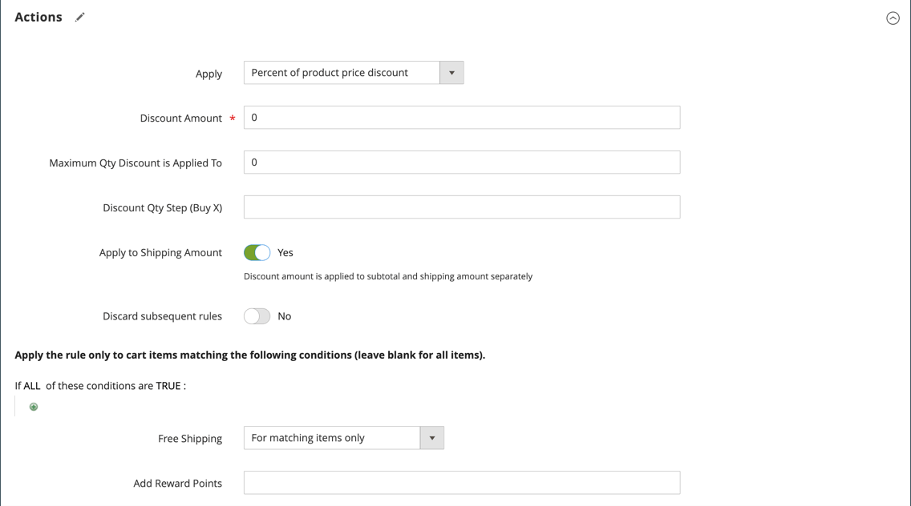

# 購物車價格規則範例 — 免運費促銷活動

免費送貨可以促銷方式提供，無論是否附有[優惠券](price-rules-cart-coupon.md)。 免費送貨優惠券或憑單也可套用至客戶取貨訂單，以便開立商業發票並送貨以完成[工作流程](../stores-purchase/order-processing.md#order-workflow-and-processing)。

某些運送業者組態可讓您根據最低訂單提供免運費。 若要在此基礎上更上一層樓，您可以使用購物車價格規則，根據多個產品屬性、購物車內容和客戶群組來建立複雜的條件。

## 步驟1. 啟用免費送貨

1. 在您的商店設定中啟用[免運費](../stores-purchase/shipping-free.md)。

1. 完成您要用於免費送貨的任何[電信業者服務](../stores-purchase/carriers.md)的免費送貨設定。

## 步驟2. 建立購物車價格規則

在&#x200B;_管理員_&#x200B;側邊欄上，移至&#x200B;**[!UICONTROL Marketing]** > _[!UICONTROL Promotions]_>**[!UICONTROL Cart Price Rules]**。

請依照下列步驟，設定您要提供的免運費促銷活動型別。

### 範例1：任何訂單的免運費

1. 完成&#x200B;**[!UICONTROL Rule Information]**，如下所示：

   - 輸入&#x200B;**[!UICONTROL Rule Name]**&#x200B;以供內部參考。
   - 輸入簡短&#x200B;**[!UICONTROL Description]**&#x200B;描述規則。
   - 將&#x200B;**[!UICONTROL Active]**&#x200B;設為`Yes`。
   - 在&#x200B;**[!UICONTROL Websites]**&#x200B;方塊中，選取每個提供免運費優惠券的網站。
   - 選取規則套用的&#x200B;**[!UICONTROL Customer Groups]**。
   - 將&#x200B;**[!UICONTROL Coupon]**&#x200B;設定為下列其中一項：
      - 若要提供不含優惠券的免運費促銷活動，請接受預設值(`No Coupon`)設定。
      - 若要搭配價格規則使用抵用券，請選取`Specific Coupon`。 如有必要，請完成指示以設定[抵用券](price-rules-cart-coupon.md)。

1. 向下捲動並展開 **[!UICONTROL Actions]**&#x200B;區段，然後執行下列動作：

   - 將&#x200B;**[!UICONTROL Apply]**&#x200B;設為`Percent of product price discount`。
   - 將&#x200B;**[!UICONTROL Apply to Shipping Amount]**&#x200B;設為`Yes`。
   - 將&#x200B;**[!UICONTROL Free Shipping]**&#x200B;設為`For matching items only`。

   {width="600" zoomable="yes"}

### 範例2：訂單金額超過$的免運費

1. 如上一個範例所述，完成&#x200B;**[!UICONTROL General Information]**&#x200B;設定。

1. 向下捲動並展開 **[!UICONTROL Conditions]**&#x200B;區段。

1. 按一下&#x200B;_新增_ （）以插入條件並執行下列動作：

   - 在&#x200B;**[!UICONTROL Cart Attribute]**&#x200B;下的清單中，選擇`Subtotal`。
   - 按一下&#x200B;**[!UICONTROL is]**&#x200B;並選擇`equals or greater than`。
   - 按一下&#x200B;**...**&#x200B;並輸入小計閾值（例如`100`）以完成條件。

   {width="600" zoomable="yes"}

1. 如有必要，請展開 **[!UICONTROL Actions]**&#x200B;區段，然後執行下列動作：

   - 將&#x200B;**[!UICONTROL Apply]**&#x200B;設為`Percent of product price discount`。
   - 將&#x200B;**[!UICONTROL Apply to Shipping Amount]**&#x200B;設為`Yes`。
   - 將&#x200B;**[!UICONTROL Free Shipping]**&#x200B;設為`For matching items only`。

## 步驟3. 完成標籤

完成購物車價格規則指示的[步驟4](price-rules-cart.md)，以輸入結帳期間出現的任何標籤。

## 步驟4. 儲存並測試規則

{{new-price-rule}}

1. 當您的規則完成時，按一下&#x200B;**[!UICONTROL Save Rule]**。

1. 測試規則以確保其正常運作。
