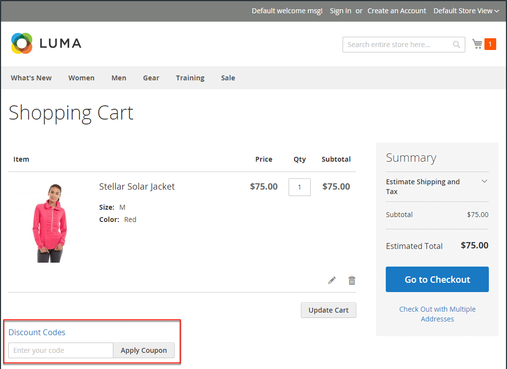

# 購物車價格規則

購物車價格規則會根據一組條件，將折扣套用至購物車中的專案。 當滿足條件或客戶輸入有效優惠券代碼時，可自動套用折扣。 套用時，折扣會顯示在小計下的購物車中。 如有需要，可以透過變更其狀態和日期範圍，將購物車價格規則用於季節或促銷活動。

>[!NOTE]
>
>如果優惠券購物車規則具有指定結帳選項的條件，例如特定送貨或付款方法，則只有在選取特定送貨/付款方法後，才符合結帳條件。 在這種情況下，可在最後一步的結帳時套用抵用券。

{width="600" zoomable="yes"}

## 存取購物車價格規則

1. 在&#x200B;_管理員_&#x200B;側邊欄上，移至&#x200B;**[!UICONTROL Marketing]** > _[!UICONTROL Promotions]_>**[!UICONTROL Cart Price Rules]**。

   {width="700" zoomable="yes"}

1. 如果您有許多規則，請使用每欄頂端的篩選選項來簡化清單，然後按一下&#x200B;**[!UICONTROL Search]**&#x200B;以套用篩選器。

1. 若要清除所有篩選選項並顯示完整清單，請按一下&#x200B;**[!UICONTROL Reset Filter]**。

1. 更新規則的屬性：

   -  （僅限Adobe Commerce）按一下「**[!UICONTROL Edit]**」以顯示「規則資訊」頁面。

   -  （僅限Magento Open Source）按一下清單中的規則以顯示「規則資訊」頁面。

   您可以在此處變更規則的設定（類似於建立規則）。

## 依欄篩選選項

| 欄 | 說明 |
|--- |--- |
| [!UICONTROL ID] | 輸入文字以篩選特定規則識別碼編號的清單。 |
| [!UICONTROL Rule] | 輸入文字，以根據建立規則時定義的規則名稱來篩選清單。 |
| [!UICONTROL Coupon Code] | 輸入文字，以根據建立規則時定義的程式碼名稱來篩選清單。 |
| [!UICONTROL Priority] | 根據為規則定義的優先順序篩選清單的自由文字欄位。 |
| [!UICONTROL Status] | 使用此選項來根據規則狀態（`Active`或`Inactive`）篩選清單。 |
| [!UICONTROL Web Site] | 使用此選項可依據針對規則定義的網站來篩選清單。 |
| [!UICONTROL Action] |  （僅限Adobe Commerce）按一下「**[!UICONTROL Edit]**」以顯示「_[!UICONTROL Rule Information]_」頁面並更新規則設定（類似於建立規則）。 |
| [!UICONTROL Start] |  （僅限Magento Open Source）使用動態行事曆欄位（_[!UICONTROL To:]_&#x200B;和_[!UICONTROL From:]_）根據建立規則時定義的規則開始日期來篩選清單。 |
| [!UICONTROL End] |  （僅限Magento Open Source）使用動態行事曆欄位（_[!UICONTROL To:]_&#x200B;和_[!UICONTROL From:]_），根據建立規則時定義的規則結束日期來篩選清單。 |

{style="table-layout:auto"}

## 使用Real-Time CDP受眾來通知購物車價格規則

瞭解如何在您的Adobe Commerce執行個體中[啟用](../customers/audience-activation.md)個Real-Time CDP對象，以告知購物車價格規則。
