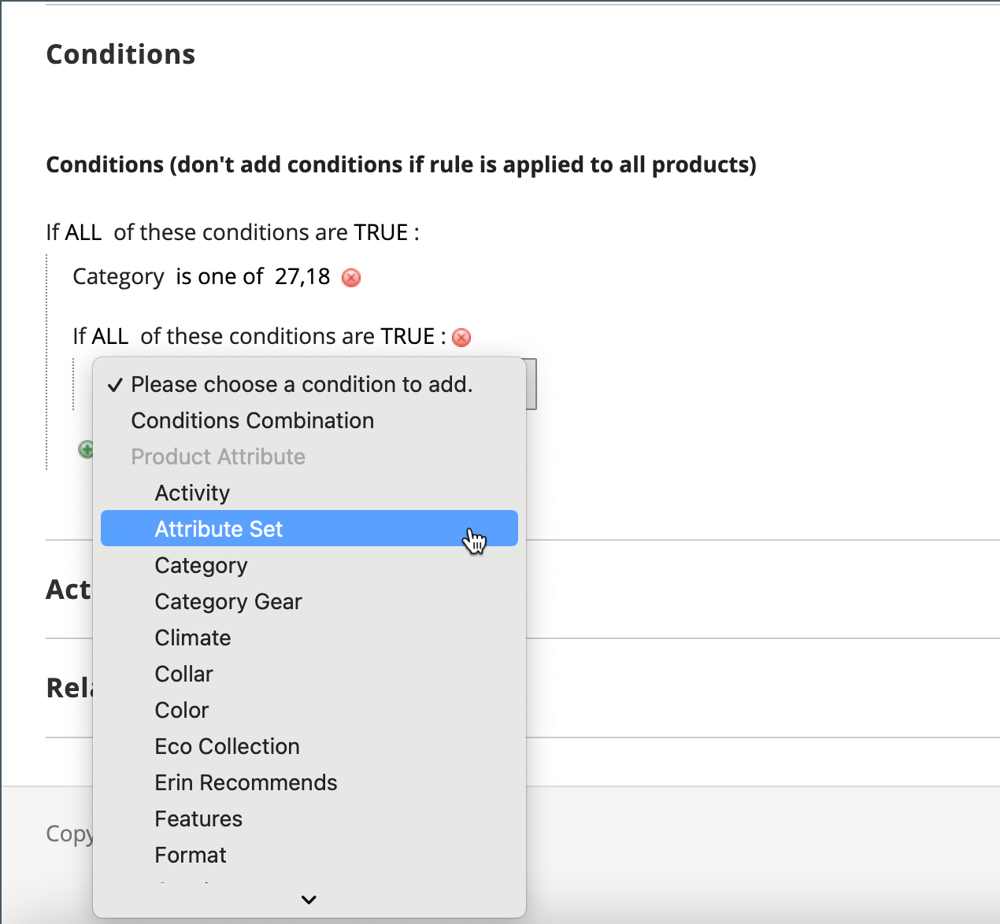
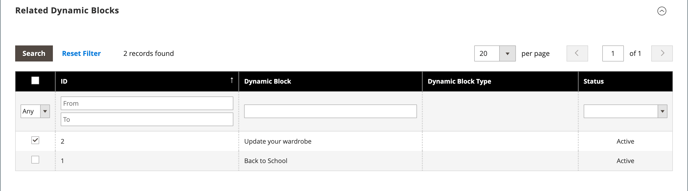
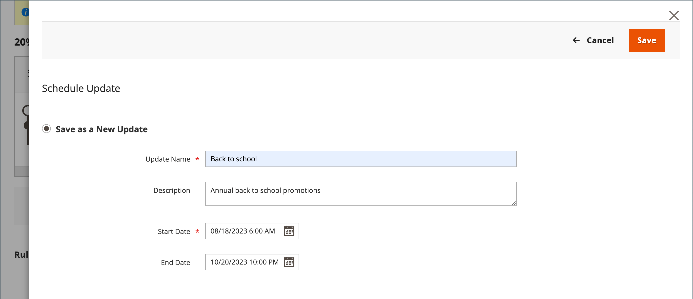

# 建立型錄價格規則

請依照這些指示，在符合一組條件時，對特定產品套用折扣。 目錄價格規則折扣在產品放入購物車之前生效。

## 步驟1：新增規則

1. 在&#x200B;_管理員_&#x200B;側邊欄上，移至&#x200B;**[!UICONTROL Marketing]** > _[!UICONTROL Promotions]_>**[!UICONTROL Catalog Price Rule]**。

1. 按一下右上角的&#x200B;**[!UICONTROL Add New Rule]**。

   _[!UICONTROL Rule Information]_&#x200B;區段包含&#x200B;**[!UICONTROL Conditions]**&#x200B;和&#x200B;**[!UICONTROL Actions]**&#x200B;的可擴充區段。

   {width="700" zoomable="yes"}

1. 完成&#x200B;**[!UICONTROL Rule Name]**&#x200B;和&#x200B;**[!UICONTROL Description]**&#x200B;欄位。

   這些欄位僅供內部參考。

1. 視需要設定價格規則的&#x200B;**[!UICONTROL Status]**。

   預設狀況為`Inactive`。

   >[!NOTE]
   >
   >建立規則後，可依需求將狀態變更為`Active`或`Inactive`以更新其狀態。

1. 選取要提供規則的&#x200B;**[!UICONTROL Websites]**。

1. 選取此規則要套用的&#x200B;**[!UICONTROL Customer Groups]**。

   若要選擇多個群組，請按住Ctrl鍵(PC)或Command鍵(Mac)，然後按一下每個選項。

   >[!NOTE]
   >
   >此清單中的選項取決於&#x200B;_客戶_ > _客戶群組_&#x200B;中建立和管理的客戶群組。

1.  (僅限Magento Open Source)輸入&#x200B;**[!UICONTROL From]**&#x200B;和&#x200B;**[!UICONTROL To]**&#x200B;日期以判斷價格規則何時生效。

   您可以輸入日期或使用&#x200B;**[!UICONTROL Calendar]** （）來選擇日期。 若將日期保留為空白，則會在儲存價格規則時啟用規則。

1. 輸入數字以建立此規則與其他規則相關的&#x200B;**[!UICONTROL Priority]**。

   >[!NOTE]
   >
   >當相同的目錄產品符合為多個價格規則設定的條件時，_[!UICONTROL Priority]_&#x200B;設定很重要。 具有最高優先順序設定的規則（從最高到最低的優先順序為0、1、2、3...）會針對產品啟用。

## 步驟2：定義條件

大部分的可用條件都以現有的屬性值為基礎。 若要將規則套用至所有產品，請將條件保留空白。

>[!NOTE]
>
>如果至少一個條件產品屬性具有空值，則型錄價格規則不會套用至產品。

>[!NOTE]
>
>若要將`Category`產品屬性條件套用至任何[套件](../catalog/product-create-bundle.md)或[群組](../catalog/product-create-grouped.md)產品，必須將所有子產品指派至相同的類別，才能正確套用規則。 如果沒有，您可以改用[購物車價格規則](price-rules-cart-create.md)促銷活動。

1. 向下捲動並展開 **[!UICONTROL Conditions]**&#x200B;區段。

   預設會顯示第一個條件，其狀態為：

   `If **ALL** of these conditions are **TRUE**:`

   {width="400"}

   陳述式有兩個粗體連結，您可以按一下這些連結，以顯示陳述式該部分的選項選項。 您可以變更這些值的組合，以建立不同的條件。

1. 請使用下列任一方式變更陳述式：

   - 按一下&#x200B;**[!UICONTROL ALL]**&#x200B;並選取`ALL`或`ANY`。
   - 按一下&#x200B;**[!UICONTROL TRUE]**&#x200B;並選取`TRUE`或`FALSE`。
   - 維持條件不變，將規則套用至所有產品。

   您可以變更這些值的組合，以建立不同的條件。 在此範例中，會使用預設條件。

1. 按一下下一行開頭的&#x200B;_新增_ （）圖示，並選取條件的選項，例如產品屬性或組合。

1. 在&#x200B;**[!UICONTROL Product Attribute]**&#x200B;下的清單中，選擇您要做為條件基礎的屬性。

   在此範例中，條件是`Attribute Set`。

   {width="400"}

   >[!NOTE]
   >
   >若要讓屬性出現在清單中，必須將它設定為用於促銷規則條件。 若要深入瞭解，請參閱[產品屬性](../catalog/product-attributes.md)。

   >[!NOTE]
   >
   >搭配&#x200B;_SKU_&#x200B;產品屬性與可設定產品使用`is not one of`條件時，必須同時選取父項與子項產品SKU。 若要避免在規則中列出所有子SKU，您可以針對可設定產品及其子產品的通用SKU部分使用`does not contain`條件。

   選取的條件會顯示在陳述式中，後面接著兩個粗體連結。 選項會因您選取的條件屬性而有所不同。 宣告現在說：

   `If **ALL** of these conditions are **TRUE**:  Attribute Set **is** …`

1. 按一下&#x200B;**[!UICONTROL is]**，然後選擇描述要符合的條件的比較運運算元。

   這些選項可能包含不同比較的選項。 在此範例中，選項為`is`和`is not`。

1. 選取或輸入條件的值。

   根據條件，您可以從格線或清單中選取產品、輸入數值等。

   {width="400"}

   選取的專案會出現在陳述式中，以完成條件。

   `If **ALL** of these conditions are **TRUE**:   Attribute Set **is Default**`

1. 若要新增其他條件列至陳述式，請按一下&#x200B;_新增_ （）圖示，並選擇下列其中一項：

   - `Conditions Combination`
   - `Product Attribute`

   重複此程式，直到所有需要的條件都完成為止。

   如果您隨時想要刪除部分條件陳述式，請按一下行尾的&#x200B;**[!UICONTROL Delete]** (圖示。

## 步驟3：定義動作

1. 展開 **[!UICONTROL Actions]**&#x200B;區段，然後執行下列動作：

   {width="600" zoomable="yes"}

1. 在&#x200B;**[!UICONTROL Pricing Structure Rules]**&#x200B;底下，將&#x200B;**[!UICONTROL Apply]**&#x200B;設定為下列其中一項：

   - `Apply as percentage of original` — 減去一般價格的百分比來折扣專案。 例如：在「折扣金額」中輸入10，以取得從一般價格減去10%的最終價格。
   - `Apply as fixed amount` — 從一般價格減去固定金額，以折扣專案。 例如：在「折扣金額」中輸入10，以取得比一般價格少$10的最終價格。
   - `Adjust final price to this percentage` — 以一般價格的百分比調整最終價格。 例如：在「折扣金額」中輸入25，以取得比一般價格低75%的最終價格。
   - `Adjust final price to discount value` — 將最終價格設定為固定的折扣金額。 例如：在「折扣金額」中輸入20，則最終價格為$20.00。

   >[!NOTE]
   >
   >_一般價格_&#x200B;是指不含任何進階價格（特殊/階層/群組）或促銷折扣的基本產品價格。 _最終價格_&#x200B;是指出現在購物車中的折扣價格。  使用下列公式，以&#x200B;**_最低_**&#x200B;相關價格計算&#x200B;**_最終_**&#x200B;產品價格：  `Final Price=Min(Regular(Base) Price, Group(Tier) Price, Special Price, Catalog Price Rule) + Sum(Min Price per each required custom option)`

   >[!NOTE]
   >
   >**_固定價格_**&#x200B;產品可自訂選項&#x200B;_不_&#x200B;受群組價格、層級價格、特殊價格或目錄價格規則影響。

1. 輸入&#x200B;**[!UICONTROL Discount Amount]**。

1. 若要在套用此規則後停止處理其他規則，請將&#x200B;**[!UICONTROL Discard Subsequent Rules]**&#x200B;設為`Yes`。

   >[!NOTE]
   >
   >將此專案設定為`Yes`是防止系統套用多重折扣（規則）至相同產品的保護措施。

## 步驟4：新增相關的動態區塊

{{ee-feature}}

只要符合條件，與目錄價格規則相關聯的[動態區塊](../content-design/dynamic-blocks.md)就會出現在店面。 此為選用步驟。

1. 展開 **[!UICONTROL Related Dynamic Blocks]**&#x200B;區段。

1. 使用[搜尋篩選器](../getting-started/admin-workspace.md)來找出您要與規則關聯的動態區塊。

1. 選取第一欄中的核取方塊，將動態區塊與規則相關聯。

   {width="600" zoomable="yes"}

1. 按一下&#x200B;**[!UICONTROL Save and Continue Edit]**。

## 步驟5：排程規則

{{ee-feature}}

>[!NOTE]
>
>將規則設定為作用中時，必須新增為排程更新。 若要深入瞭解，請參閱[排程變更](price-rule-catalog-scheduled-changes.md)。

1. 在&#x200B;_排程變更_&#x200B;方塊中，按一下方塊頂端的&#x200B;**[!UICONTROL Schedule New Update]**。

   如果規則已有排定的更新，您可以按一下所列出變更右側的&#x200B;**[!UICONTROL View/Edit]**。

   您可以編輯現有的更新，或將型錄價格規則指定給其他促銷活動。 預設會選取&#x200B;**編輯現有更新**&#x200B;選項。

1. 若要排程規則，請輸入價格規則要生效的&#x200B;**[!UICONTROL Start Date]**&#x200B;與&#x200B;**[!UICONTROL End Date]**。

   您可以輸入日期或從&#x200B;_行事曆_ （）中選擇日期。

   {width="600" zoomable="yes"}

1. 按一下&#x200B;**[!UICONTROL Save]**。

1. 在&#x200B;_規則資訊_&#x200B;區段中，將&#x200B;**[!UICONTROL Status]**&#x200B;設為`active`。

## 步驟6：儲存並測試規則

1. 完成後，儲存規則。

   -  (僅限Magento Open Source)按一下&#x200B;**[!UICONTROL Save and Apply]**。

   -  (僅限Adobe Commerce)按一下&#x200B;**[!UICONTROL Save]**。

     「規則資訊」頁面會在規則的排程變更中顯示更新的時間表。

     {width="600" zoomable="yes"}

1. 更新規則的屬性：

   -  (僅限Adobe Commerce)按一下「**[!UICONTROL Edit]**」以顯示&#x200B;_[!UICONTROL Rule Information]_&#x200B;頁面。

   -  (僅限Magento Open Source)按一下清單中的規則以顯示&#x200B;_[!UICONTROL Rule Information]_&#x200B;頁面。

1. 測試規則以確保其正常運作。

   價格規則每晚都會與其他系統規則一起自動處理。 建立價格規則時，請先留出足夠的時間讓規則進入系統，然後再測試規則，確保規則正常運作。 新增規則後，Commerce會據此重新計算價格和優先順序。

## 目錄價格規則示範

觀看此影片，瞭解如何建立目錄價格規則：

>[!VIDEO](https://video.tv.adobe.com/v/343834?quality=12&learn=on)

## 欄位說明

### [!UICONTROL Rule Information]

| 欄位 | 說明 |
|-----|-----------|
| [!UICONTROL Rule name] | （必要）規則的名稱供內部參考。 |
| [!UICONTROL Description] | 規則的說明應包括規則的用途並解釋其使用方式。 |
| [!UICONTROL Websites] | （必要）識別可使用此規則的網站。 |
| [!UICONTROL Customer Groups] | （必要）識別規則套用的客戶群組。 |
| [!UICONTROL Priority] | 表示此規則相對於其他規則的優先順序的數字。 從最高到最低的優先順序為`0,1,2,3...` |
| [!UICONTROL Status] |  (僅限Magento Open Source)判斷規則在存放區中是否有效。 選項： `Yes` / `No` |
| [!UICONTROL From] |  (僅限Magento Open Source)指定價格規則生效的第一天。 如果保留為空白，價格規則會在儲存時生效。 |
| [!UICONTROL To] |  (僅限Magento Open Source)指定價格規則生效的最後一天。 如果保留為空白，價格規則會無限期繼續。 |

{style="table-layout:auto"}

### [!UICONTROL Conditions]

指定型錄價格規則生效之前必須符合的條件。 若保留為空白，此規則將套用至所有產品。

### [!UICONTROL Actions]

| 欄位 | 說明 |
|-----|-----------|
| [!UICONTROL Apply] | 決定套用至購買的計算型別。 選項：  **[!UICONTROL Apply as percentage of original]**— 減去一般價格的百分比，以折扣料號。 **[!UICONTROL Apply as fixed amount]** — 從一般價格減去固定金額，以折扣專案。  **[!UICONTROL Adjust final price to this percentage]**— 以一般價格的百分比調整最終價格。 **[!UICONTROL Adjust final price to discount value]** — 將最終價格設定為固定的折扣金額。   **_備註：_**&#x200B;一般價格是指不含任何進階價格（特殊/階層/群組）或促銷折扣的基準產品價格。 最終價格是指出現在購物車中的折扣價格。  使用下列公式，以&#x200B;**_最低&#x200B;_**&#x200B;相關價格計算&#x200B;**_最終&#x200B;_**&#x200B;產品價格：  `Final Price=Min(Regular(Base) Price, Group(Tier) Price, Special Price, Catalog Price Rule) + Sum(Min Price per each required custom option)` |
| [!UICONTROL Discount Amount] | （必要）提供的折扣金額。 |
| [!UICONTROL Discard Subsequent Rules] | 決定是否可將其他規則套用至此次購買。 若要防止將多重折扣套用至相同的購買，請選取`Yes`。 選項： `Yes` / `No` |

{style="table-layout:auto"}

### [!UICONTROL Related Dynamic Blocks]

{{ee-feature}}

識別與規則關聯的任何[動態區塊](../content-design/dynamic-blocks.md)。
