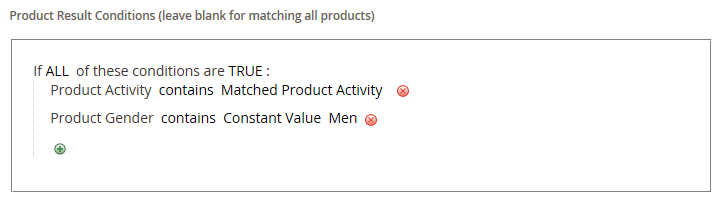

# 建立相關的產品規則

{{ee-feature}}

建立相關產品規則的程式與設定價格規則類似。 首先，請定義相符條件，然後選擇要顯示的產品。 在任何指定時間，都可能會觸發數個作用中規則來顯示相關產品、向上銷售和交叉銷售。 每個規則的優先順序會決定產品區塊在頁面上出現的順序。

>[!NOTE]
>
>對於要用於目標規則中的屬性， [_[!UICONTROL Use for Promo Rule Conditions]_](../catalog/product-attributes.md) 屬性必須設定為 `Yes`.

>[!NOTE]
>
>此 `All Store Views` 範圍值一律會用於兩者 [!UICONTROL Products to Match] 和 [!UICONTROL Products to Display] 所有產品屬性的條件。 當產品屬性針對不同的商店檢視和網站具有不同值時，這也適用。

## 建立相關的產品規則

1. 在 _管理員_ 側欄，前往 **[!UICONTROL Marketing]** > _[!UICONTROL Promotions]_>**[!UICONTROL Related Product Rules]**.

1. 在右上角，按一下 **[!UICONTROL Add Rule]**.

   {width="600" zoomable="yes"}

1. 完成 **[!UICONTROL Rule Information]** 如下所示：

   - 輸入 **[!UICONTROL Rule Name]** 以識別在Admin中運作時的規則。

   - 的 **[!UICONTROL Priority]**，輸入數字，以決定其他規則的結果鎖定相同位置時，結果在頁面上顯示的順序。 數字 `1` 是最高優先順序。

   - 若要啟用規則，請設定 **[!UICONTROL Status]** 至 `Active`.

   - 設定 **[!UICONTROL Apply To]** 變更為下列其中一項：

      - `Related Products`
      - `Up-sells`
      - `Cross-sells`

   - 如果規則要在特定時間範圍內啟用，請輸入 **[!UICONTROL From]** 和 **[!UICONTROL To]** 日期。

   - 的 **[!UICONTROL Result Limit]**，輸入要出現在結果清單中的記錄數。 最大數目為20。

   - 如果規則套用至特定 [客戶區段](../customers/customer-segments.md)，設定 **[!UICONTROL Customer Segments]** 至 `Specified` 並從清單中選擇客戶區段。

   - 如果規則套用至特定 [Real-Time CDP對象](../customers/audience-activation.md)，設定 **[!UICONTROL Real-Time CDP Audience]** 至 `Specified` 並從清單中選擇Real-Time CDP對象。 此功能為測試版。 如果您想要加入Beta版計畫，請傳送要求至 [dataconnection@adobe.com](mailto:dataconnection@adobe.com).

     {width="500"}

1. 在左側面板中，選擇 **[!UICONTROL Products to Match]** 並建置條件，就像您對 [型錄價格規則](price-rules-catalog.md).

   {width="500"}

1. 在左側面板中，選擇 **[!UICONTROL Products to Display]** 並建置結果條件，就像您對 [型錄價格規則](price-rules-catalog.md).

   {width="500"}

   完成條件以說明您要包含在顯示結果中的產品。

1. 完成後，按一下 **[!UICONTROL Save]**.

## 刪除相關的產品規則

1. 在 _管理員_ 側欄，前往 **[!UICONTROL Marketing]** > _[!UICONTROL Promotions]_>**[!UICONTROL Related Product Rules]**.

1. 尋找您要刪除的相關產品規則。

1. 按一下規則以開啟詳細資訊頁面。

1. 在右上角，按一下 **[!UICONTROL Delete]**.

1. 若要確認動作，請按一下 **[!UICONTROL OK]**.

## 相關產品規則示範

觀看此影片以瞭解如何建立相關的產品規則：

>[!VIDEO](https://video.tv.adobe.com/v/343837?quality=12&learn=on)

## 欄位說明

| 欄位 | 說明 |
|--- |--- |
| [!UICONTROL Rule Name] | 識別內部使用規則的名稱。 |
| [!UICONTROL Priority] | 決定規則的結果與針對頁面上相同位置的其他結果集一起顯示時的顯示順序。 此值可設為任何整數，最高優先順序為1。 例如，如果有多個適用的向上銷售規則，優先順序最高的規則會出現在其他規則之前。 每組結果中的產品排序順序是隨機的。 任何手動設定的向上銷售、交叉銷售及相關產品，一律會出現在任何規則型產品促銷活動之前的頁面上。 |
| [!UICONTROL Status] | 控制規則的作用中狀態。 選項： `Active` / `Inactive` |
| [!UICONTROL Apply To] | 識別與規則相關聯的產品關係型別。 選項： `Related Products` / `Up-sells` / `Cross-sells` |
| [!UICONTROL From Date] | 如果規則在一段時間內有效，此設定會決定規則生效的第一個日期。 |
| [!UICONTROL To Date] | 如果規則在一段時間內有效，此設定會決定規則最後有效的日期。 |
| [!UICONTROL Result Limit] | 決定一次出現在結果中的產品數量。 最大數目為20。 如果找到更多相符的結果，每次重新整理頁面時，產品都會在區塊中旋轉。 |
| [!UICONTROL Customer Segments] | 識別規則套用的客戶區段。 選項： `All` / `Specified` |

{style="table-layout:auto"}
