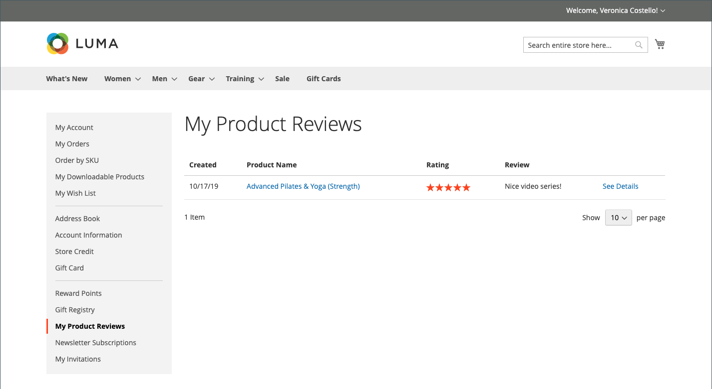

# 產品評論

產品評論有助於建立社群意識，而且被認為比任何廣告收入都更可信。 事實上，有些搜尋引擎會對有產品評論的網站給予比沒有產品評論的網站更高的排名。 對於透過搜尋特定產品來尋找您網站的人，產品評論基本上是您商店的登陸頁面。 產品評論有助於人們找到您的商店、讓他們持續參與，並且經常帶來銷售。

Commerce包含原生產品檢閱功能，可由管理員管理。 您也可以使用[Commerce Marketplace](../getting-started/commerce-marketplace.md)的擴充功能，以使用裝載的稽核管理系統。

>[!NOTE]
>
>Adobe Commerce和Magento Open Source版本2.4.0到2.4.3包含Yotpo廠商開發的擴充功能。 從2.4.4版開始，此擴充功能不再與核心版本搭配，必須從Commerce Marketplace安裝和更新。 此Marketplace也可讓您存取擴充功能開發人員提供的目前檔案。
>&#x200B;>  
>&#x200B;>如果您已啟用並設定隨附的擴充功能，則必須在2.4.4升級程式中更新composer.json檔案，並管理後續的擴充功能更新。 如需詳細資訊，請參閱&#x200B;_升級指南_&#x200B;中的[升級模組](https://experienceleague.adobe.com/docs/commerce-operations/upgrade-guide/modules/upgrade.html)。

## 店面的產品評論

啟用原生產品評論功能時，客戶可以為目錄中的任何產品撰寫評論。 您可以按一下，從產品頁面撰寫評論：

- **新增您的產品評論** （包含現有評論）。

- **成為第一個檢閱此產品的使用者**，檢閱沒有現有檢閱的產品。

[!UICONTROL Reviews]索引標籤會列出所有目前的稽核，以及用於提交稽核的表單。

您的設定會決定客戶在撰寫產品評論之前是否必須在您的商店開立帳戶，或者他們是否能以訪客身份提交評論。 要求稽核者開立帳戶，可防止匿名提交並改善稽核品質。

{width="700" zoomable="yes"}

星級數表示產品的滿意度評等。 訪客可以按一下連結，閱讀評論並撰寫自己的評論。 作為獎勵，客戶可以因提交評論而獲得獎勵積分。 提交稽核時，稽核會傳送給管理員進行稽核。 核准後，該評論就會發佈在您的商店中。

{width="700" zoomable="yes"}

### [!UICONTROL My Product Reviews]

客戶帳戶儀表板的&#x200B;_[!UICONTROL My Product Reviews]_&#x200B;區段會列出客戶提交並核准發佈的所有評論。 每個稽核摘要都包含提交稽核的日期、產品頁面的連結和稽核詳細資訊。

{width="700" zoomable="yes"}

1. 在其帳戶的側邊欄中，客戶選擇&#x200B;**[!UICONTROL My Product Reviews]**。

1. 若要檢視完整評論，請按一下&#x200B;**[!UICONTROL See Details]**。

   {width="700" zoomable="yes"}

## 啟用產品評論功能

Commerce產品評論功能預設為啟用。

>[!NOTE]
>
>若要將這些欄位設為`No`並停用Commerce產品評論，您必須清除&#x200B;**使用系統值**&#x200B;核取方塊。

1. 在&#x200B;_管理員_&#x200B;側邊欄上，移至&#x200B;**[!UICONTROL Stores]** > _[!UICONTROL Settings]_>**[!UICONTROL Configuration]**。

1. 在左側面板中，展開&#x200B;**[!UICONTROL Catalog]**&#x200B;並選取下方的&#x200B;**[!UICONTROL Catalog]**。

1. 展開&#x200B;**[!UICONTROL Product Reviews]**&#x200B;區段的。

   {width="600" zoomable="yes"}

1. 將&#x200B;**[!UICONTROL Enabled]**&#x200B;設為`Yes`。

   這是啟用產品評論的預設設定。

1. 將&#x200B;**[!UICONTROL Allow Guests to Write Reviews]**&#x200B;設為`Yes`。

   此預設設定可判斷客戶是否必須在您的商店開立帳戶才能撰寫產品評論。

1. 完成時，按一下&#x200B;**[!UICONTROL Save Config]**。

## 建立自訂評等

透過Commerce產品評論，客戶可以在提交產品評論時指派評分。 預設評等為品質、價格和值。 除了這些以外，您也可以新增自己的自訂評分。 目錄頁面上顯示的五星級評等是每個產品的平均值。

{width="700" zoomable="yes"}

1. 在&#x200B;_管理員_&#x200B;側邊欄上，移至&#x200B;**[!UICONTROL Stores]** > _[!UICONTROL Attributes]_>**[!UICONTROL Rating]**。

1. 按一下右上角的&#x200B;**[!UICONTROL Add New Rating]**。

   {width="700" zoomable="yes"}

1. 在&#x200B;_[!UICONTROL Rating Title]_&#x200B;區段中，輸入新評等的&#x200B;**[!UICONTROL Default Value]**。

   如果適用，也請輸入每個商店檢視的翻譯。

   {width="600" zoomable="yes"}

1. 在&#x200B;_評等可見度_&#x200B;區段中，將&#x200B;**[!UICONTROL Visibility In]**&#x200B;設定為要使用評等的商店檢視。

   若要選取多個存放區檢視，請按住Ctrl鍵(PC)或Command鍵(Mac)並按一下每個專案。

   >[!NOTE]
   >
   >除非指派給商店檢視，否則不會顯示評等。

1. 針對&#x200B;**[!UICONTROL Sort Order]**，輸入數字，以決定此評等與其他專案一起列出的順序。

1. 如果要在店面顯示您的評分，請選取&#x200B;**[!UICONTROL Is Active]**&#x200B;核取方塊。

   {width="600" zoomable="yes"}

1. 完成時，按一下&#x200B;**[!UICONTROL Save Rating]**。

   目錄產品格線頁面上會顯示每個產品的所有評論平均評分。

   {width="700" zoomable="yes"}
