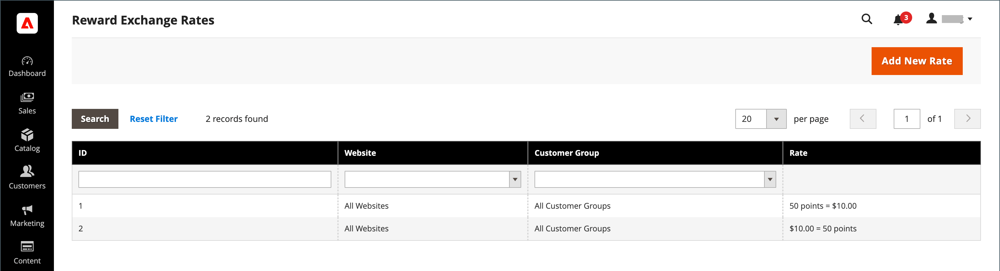

# 獎勵匯率

{{ee-feature}}

獎勵匯率會決定根據訂單金額所賺取的點數，以及所賺取的點數的值。 不同的匯率適用於不同的網站和不同的客戶群組。 如果來自不同網站和客戶群組的多個匯率套用至相同的客戶，則套用下列優先順序規則：

## 匯率優先順序

**1**：套用至特定網站和特定客戶群組。

**2**：套用至所有網站和特定客戶群組。

**3**：套用至特定網站和所有客戶群組。

**4**：適用於所有網站和所有客戶群組。

將貨幣轉換為點數時，點數無法劃分。 任何剩餘貨幣都會無條件舍去。 例如，如果$2.00轉換成十點，則以$2.00的群組獲得點數。因此，$7.00的訂單可贏取30點，而剩下的$1.00則會舍入入計算。 訂單的貨幣金額定義為商家收到的金額，或總金額減去運費、稅捐、折扣、商店貸方和禮品卡。 當訂單中沒有未開立商業發票的專案時（所有專案都會付款或取消），即會取得積分。 如果管理員使用者不想讓客戶獲得已取消訂單的獎勵積分，則可以從「管理客戶」頁面手動扣除這些積分。

## 設定匯率

{width="700" zoomable="yes"}

1. 在 _管理員_ 側欄，前往 **[!UICONTROL Stores]** > _[!UICONTROL Other Settings]_>**[!UICONTROL Reward Exchange Rates]**.

1. 在右上角，按一下 **[!UICONTROL Add New Rate]**.

1. 在 **[!UICONTROL Reward Exchange Rate Information]** 區段，請執行下列動作：

   {width="600" zoomable="yes"}

   - 設定 **[!UICONTROL Website]** 至獎勵匯率適用的網站。

   - 設定 **[!UICONTROL Customer Group]** 套用獎勵匯率的群組。

   - 設定 **[!UICONTROL Direction]** 變更為下列其中一項：

      - `Points to Currency`
      - `Currency to Points`

   無論是哪一個「方向」設定，金額都會以網站的基本貨幣表示。

1. 輸入 **[!UICONTROL Rate]** 根據 _[!UICONTROL Direction]_設定。

   | 方向 | 費率設定 |
   |---------|-------------|
   | [!UICONTROL Points to Currency] | 在第一個 _[!UICONTROL Rate]_欄位，輸入點數。 在第二個_[!UICONTROL Rate]_ 欄位，輸入點的貨幣值。 |
   | [!UICONTROL Currency to Points] | 在第一個  _[!UICONTROL Rate]_欄位，輸入貨幣值。 在第二個_[!UICONTROL Rate]_ 欄位，輸入貨幣值所代表的點數。 |

   將點數轉換為貨幣時，點數無法劃分。 例如，如果10點轉換為$2.00，則必須在以10點為單位的群組中兌換點。 因此，25點可兌換$4.00，剩餘5點則歸客戶結餘。

   建議您為兩者設定轉換 `Points to Currency` 和 `Currency to Points`.

1. 完成後，按一下 **[!UICONTROL Save]**.

## 刪除獎勵匯率

1. 在 _管理員_ 側欄，前往 **[!UICONTROL Stores]** > _[!UICONTROL Other Settings]_>**[!UICONTROL Reward Exchange Rates]**.

1. 尋找要刪除的獎勵匯率，並在編輯模式中開啟。

1. 在功能表列中，按一下 **[!UICONTROL Delete]**.

1. 若要確認動作，請按一下 **[!UICONTROL OK]**.

## 欄位說明

| 欄位 | 說明 |
|--- |--- |
| [!UICONTROL Website] | 套用回報率的網站。 |
| [!UICONTROL Customer Group] | 套用回報率的客戶群組。 |
| [!UICONTROL Direction] | 決定匯率所定義的交易型別。 選項：  **[!UICONTROL Points to Currency]**— 定義可套用為訂單金額之點數的點數。 在第一個 _[!UICONTROL Rate]_欄位，輸入點數。 在第二個_[!UICONTROL Rate]_ 欄位，輸入點的貨幣值。 **[!UICONTROL Currency to Points]**  — 定義可取得客戶點的訂單金額。 在第一個  _[!UICONTROL Rate]_欄位，輸入貨幣值。 在第二個_[!UICONTROL Rate]_ 欄位，輸入貨幣值所代表的點數。 |
