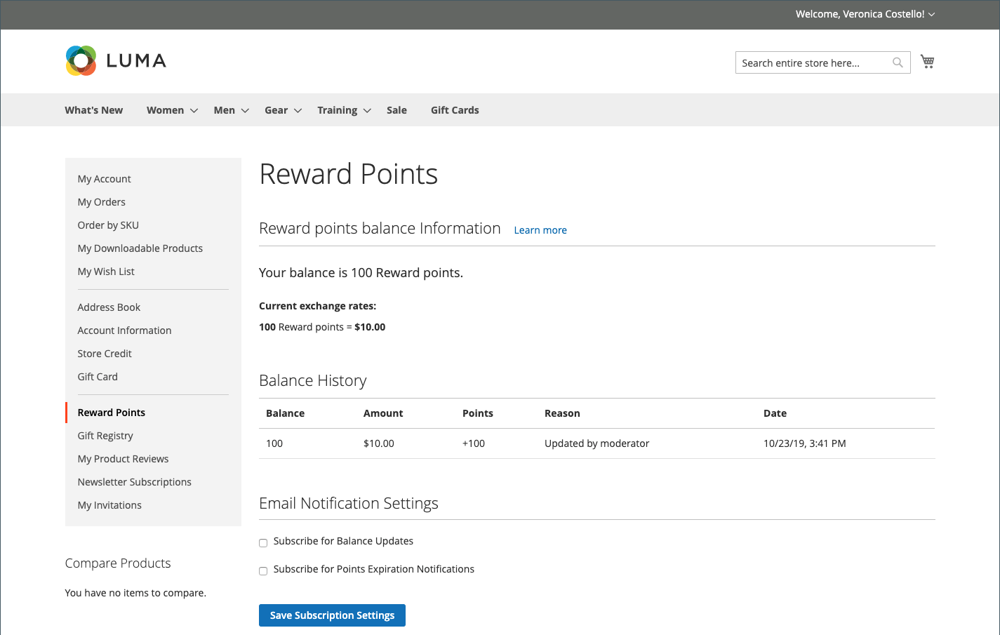

# 獎勵點數店面體驗

{{ee-feature}}

此 [獎勵點數](rewards-loyalty.md) 「客戶帳戶」的區段會顯示客戶取得的獎勵點數目前餘額，以及其獎勵點數餘額的歷史記錄。

{width="700" zoomable="yes"}

## 在結帳期間兌換獎勵積分

如果 [獎勵匯率](reward-exchange-rates.md) 替換為 `Points to Currency` 方向已設定，客戶可在結帳時使用獎勵積分。

1. 將所有必需的產品新增至購物車後，客戶會導覽至結帳。

1. 輸入所有必要的送貨資訊，並導覽至 _稽核與付款_ 步驟。

1. 在 _[!UICONTROL Reward points]_區段，檢查可用點的數目及其貨幣值。

1. 點擊數 **[!UICONTROL Use reward points]**.

{width="700" zoomable="yes"}

可用點數折扣會套用至小計。

>[!NOTE]
>
>如果可用餘額大於訂單的總計，則不需要其他付款方式。
