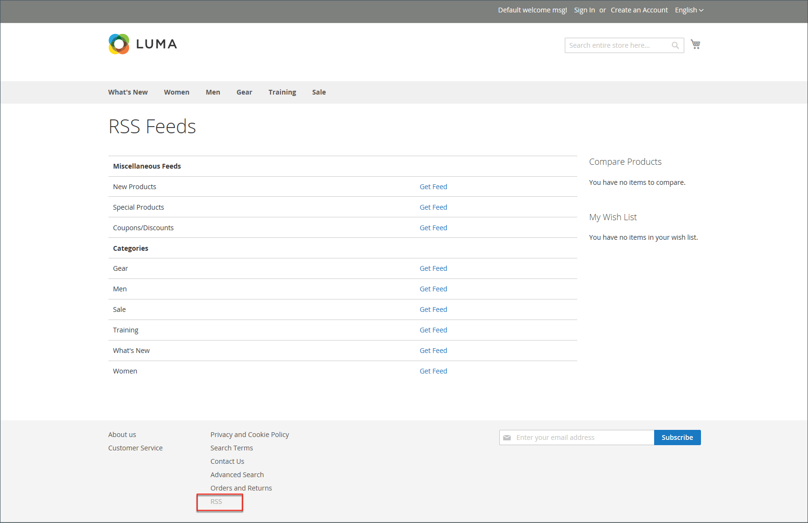

# 社群媒體和RSS摘要

許多商家使用社群媒體和其他數位工具來建立品牌和產品知名度。 您可以安裝Marketplace擴充功能或新增外掛程式至內容頁面，將商店與社交網路整合。 使用RSS摘要將您的產品資訊發佈到購物彙總網站，甚至將其包含在您的電子報中。 客戶可以訂閱您的RSS摘要，瞭解新產品和促銷活動。

## 社交網路

您可以透過安裝 [Marketplace擴充功能](../getting-started/commerce-marketplace.md). 此外，您也可以輕鬆新增社交外掛程式，例如 _按讚_ CMS區塊按鈕，可整合至您商店各頁面中。

社交網站有許多外掛程式，可以輕鬆新增到您的商店。 此外，Commerce Marketplace上有許多擴充功能可用來將您的商店與社群媒體整合。 下列範例顯示如何新增Facebook _按讚_ 按鈕到您的商店。

>[!NOTE]
>
>Adobe Commerce已移除原生 _Magento社交_ facebook整合，不再支援此擴充功能。 前往 [Commerce Marketplace](https://marketplace.magento.com/catalogsearch/result/?q=Facebook){：target=&quot;_blank&quot;}以尋找Facebook整合的替代擴充功能。

### 步驟1. 取得按鈕程式碼

1. 在中繼開發人員網站上，前往 [按鈕設定](https://developers.facebook.com/docs/plugins/like-button) 頁面。

1. 的 **[!UICONTROL URL to Like]**，輸入您商店中您希望人們瀏覽的頁面URL _按讚_.

   例如，您可以輸入商店首頁的URL。

1. 選擇 **[!UICONTROL Layout]** 用於按鈕。

1. 輸入 **[!UICONTROL Width]** 以您的網站上按鈕及任何關聯文字訊息可用的畫素為單位。

1. 設定 **[!UICONTROL Action Type]** 變更為下列其中一項：

   - `Like`
   - `Recommend`

1. 按一下 **[!UICONTROL Get Code]** 將產生的程式碼複製到剪貼簿。

### 步驟2. 建立內容區塊

1. 返回您的商店管理員。

1. 在 _管理員_ 側欄，前往 **[!UICONTROL Content]** > _[!UICONTROL Elements]_>**[!UICONTROL Blocks]**.

1. 在右上角，按一下 **[!UICONTROL Add New Block]**.

1. 輸入描述性 **[!UICONTROL Block Title]** 以供內部參考。

   例如： `Facebook Like Button`.

1. 指派唯一 **[!UICONTROL Identifier]** 至區塊時，請使用所有小寫字元和底線而非空格。

   例如： `facebook_like_button`.

1. 如果您的Commerce執行個體有多個商店檢視，請選擇各個 **[!UICONTROL Store View]** 區塊可用的位置。

1. 視您的內容工具而定，將程式碼片段新增至區塊內容：

   - 使用時 [!DNL Page Builder]，新增 [HTML代碼](../page-builder/html-code.md) 將封鎖至舞台，並貼上您從Facebook網站複製的程式碼片段。 否則，請將程式碼片段貼入 **[!UICONTROL Content]** 方塊。

   - 使用編輯器時，將您從Facebook網站複製的程式碼片段貼到 **[!UICONTROL Content]** 方塊。

1. 如果區塊尚未準備好上線，請設定 **[!UICONTROL Enable Block]** 至 `No`.

1. 完成後，按一下 **[!UICONTROL Save Block]**.

### 步驟3. 放置區塊

1. 根據您的內容工具新增區塊：

   - 使用時 [!UICONTROL Page Builder]，請依照指示執行 [新增區塊](../page-builder/block.md) 到舞台。

   - 在 _管理員_ 側欄，前往 **[!UICONTROL Content]** > _[!UICONTROL Elements]_>**[!UICONTROL Widgets]**.

1. 在右上角，按一下 **[!UICONTROL Add Widget]** 並執行下列動作：

   -  (僅適用於Adobe Commerce B2B) _設定_ 部分，設定 **[!UICONTROL Type]** 至 `CMS Static Block` 並按一下 **[!UICONTROL Continue]**.

   - 確認 **[!UICONTROL Design Theme]** 設定為目前佈景主題。

   - 按一下 **[!UICONTROL Continue]**.

1. 在 **[!UICONTROL Storefront Properties]** 區段，請執行下列動作：

   - 的 **[!UICONTROL Widget Title]**，輸入標題以供內部參考。

   - 設定 **[!UICONTROL Assign to Store Views]** 至 `All Store Views`，或前往您要讓應用程式可用的檢視。 若要選取多個檢視，請按住Ctrl鍵(PC)或Command鍵(Mac)並按一下每個選項。

   - 在 **[!UICONTROL Sort Order]** 如果區塊被指派在頁面上與其他內容元素相同的位置出現，此欄位可用於決定區塊的順序。 頂端位置是零。

1. 在 _[!UICONTROL Layout Updates]_區段，按一下&#x200B;**[!UICONTROL Add Layout Update]**並設定&#x200B;**[!UICONTROL Display On]**至您要顯示區塊的類別、產品或頁面。

   例如，如果您選擇 `All Pages` 並將區塊放置在頁首或頁尾中，區塊會出現在商店每個頁面的相同位置。

   若要將區塊放置在特定頁面上，請執行下列動作：

   - 設定 **[!UICONTROL Display On]** 至 `Specified Page` 並選取 **[!UICONTROL Page]** 您希望區塊出現的位置。

   - 選擇 **[!UICONTROL Block Reference]** 識別頁面上要放置區塊的位置。

   - 接受預設設定 **[!UICONTROL Template]**，設為 `CMS Static Block Default Template`.

   - 按一下 **[!UICONTROL Save and Continue Edit]**.

1. 在左側的面板中，選擇 **[!UICONTROL Widget Options]**.

1. 按一下 **[!UICONTROL Select Block…]** 並選擇要放置的區塊。

1. 完成後，按一下 **[!UICONTROL Save]**.

1. 出現提示時，請依照工作區頂端的指示，更新索引和頁面快取。

   Widget現在會出現在 _[!UICONTROL Widgets]_清單。

### 步驟4. 驗證在存放區中的位置

返回您的店面，確認區塊位於正確位置。 若要移動區塊，您可以重新開啟Widget，嘗試不同的頁面或區塊參照。

## RSS摘要

RSS (Really Simple Syndication)是一種以XML為基礎的資料格式，用於線上散發資訊。 您的客戶可以訂閱您的RSS摘要，以瞭解有關新產品和促銷活動的資訊。 RSS摘要也可用來將您的產品資訊發佈到購物彙總網站，並包含在電子報中。

啟用RSS摘要時，產品、特殊優惠、類別和優惠券的任何新增內容都會自動傳送給每個摘要的訂閱者。 您發佈的所有RSS摘要連結位於商店頁尾。

{width="100"} 

讀取RSS摘要所需的軟體稱為摘要讀取器，可讓使用者訂閱標題、部落格、播客等。 GoogleReader是眾多線上免費提供的摘要閱讀程式之一。

{width="700" zoomable="yes"}

### 設定RSS摘要的優點

- 從您的商店或部落格下載最新更新
- 淺色廣告
- 普通股
- 提升SEO
- 增加銷售額

### RSS摘要型別

| RSS摘要 | 說明 |
|--- |--- |
| [!UICONTROL Wish List] | 啟用時，RSS摘要連結會出現在客戶希望清單頁面的頂端。 此外，希望清單共用頁面包含一個核取方塊，可讓您包含共用希望清單之摘要的連結。 |
| [!UICONTROL New Products] | 發佈新增至目錄之新產品的通知。 |
| [!UICONTROL Special Products] | 發佈任何具有特殊定價之產品的通知。 |
| [!UICONTROL Coupons / Discounts] | 發佈商店內任何特殊優惠券或折扣的通知。 |
| [!UICONTROL Top Level Category] | 發佈目錄之最上層類別結構變更的通知，這會反映在主功能表中。 |
| [!UICONTROL Customer Order Status] | 讓客戶能透過RSS摘要追蹤其訂單狀態。 啟用時，訂單上會顯示RSS摘要連結。 |

{style="table-layout:auto"}

### 為您的商店設定RSS摘要

1. 在 _管理員_ 側欄，前往 **[!UICONTROL Stores]** > _[!UICONTROL Settings]_>**[!UICONTROL Configuration]**.

1. 在右上角，設定 **[!UICONTROL Store View]** 至可使用摘要的檢視。

   如果系統提示您確認，請按一下 **[!UICONTROL OK]**.

1. 在左側面板中，展開 **[!UICONTROL Catalog]** 並選擇 **[!UICONTROL RSS Feeds]**.

1. 展開  此 **[!UICONTROL Rss Config]** 部分與集合 **[!UICONTROL Enable RSS]** 至 `Enable`.

   {width="600" zoomable="yes"}

   如有必要，請清除 **[!UICONTROL Use Default]** 核取方塊以變更預設值。

1. 展開  此 **[!UICONTROL Wish List]** 部分與集合 **[!UICONTROL Enable RSS]** 至 `Enable`.

1. 展開  此 **[!UICONTROL Catalog]** 區段並將其他摘要設為 `Enable` 視需要。

   - **[!UICONTROL New Products]**
   - **[!UICONTROL Special Products]**
   - **[!UICONTROL Coupons/Discounts]**
   - **[!UICONTROL Top Level Category]**

   {width="600" zoomable="yes"}

1. 展開  此 **[!UICONTROL Order]** 部分與集合 **[!UICONTROL Customer Order Status Notification]** 至 `Enable`.

1. 完成後，按一下 **[!UICONTROL Save Config]**.

1. 透過以下方式檢視店面的結果 `/rss` 在頁面URL的結尾處。

