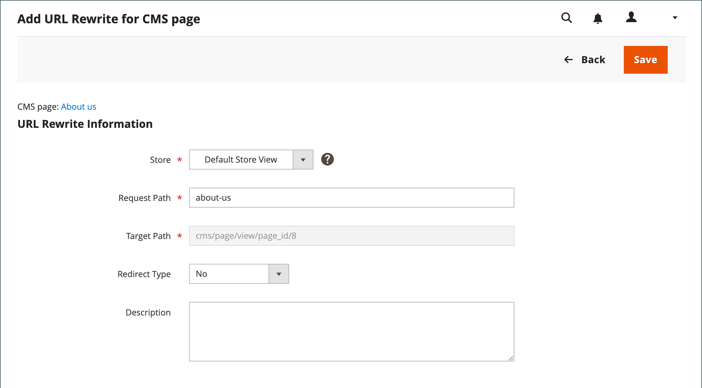

# 內容頁面URL重新寫入

開始之前，請確定您清楚重新導向要達成的目的。 從&#x200B;_的_&#x200B;目標&#x200B;_/_&#x200B;來源&#x200B;_或_&#x200B;重新導向至&#x200B;_/_&#x200B;重新導向。 雖然使用者可能仍會從搜尋引擎或過時的連結導覽至先前的頁面，但重新導向會導致您的商店切換至新目標。

{width="700" zoomable="yes"}

## 步驟1. 計畫重新寫入

若要避免錯誤，請記下&#x200B;_重新導向至_&#x200B;頁面的URL索引鍵，以及&#x200B;_重新導向自_&#x200B;頁面的索引鍵。

如果您不確定，請開啟商店中的每個頁面，並從瀏覽器的位址列複製路徑。

### CMS頁面路徑

重新導向至： `new-page`

重新導向來源： `old-page`

## 步驟2. 建立重新寫入

{{url-rewrite-params}}

1. 在&#x200B;_管理員_&#x200B;側邊欄上，移至&#x200B;**[!UICONTROL Marketing]** > _[!UICONTROL SEO & Search]_>**[!UICONTROL URL Rewrites]**。

1. 在繼續之前，請執行以下操作以確認請求路徑可用。

   - 在&#x200B;**[!UICONTROL Request Path]**&#x200B;欄頂端的搜尋篩選中，輸入要重新導向之頁面的URL索引鍵，然後按一下&#x200B;**[!UICONTROL Search]**。

   - 如果頁面有多個重新導向記錄，請尋找符合適用商店檢視的記錄，並以編輯模式開啟。

   - 按一下右上角的&#x200B;**[!UICONTROL Delete]**。 出現提示時，按一下&#x200B;**[!UICONTROL OK]**&#x200B;確認。

1. 當您返回「URL重新寫入」頁面時，請按一下&#x200B;**[!UICONTROL Add URL Rewrite]**。

1. 將&#x200B;**[!UICONTROL Create URL Rewrite]**&#x200B;設為`for CMS page`。

1. 在格線中尋找新的目標頁面，並以編輯模式開啟。

   {width="700" zoomable="yes"}

1. 在「URL重寫資訊」下，執行下列動作：

   - 如果您有多個存放區檢視，請選取套用重寫的&#x200B;**[!UICONTROL Store]**。

   - 針對&#x200B;**[!UICONTROL Request Path]**，輸入客戶要求的原始頁面的URL金鑰。 這是&#x200B;_頁面的_&#x200B;重新導向。

     >[!NOTE]
     >
     >要求的路徑對於指定的存放區必須是唯一的。 如果已經有使用相同請求路徑的重新導向，當您嘗試儲存重新導向時會收到錯誤。 必須先刪除先前的重新導向，才能建立重新導向。

   - 將&#x200B;**[!UICONTROL Redirect]**&#x200B;設定為下列其中一項：

      - `Temporary (302)`
      - `Permanent (301)`

   - 如需參考，請輸入重寫的簡短說明。

   {width="600" zoomable="yes"}

1. 儲存重新導向之前，請先檢閱下列內容：

   - 左上角的連結會顯示目標頁面的名稱。
   - 要求路徑包含來自&#x200B;_頁面的原始_&#x200B;重新導向路徑。

1. 完成時，按一下&#x200B;**[!UICONTROL Save]**。

   新的重寫會顯示在清單頂端的格線中。

## 步驟3. 測試結果

1. 前往商店的首頁。

1. 執行下列任一項作業：

   - 從&#x200B;_頁面瀏覽至原始的_&#x200B;重新導向。
   - 在瀏覽器的位址列中，在商店URL後面緊接著輸入原始&#x200B;_重新導向_&#x200B;頁面的名稱，然後按&#x200B;**Enter**。

   此時會出現新的目標頁面，而非原始頁面請求。

## 欄位說明

| 欄位 | 說明 |
|--- |--- |
| [!UICONTROL Create URL Rewrite] | 指示重寫的型別。 建立重寫之後無法變更型別。 選項： `Custom` / `For category` / `For product` / `For CMS page` |
| [!UICONTROL Request Path] | 要重新導向的CMS頁面。 請求路徑必須是唯一的，且不能由另一個重新導向使用。 如果您收到要求路徑存在的錯誤訊息，請刪除現有的重新導向，然後再試一次。 |
| [!UICONTROL Target Path] | 系統用來指向目的地的內部路徑。 目標路徑會呈現灰色，且無法編輯。 |
| [!UICONTROL Redirect] | 決定重新導向的型別。 選項：  **[!UICONTROL No]**— 未指定重新導向。 **[!UICONTROL Temporary (302)]** — 向搜尋引擎指出該重新寫入限時有效。 搜尋引擎通常不會保留頁面排名資訊以供暫時重寫。  **[!UICONTROL Permanent (301)]**— 向搜尋引擎指出此重新寫入是永久性的。 搜尋引擎通常會保留頁面排名資訊以供永久重寫。 |
| [!UICONTROL Description] | 說明重寫以供內部參考的用途。 |

{style="table-layout:auto"}
