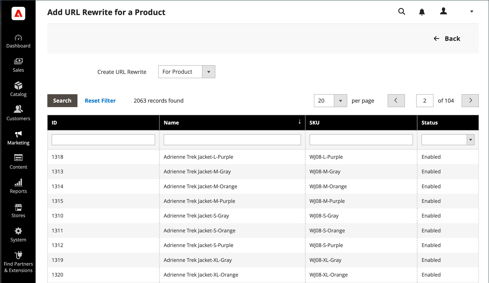

# 產品URL

開始之前，請務必瞭解重新導向應該有哪些功用。 思考角度 _目標_ / _原始請求_ 或 _重新導向至_ / _重新導向來源_. 雖然使用者可能仍會從搜尋引擎或過時的連結導覽至先前的頁面，但重新導向會導致您的商店切換至新目標。

如果 [自動重新導向](url-redirect-product-automatic.md) 已針對您的商店啟用，不需要在產品啟用時建立重新寫入 [URL索引鍵](../catalog/catalog-urls.md) 已變更。

{{url-rewrite-skip}}

## 步驟1. 計畫重新寫入

若要避免錯誤，請寫下 _重新導向至_ 路徑和 _重新導向來源_ 路徑並包含URL金鑰和尾碼（若適用）。

如果您不確定，請開啟商店中的每個產品頁面，並從瀏覽器的位址列複製路徑。 建立產品重新導向時，您可以包含或排除 [類別路徑](../catalog/catalog-urls.md). 在此範例中，我們會建立不含類別路徑的產品重新導向。

### 具有類別路徑的產品

重新導向至： `gear/bags/impulse-duffle.html`

重新導向來源： `gear/bags/overnight-duffle.html`

### 沒有類別路徑的產品

重新導向至： `impulse-duffle.html`

重新導向來源： `overnight-duffle.html`

## 步驟2. 建立重新寫入

{{url-rewrite-params}}

1. 在 _管理員_ 側欄，前往 **[!UICONTROL Marketing]** > _[!UICONTROL SEO & Search]_>**[!UICONTROL URL Rewrites]**.

1. 在繼續之前，請執行以下操作以確認請求路徑可用。

   - 在頂端搜尋篩選條件中 **[!UICONTROL Request Path]** 欄，輸入要重新導向之頁面的URL索引鍵，然後按一下 **[!UICONTROL Search]**.

   - 如果頁面有多個重新導向記錄，請尋找符合適用商店檢視的記錄，並以編輯模式開啟。

   - 在右上角，按一下 **[!UICONTROL Delete]**. 出現提示時，按一下 **[!UICONTROL OK]** 以確認。

1. 在URL重寫頁面的右上角，按一下 **新增URL重寫**.

1. 設定 **[!UICONTROL Create URL Rewrite]** 至 `For product`.

1. 在網格中，尋找作為重新導向目標（目的地）的產品，然後按一下列。

   {width="700" zoomable="yes"}

1. 在類別樹的下方，按一下 **[!UICONTROL Skip Category Selection]**.

   在此範例中，重新導向不包含類別。

   {width="600" zoomable="yes"}

   「為產品新增URL重寫」頁面左上角顯示指向目標的連結，而「目標路徑」欄位則顯示無法變更的路徑系統版本。 「重新導向路徑」欄位一開始也會顯示目標路徑。

   - 如果您有多個商店檢視，請設定 **[!UICONTROL Store]** 至套用重新寫入的檢視。 否則，會為每個檢視建立一個重寫。

   - 的 **[!UICONTROL Request Path]**，輸入原始產品請求的URL索引鍵和尾碼（如果適用）來取代預設值。 這是 _重新導向來源_ 您在計畫步驟中識別的產品。

     >[!NOTE]
     >
     >對於指定的存放區而言，要求路徑必須是唯一的。 如果已經有使用相同請求路徑的重新導向，當您嘗試儲存重新導向時會收到錯誤。 必須先刪除先前的重新導向，才能建立重新導向。

   - 設定 **[!UICONTROL Redirect Type]** 變更為下列其中一項：

      - `Temporary (302)`
      - `Permanent (301)`

   - 如需您自己的參考，請輸入簡短 **[!UICONTROL Description]** 重新寫入。

   {width="600" zoomable="yes"}

1. 儲存重新導向之前，請先檢閱下列內容：

   - 左上角的連結會顯示目標產品的名稱。
   - 請求路徑包含原始檔案的路徑 _重新導向來源_ 產品。

1. 完成後，按一下 **[!UICONTROL Save]**.

   新產品重寫現在會出現在URL重寫格線的頂端。

## 步驟3. 測試結果

1. 前往商店的首頁。

1. 執行下列任一項作業：

   - 導覽至原始檔案 _重新導向來源_ 產品請求頁面。
   - 在瀏覽器的位址列中，輸入原始檔案的路徑 _重新導向來源_ 產品在商店URL後面緊接著並按下 **輸入**.

   隨即顯示新的目標產品，而非原始產品請求。

## 欄位說明

| 欄位 | 說明 |
|--- |--- |
| [!UICONTROL Create URL Rewrite] | 指示重寫的型別。 建立重寫之後無法變更型別。 選項： `Custom` / `For category` / `For product` / `For CMS page` |
| [!UICONTROL Request Path] | 要重新導向的產品。 根據您的設定，請求路徑可能包括 `.html` 或 `.htm` 尾碼和類別。 請求路徑必須是唯一的，且不能由另一個重新導向使用。 如果您收到要求路徑存在的錯誤，請刪除現有的重新導向，然後再試一次。 |
| [!UICONTROL Target Path] | 系統用來指向重新導向目的地的內部路徑。 目標路徑會呈現灰色，且無法編輯。 |
| [!UICONTROL Redirect] | 決定重新導向的型別。 選項：  **[!UICONTROL No]**— 未指定重新導向。 許多作業會建立此型別的重新導向要求。 例如，每次將產品新增至類別時， `No` 型別會在每個商店檢視中建立。 **[!UICONTROL Temporary (302)]**  — 向搜尋引擎指出該重寫作業限時有效。 搜尋引擎通常不會保留頁面排名資訊以供暫時重寫。  **[!UICONTROL Permanent (301)]**— 向搜尋引擎指出此重新寫入是永久性的。 搜尋引擎通常會保留頁面排名資訊以供永久重寫。 |
| [!UICONTROL Description] | 說明重寫以供內部參考的用途。 |

{style="table-layout:auto"}

## 多個URL重寫

您可以使用以下步驟同時快速更新多個或所有產品的URL重寫。

1. 在 _管理員_ 側欄，前往 **[!UICONTROL Catalog]** > **[!UICONTROL Products]**.

1. 選取您要更新URL重寫的所有產品。

1. 在 _[!UICONTROL Actions]_，選擇&#x200B;**[!UICONTROL Update attributes]**更新多個或全部重寫。

1. 在 _[!UICONTROL PRODUCTS INFORMATION]_，按一下&#x200B;**[!UICONTROL Websites]**標籤。

1. 在 _[!UICONTROL Add Product To Websites]_區段，選取您要還原URL重寫的所有網站。

1. 準備好更新時，按一下 **[!UICONTROL Save]**.

>[!NOTE]
>
>所有選取的產品都會重新導向至選取的網站，並重新產生URL重新寫入。

{width="600" zoomable="yes"}
