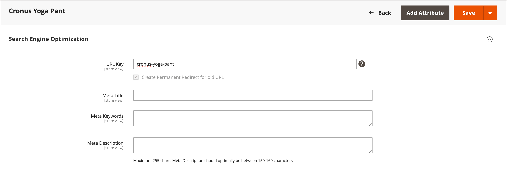

# URL重新寫入

URL重寫工具可讓您變更與產品、類別或CMS頁面相關聯的任何URL。 當重寫生效時，任何指向先前URL的連結都會重新導向到新位址。

>[!NOTE]
>
>若要同時更新多個或所有產品的URL重寫，請參閱 [多個URL重寫](url-rewrite-product.md#multiple-url-rewrites).

條款 _重寫_ 和 _重新導向_ 通常可互換使用，但指的流程稍有不同。 URL重寫會變更URL在瀏覽器中的顯示方式。 URL重新導向會更新儲存在伺服器上的URL。 URL重新導向可以是暫時的或永久的。 您的商店會使用URL重寫和重新導向，讓您輕鬆變更產品、類別或頁面的URL金鑰，並保留現有連結。

根據預設， [自動URL重新導向](url-redirect-product-automatic.md) 已為您的商店啟用，且 **為舊URL建立永久重新導向** 勾選每個產品的URL鍵欄位下的核取方塊。

{{url-rewrite-skip}}

{{url-rewrite-params}}

{width="600" zoomable="yes"}

## 標準URL

出於SEO目的，建議您每個網頁都只有一個不同的URL。

如果您有多個URL可存取單一頁面，或內容相似的不同頁面，Google會將這些頁面視為相同頁面的重複版本。 Google會選擇一個URL作為規範版本並進行編目，而其他所有URL都會被視為重複URL，且編目頻率較低。

Google如果您未明確指出哪個URL是標準網址，系統會為您做出選擇，或可能會將兩者視為同等權重。 這可能會導致不必要的行為，並存在編目預算無效和分散式反向連結不足的風險。

根據您設定網站的方式，索引中可能會有您網站的多個版本，包括：

    https://www.example.com
    https://www.example.com/
    http://www.example.com
    https://example.com
    https://www.example.com/index.html

若要指定標準頁面，請參閱 [Google Search Central檔案](https://developers.google.com/search/docs/crawling-indexing/consolidate-duplicate-urls).

## 設定URL重寫

啟用網頁伺服器Apache Rewrites是初始Commerce設定的一部分。 Commerce會定期使用URL重寫來移除檔案名稱 `index.php` 通常顯示在根資料夾之後的URL中。 啟用Web伺服器重寫時，系統會重寫每個URL以省略 `index.php`. 重寫作業會移除對搜尋引擎或客戶毫無價值的字詞，對效能或網站排名沒有影響。

不重寫網頁伺服器的URL

    http://www.yourdomain.com/magento/index.php/storeview/url-identifier

網頁伺服器重寫的URL

    http://www.yourdomain.com/magento/storeview/url-identifier

1. 在 _管理員_ 側欄，前往 **[!UICONTROL Stores]** > _[!UICONTROL Settings]_>**[!UICONTROL Configuration]**.

1. 在左側面板中，其中 **[!UICONTROL General]** 展開，請選擇 **[!UICONTROL Web]**.

1. 展開  此 **[!UICONTROL Search Engine Optimization]** 區段。

   {width="600" zoomable="yes"}

1. 設定 **[!UICONTROL Use Web Server Rewrites]** 依您的偏好設定。

1. 完成後，按一下 **[!UICONTROL Save Config]**.

## 建立URL重寫

您可以使用URL重寫工具來建立產品和類別重寫，以及商店中任何頁面的自訂重寫。 當重寫生效時，任何指向先前URL的現有連結都會順暢地重新導向至新位址。

URL重寫可用來新增高值關鍵字，以改善搜尋引擎為產品編制索引的方式。 您也可以使用重寫，針對暫時性季節性變更或永久性變更建立其他URL。 可以為任何有效路徑（包括CMS內容頁面）建立重寫。 在內部，系統會一律透過ID參考產品和類別。 不論URL多久變更一次，ID都會保持不變。 以下是您可以使用URL重寫的一些方法：

系統URL

    http://www.example.com/catalog/category/id/6

原始URL

    http://www.example.com/peripherals/keyboard.html

重新導向的產品URL

    http://www.example.com/ergonomic-keyboard.html

其他類別URL

    http://www.example.com/all-on-sale.html
    http://www.example.com/save-now/spring-sale

{width="700" zoomable="yes"}

Commerce提供下列URL重寫型別：

* [產品重寫](url-rewrite-product.md)
* [類別重寫](url-rewrite-category.md)
* [CMS頁面重寫](url-rewrite-cms-page.md)
* [自訂重寫](url-rewrite-custom.md)

## URL重寫示範

觀看此影片，瞭解如何管理URL重寫：

>[!VIDEO](https://video.tv.adobe.com/v/343751?quality=12&learn=on)
