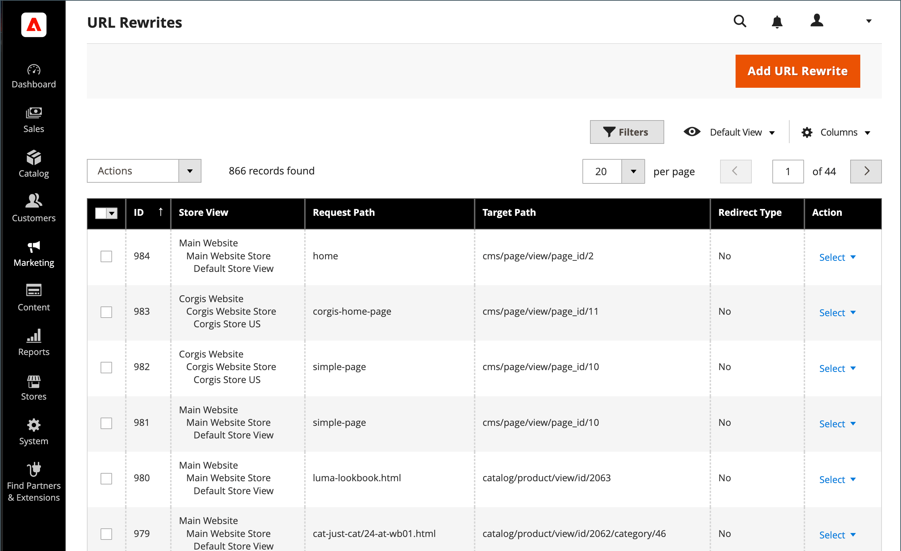

# URL重新寫入

>[!TIP]
>
>如需Adobe Commerce as a Cloud Service的相關資訊，請參閱Commerce Storefront檔案中的[SEO指引](https://experienceleague.adobe.com/developer/commerce/storefront/setup/seo/indexing/)

URL重寫工具可讓您變更與產品、類別或CMS頁面相關聯的任何URL。 當您建立URL重新寫入時，Commerce會自動建立永久重新導向(301)，因此任何指向舊URL的連結都會重新導向至新位址。

>[!NOTE]
>
>若要同時更新多個或所有產品的URL重寫，請參考[多個URL重寫](url-rewrite-product.md#multiple-url-rewrites)。

>[!BEGINSHADEBOX 「瞭解重新寫入和重新導向」]

術語&#x200B;_rewrite_&#x200B;和&#x200B;_重新導向_&#x200B;通常可互換使用，但它們是不同的操作：

* **URL重寫** — 伺服器端程式，可在內部將一個URL對應到另一個URL，而不變更瀏覽器位址列中顯示的內容。 當訪客請求URL時，伺服器會在背景將其視為不同的URL處理，但瀏覽器會繼續顯示原始URL。

* **URL重新導向** — 傳送HTTP回應給瀏覽器，指示它導覽至不同的URL。 瀏覽器的位址列會更新以顯示新的URL。 重新導向可以是暫時性(302)或永久性(301)。

>[!ENDSHADEBOX]

## 重寫工具的運作方式

在Adobe Commerce中，URL重寫工具預設會建立永久重新導向(301)，以便在您變更產品、類別或頁面的URL索引鍵時保留SEO值。 此行為可確保現有連結繼續運作，並保持搜尋引擎排名。

預設會針對您的商店啟用[自動URL重新導向](url-redirect-product-automatic.md)，並且在每個產品的URL索引鍵欄位下會選取&#x200B;**為舊URL建立永久重新導向**&#x200B;核取方塊。

{{url-rewrite-skip}}

{width="600" zoomable="yes"}

{{url-rewrite-params}}

## URL重寫示範

觀看以下影片，瞭解如何管理URL重寫：

>[!VIDEO](https://video.tv.adobe.com/v/343751?quality=12&learn=on)

## 建立URL重寫

使用URL重寫工具來建立產品和類別重新導向，以及商店中任何頁面的自訂重新導向。 套用URL重寫設定時，指向先前URL的任何現有連結都會無縫地重新導向至新位址。

您可以建立URL重寫至：

* 新增高值關鍵字以改進搜尋引擎為產品編制索引的方式。

* 為暫時的季節性變更或永久變更新增其他URL。

* 為頁面新增有效路徑，包括CMS內容頁面。 例如，您可以建立URL以在系統上建立較方便使用者或SEO使用的URL，此URL一律會依據其內部ID參考產品和類別。

您建立的URL重寫可重新導向至現有類別或自訂頁面，而不需變更網站結構，讓您輕鬆建立行銷活動難忘的URL。

{width="700" zoomable="yes"}

Commerce提供下列URL重寫型別：

* [產品重寫](url-rewrite-product.md)
* [類別重寫](url-rewrite-category.md)
* [CMS頁面重寫](url-rewrite-cms-page.md)
* [自訂重寫](url-rewrite-custom.md)

### 使用案例和範例

URL重寫通常用於以下情況：

#### 將內部系統URL變更為適合SEO的URL

Commerce在內部使用ID型URL，但您可以為客戶建立SEO友善URL：

**系統URL （內部）：**

    http://www.example.com/catalog/category/id/6

**面對客戶的URL：**

    http://www.example.com/peripherals/keyboard.html

#### 產品品牌重塑或URL最佳化

當您重新命名產品或想要改善其SEO URL時，請建立重新導向以保留現有連結：

**原始URL：**

    http://www.example.com/peripherals/keyboard.html

**新的最佳化URL：**

    http://www.example.com/ergonomic-keyboard.html

重寫工具會自動建立301從舊URL重新導向至新URL，因此客戶和搜尋引擎可順暢地導向正確頁面。

#### 促銷登陸頁面

建立行銷活動的暫時或永久自訂URL：

**促銷活動URL：**

    http://www.example.com/all-on-sale.html
    http://www.example.com/save-now/spring-sale

## 其他URL管理設定

以下章節說明如何設定Commerce的網頁伺服器重寫與標準URL。

### 設定Web伺服器重寫

>[!NOTE]
>
>本節說明Web伺服器層級URL重新寫入，此重新寫入與URL重新寫入工具功能不同。 網頁伺服器重寫處理技術URL格式（例如移除`index.php`），而URL重寫工具則管理內容變更的重新導向。

啟用Web伺服器重寫是初始Commerce設定的一部分，通常在安裝期間進行設定。 啟用後，網頁伺服器（Apache或Nginx）會自動從URL中移除檔案名稱`index.php`，建立更乾淨、SEO友善的位址。
下列範例顯示URL在啟用Web伺服器重寫與未啟用重寫情況下的顯示方式：

**沒有Web伺服器重寫的URL**

    http://www.yourdomain.com/magento/index.php/storeview/url-identifier

**網頁伺服器重寫的URL**

    http://www.yourdomain.com/magento/storeview/url-identifier

#### 啟用或停用Web伺服器重寫：

1. 在&#x200B;_管理員_&#x200B;側邊欄上，移至&#x200B;**[!UICONTROL Stores]** > _[!UICONTROL Settings]_>**[!UICONTROL Configuration]**。

1. 在展開&#x200B;**[!UICONTROL General]**&#x200B;的左側面板中，選擇&#x200B;**[!UICONTROL Web]**。

1. 展開擴充選擇器&#x200B;**[!UICONTROL Search Engine Optimization]**。

   {width="600" zoomable="yes"}

1. 將&#x200B;**[!UICONTROL Use Web Server Rewrites]**&#x200B;設定為您的偏好設定。

1. 完成時，按一下&#x200B;**[!UICONTROL Save Config]**。

### 指定標準URL

出於SEO目的，您的每個網頁應僅有一個不同的URL。

如果您有多個URL可存取單一頁面，或內容相似的不同頁面，Google會將這些頁面視為相同頁面的重複版本。 Google會選擇一個URL作為規範版本並加以編目，而其他所有URL則會視為重複的URL，且編目頻率較低。

Google如果您未明確指出哪個URL是標準網址，系統會為您做出選擇，或可能會將兩者視為同等權重。 這可能會導致不必要的行為，並帶來編目預算無效和分散式反向連結不足的風險。

根據您設定網站的方式，索引中可能會有您網站的多個版本，例如：

    https://www.example.com
    https://www.example.com/
    http://www.example.com
    https://example.com
    https://www.example.com/index.html

若要指定標準頁面，請參閱[Google Search Central檔案](https://developers.google.com/search/docs/crawling-indexing/consolidate-duplicate-urls)。
