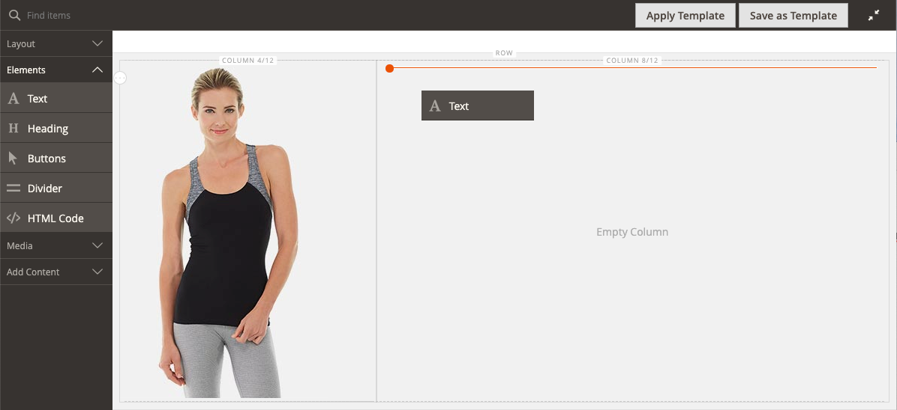
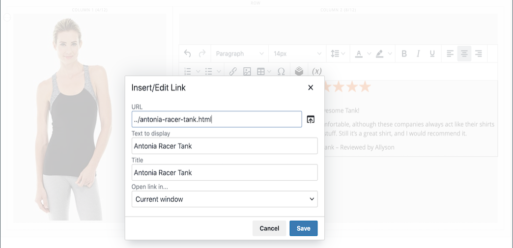

# [!DNL Page Builder]逐步解說第1部分：簡單頁面

請依照此三部分練習來建立簡單頁面，說明建立您自己的設計內容豐富的頁面是多麼容易，以熟悉[!DNL Page Builder]工作區。

{width="700" zoomable="yes"}

>[!NOTE]
>
>這些逐步解說練習已更新，以反映2.4.1版本中[!DNL Page Builder]工作區的近期變更。

## 開始之前

開始此練習前，建議您增加[管理員工作階段存留期](../systems/security-admin.md)以防止工作階段在您工作時逾時。

驗證必要的內容管理組態設定：

- 已在[WYSIWYG選項](../content-design/editor.md#configure-the-editor)設定中啟用WYSIWYG編輯器。

- 已在[進階內容工具](setup.md)組態中啟用[!DNL Page Builder]。

### 下載逐步解說影像資產

1. 下載[`simple-page-assets`](./assets/simple-page-assets.zip)檔案並將檔案儲存到您的本機系統。

1. 導覽至下載的檔案，然後解壓縮檔案。

   在Windows系統上，按一下滑鼠右鍵並選擇&#x200B;**[!UICONTROL Extract All]**&#x200B;個檔案。 然後，選擇目的地資料夾並按一下&#x200B;**[!UICONTROL Extract]**。

   在Mac系統上，只要按兩下zip檔案，並將解壓縮的檔案移至目標資料夾即可。

   資料夾包含下列影像檔案：

   ![[!DNL Page Builder]逐步解說檔案 — 簡單頁面資產](./assets/pb-tutorial-simple-page-assets.png){width="500"}

依序依照此逐步解說的三部分進行。

## 第1部分：含橫幅的完整出血列

在「簡單頁面」練習的這一部分，您會建立具有完整出血列和橫幅的頁面。 該列針對桌上型電腦和行動裝置有不同的背景影像。

具有橫幅{width="700" zoomable="yes"}的[!DNL Page Builder]完整出血列

### 步驟1：建立頁面

1. 在&#x200B;_管理員_&#x200B;側邊欄上，移至&#x200B;**[!UICONTROL Content]** > _[!UICONTROL Elements]_>**[!UICONTROL Pages]**。

1. 按一下右上角的&#x200B;**[!UICONTROL Add New Page]**&#x200B;並執行下列動作：

   - 若要防止此頁面在您的存放區中發佈，請將&#x200B;**[!UICONTROL Enable Page]**&#x200B;設為`No`。

   - 針對&#x200B;**[!UICONTROL Page Title]**，輸入`Simple Page`。

   {width="600" zoomable="yes"}

1. 展開&#x200B;**[!UICONTROL Design]**&#x200B;區段的。

   請注意，**[!UICONTROL Layout]**&#x200B;預設為`Page -- Full Width`。 除了五個標準[版面](../content-design/page-layout.md)選項外，[!DNL Page Builder]還新增了頁面、類別和產品的完整版面配置。

1. 如果範例資料可用，請將&#x200B;**[!UICONTROL New Theme]**&#x200B;設為`Magento Luma`。 否則，您可以選擇另一個可用的主題，或將其保留空白以使用預設主題。

   _[!UICONTROL New Theme]_&#x200B;設定可用來覆寫預設佈景主題，以及將不同的佈景主題套用至頁面。

   >[!NOTE]
   >
   >完整寬度配置只能與相容的[佈景主題](../content-design/themes.md)搭配使用。

   {width="600" zoomable="yes"}

1. 按一下右上角的&#x200B;**[!UICONTROL Save]**。

   儲存頁面時，名稱&#x200B;_Simple Page_&#x200B;會出現在頁面的左上角。

### 步驟2：格式化列

1. 展開&#x200B;**[!UICONTROL Content]**&#x200B;區段的。

   此動作以空白列顯示[!DNL Page Builder]預覽。

   >[!NOTE]
   >
   >[內容標題](workspace.md)欄位是選擇性的。 預設會根據主題格式化為標題層級1 (H1)。 在本練習中，_內容標題_&#x200B;會保留空白。

   {width="600" zoomable="yes"}

1. 按一下&#x200B;**[!UICONTROL Edit with Page Builder]**&#x200B;或在內容預覽區域內。

   在展開的[!DNL Page Builder] [工作區](workspace.md)中，左側的面板提供您可用來在階段中建置內容的內容工具。

1. 將滑鼠懸停在空白列上以顯示工具箱。

   每個內容容器都有一個工具箱，其中包含一組類似的選項。

   ![[!DNL Page Builder]列工具箱](./assets/pb-layout-page-add-content-row-tools.png){width="600" zoomable="yes"}

1. 在「列」工具箱中，選擇&#x200B;_設定_ ({width="20"}圖示。

1. 在&#x200B;_[!UICONTROL Appearance]_&#x200B;底下，選擇&#x200B;**完整出血**。

   「完整出血」外觀設定會將列與背景內容區域的左右邊界延伸至頁面的完整寬度。

   {width="600" zoomable="yes"}

1. 向下捲動至&#x200B;_[!UICONTROL Advanced]_&#x200B;區段，並將所有&#x200B;**[!UICONTROL Margins and Padding]**&#x200B;設定設為`0`。

   此設定可確保橫幅延伸整列的寬度。

   {width="600" zoomable="yes"}

1. 若要儲存設定並返回[!DNL Page Builder]工作區，請向上捲動至頁面頂端並按一下右上角的&#x200B;**[!UICONTROL Save]**。

### 步驟3：新增橫幅

>[!NOTE]
>
>[!DNL Page Builder]具有名稱為&#x200B;_Banner_&#x200B;的新內容型別，此步驟中會特別說明此型別。 先前在[內容]功能表中的&#x200B;_橫幅_&#x200B;選項現在是&#x200B;_動態區塊_。

1. 在[!DNL Page Builder]面板中，展開&#x200B;**[!UICONTROL Media]**&#x200B;並將&#x200B;**橫幅**&#x200B;預留位置拖曳到舞台。

   {width="600" zoomable="yes"}
1. 將滑鼠懸停在橫幅容器上以顯示工具箱。

   >[!NOTE]
   >
   >舞台現在有兩個內容容器，每個都有一個單獨的工具箱。 因為橫幅是巢狀內嵌在列中，請確定您使用的是正確的工具箱。

   除了工具箱之外，還包含&#x200B;_上傳影像_&#x200B;和&#x200B;_從相簿選取_&#x200B;按鈕，以便您可以直接從舞台上快速變更橫幅。

   {width="600" zoomable="yes"}

1. 在橫幅工具箱中，選擇&#x200B;_設定_ （ {width="20"} ）圖示。

1. 在&#x200B;_[!UICONTROL Appearance]_&#x200B;底下，選擇&#x200B;**[!UICONTROL Collage Right]**。

   「拼貼右側」設定會將內容放置在橫幅的右側。

   {width="600" zoomable="yes"}

1. 向下捲動至&#x200B;_[!UICONTROL Background]_&#x200B;區段，並設定橫幅的背景影像：

   - 針對&#x200B;**[!UICONTROL Background Image]**，按一下&#x200B;**上傳**。

     {width="600" zoomable="yes"}

     導覽至您儲存擷取之簡單頁面資產的目錄，然後選擇`wide-banner-background.jpg`檔案。

     影像會上傳，並顯示上傳影像的縮圖。 檔案名稱、影像尺寸和檔案大小如下所述。

     {width="600" zoomable="yes"}

   - 針對&#x200B;**[!UICONTROL Background Mobile Image]**，按一下&#x200B;**上傳**。

     在相同檔案目錄中，選擇`wide-banner-background-mobile.jpg`檔案。

     行動背景影像會用於行動裝置，也會在案頭瀏覽器視窗調整為行動裝置寬度時使用。

     {width="600" zoomable="yes"}

   - 捲動回頁面頂端，然後按一下&#x200B;**[!UICONTROL Save]**&#x200B;以儲存設定並返回[!DNL Page Builder]工作區。

     背景會出現在舞台上，並延伸列的完整寬度。

     {width="600" zoomable="yes"}

   請注意顯示在列右側的預留位置文字。 此文字的位置反映&#x200B;_拼貼右側_&#x200B;外觀設定。

1. 按一下預留位置文字，然後輸入下列訊息作為兩行：

   `Get fit and look fab in new seasonal styles.`

   `New LUMA yoga collection`

   編輯器工具列會顯示在文字方塊上方。 您可以直接從舞台輸入文字並設定格式，或是選擇橫幅工具箱中的&#x200B;_設定_。

   {width="600" zoomable="yes"}

1. 套用格式至文字：

   - 選取文字的第一行。 然後，在&#x200B;**格式**&#x200B;下的編輯器工具列上，選擇`Heading 2`。

     {width="600" zoomable="yes"}

   - 選取第二行文字。 然後，在&#x200B;**格式**&#x200B;下的編輯器工具列上，選擇`Paragraph`。

   格式設定會套用與目前主題關聯的樣式表中的樣式。

   {width="600" zoomable="yes"}
__

1. 將游標暫留以顯示「橫幅工具箱」，再次選擇「_設定_」（「{width="20"}）圖示，然後捲動至「_[!UICONTROL Content]_」區段。

   請注意，您的文字會顯示在&#x200B;_訊息文字_&#x200B;方塊中。 您可以從舞台或橫幅設定的&#x200B;_[!UICONTROL Content]_&#x200B;區段輸入及編輯文字。

   {width="600" zoomable="yes"}

1. 繼續在&#x200B;_[!UICONTROL Content]_&#x200B;區段中，設定橫幅連結和按鈕：

   - 將&#x200B;**連結**&#x200B;設定為`Category`，然後按一下&#x200B;**[!UICONTROL Select]**&#x200B;以顯示類別樹狀結構。

   - 選擇`What's New`作為連結的類別。

     {width="600" zoomable="yes"}

   - 將&#x200B;**[!UICONTROL Show Button]**&#x200B;設為`Always`。

   - 針對&#x200B;**[!UICONTROL Button Text]**，輸入`Shop Now`作為按鈕上顯示的文字。

   - 對於&#x200B;**[!UICONTROL Button Type]**，接受`Primary`預設值。

     目前主題的按鈕樣式決定按鈕格式。

1. 設定橫幅覆蓋：

   您可以使用覆蓋將背景顏色套用至由「外觀」設定所定義的作用中內容區域。 橫幅背景影像在橫幅的整個寬度內仍可見。

   - 將&#x200B;**[!UICONTROL Show Overlay]**&#x200B;設為`Always`。

   - 針對&#x200B;**[!UICONTROL Overlay Color]**，執行下列任一項作業：

      - 按一下色塊並選擇白色色票。
      - 按一下&#x200B;_無色彩_&#x200B;文字方塊，並輸入`White`或十六進位值`#ffffff`。

     然後，按一下&#x200B;**[!UICONTROL Apply]**。

     {width="600" zoomable="yes"}

   - 捲動回頁面頂端，然後按一下&#x200B;**[!UICONTROL Save]**&#x200B;以儲存設定並返回[!DNL Page Builder]工作區。

     按鈕會出現在舞台上橫幅訊息的下方。

     內容階段中的{width="600" zoomable="yes"}

1. 在舞台的右上角，按一下&#x200B;_關閉全熒幕_ （）圖示。

   按一下此圖示會返回頁面的&#x200B;_[!UICONTROL Content]_&#x200B;區段，並顯示預覽。

   您可以隨時在兩種工作區模式之間切換。

1. 在右上角，按一下&#x200B;**[!UICONTROL Save]**&#x200B;箭頭並選擇&#x200B;**[!UICONTROL Save & Close]**。

1. 如果出現提示，請按一下頁面頂端訊息中的[快取管理](../systems/cache-management.md)連結，並重新整理任何無效的快取。

## 第2部分：包含具有兩個相等欄的列

在本練習的這一部分，您會在頁面中新增一列，並將列分成兩個相等的欄。 接著，將連結的影像新增至各欄。 在指示中，每個新列都會在第一列之前新增，以使[!DNL Page Builder]面板與舞台對齊。 在練習結束時，您會重新排列列，使其與簡單頁面範例相符。

{width="600" zoomable="yes"}

### 步驟1：新增列

1. 在「頁面」格線中，尋找您在本練習第一部分建立的&#x200B;_簡單頁面_，並在&#x200B;_[!UICONTROL Action]_&#x200B;欄中選取&#x200B;**[!UICONTROL Edit]**。

1. 展開&#x200B;**[!UICONTROL Content]**&#x200B;區段的。

1. 按一下&#x200B;**[!UICONTROL Edit with Page Builder]**&#x200B;或在內容預覽區域內。

1. 在&#x200B;_[!UICONTROL Layout]_&#x200B;下方的[!DNL Page Builder]面板中，將&#x200B;**[!UICONTROL Row]**&#x200B;預留位置拖曳至舞台，並將其置於橫幅上方。

   紅色指引會標籤兩列之間的邊界。

   {width="600" zoomable="yes"}

1. 將游標停留在新列上以顯示工具箱，然後選擇&#x200B;_設定_ （ {width="20"} ）圖示。

   {width="600" zoomable="yes"}

1. 在&#x200B;_[!UICONTROL Appearance]_&#x200B;底下，接受&#x200B;**包含**&#x200B;預設設定。

   此設定會將列的內容區域限製為主題所定義的頁面寬度。

   {width="600" zoomable="yes"}

1. 在右上角，按一下&#x200B;**[!UICONTROL Save]**&#x200B;以儲存設定並返回[!DNL Page Builder]工作區。

### 步驟2：新增欄

1. 在&#x200B;_[!UICONTROL Layout]_&#x200B;下方的[!DNL Page Builder]面板中，將&#x200B;**[!UICONTROL Column]**&#x200B;預留位置拖曳到新列。

   {width="600" zoomable="yes"}

   該列現在分成兩個寬度相等的欄。 每一欄都是一個單獨的內容容器，有其專用的選項工具箱。

   {width="600" zoomable="yes"}的列

1. 在第一欄的左上角，按一下圓形的&#x200B;_格線_&#x200B;控制項（）以顯示格線指導方針。

   格線可確保內容保持一致，並在桌上型電腦和行動裝置上正確轉譯。 如需設定網格大小的資訊，請參閱[!DNL Page Builder]設定主題中的[設定 [!DNL Page Builder]](setup.md#configure-page-builder)區段。

   每個欄容器頂端邊界括弧(6/12)中的數字表示每個欄的網格分割數，以及列的分割總數。

   {width="600" zoomable="yes"}的格線大小詳細資料

### 步驟3：新增含有連結的影像

在此步驟中，您將瞭解如何上傳影像至橫幅。

1. 在[!DNL Page Builder]面板中，展開&#x200B;**[!UICONTROL Media]**&#x200B;區段並將&#x200B;**[!UICONTROL Image]**&#x200B;預留位置拖曳到第一欄。

   {width="600" zoomable="yes"}

1. 將範例影像插入預留位置。

   {width="600" zoomable="yes"}

   對於位於您系統上的影像，您可以選擇下列其中一種方法：

   - **上傳影像檔**：在第一欄，按一下&#x200B;**[!UICONTROL Upload Image]**。 然後，導覽至您儲存擷取之簡單頁面資產的目錄，並選擇`small-banner-1.jpg`檔案。

     {width="600" zoomable="yes"}

     重複此動作，將`small-banner-2.jpg`檔案新增至第二欄。

   - **拖曳影像檔案**：在案頭上，開啟簡單頁面資產資料夾，並將其置於您正在處理[!DNL Page Builder]階段的管理瀏覽器視窗旁。 然後，從簡單頁面資產資料夾拖曳檔案`small-banner-1.jpg`，並將它拖放到第一欄。

     {width="600" zoomable="yes"}

     重複此動作，將`small-banner-2.jpg`檔案新增至第二欄。

1. 決定目錄中的哪個頁面要連結至每個影像。

1. 將滑鼠停留在第一欄中的影像上，以顯示工具箱，並選擇&#x200B;_設定_ （ {width="20"} ）圖示。

   {width="600" zoomable="yes"}

1. 將影像連結至類別：

   - 向下捲動並將&#x200B;**連結**&#x200B;設定為`Category`。

   - 在類別樹狀結構中，向下展開並選擇`Men's Hoodies & Sweatshirt`類別。

   - 在右上角，**[!UICONTROL Save]**&#x200B;設定並返回[!DNL Page Builder]工作區。

1. 重複上一步驟，將第二欄的影像連結至&#x200B;_齒輪_&#x200B;類別。

1. 在舞台的右上角，按一下&#x200B;_關閉全熒幕_ （）圖示。

   按一下此圖示會返回頁面的&#x200B;_[!UICONTROL Content]_&#x200B;區段，並顯示預覽。

1. 在右上角，按一下&#x200B;**[!UICONTROL Save]**&#x200B;箭頭並選擇&#x200B;**[!UICONTROL Save & Close]**。

1. 出現提示時，請按一下頁面頂端訊息中的[快取管理](../systems/cache-management.md)連結，並重新整理任何無效的快取。

## 第3部分：具有不相等欄的全寬列

此頁面的最後一列包含產品評論的內容。 您新增一個全寬度列，並將其劃分為兩個寬度不同的欄。 背景影像會新增至第一欄，並套用相符的背景顏色至列，以獲得統一的效果。

{width="500"}

### 步驟1：新增列

1. 在「頁面」格線中，尋找您在本練習第一部分建立的&#x200B;_簡單頁面_，並在&#x200B;_[!UICONTROL Action]_&#x200B;欄中選取&#x200B;**[!UICONTROL Edit]**。

1. 展開&#x200B;**[!UICONTROL Content]**&#x200B;區段的。

1. 按一下&#x200B;**[!UICONTROL Edit with Page Builder]**&#x200B;或在內容預覽區域內。

1. 在&#x200B;_[!UICONTROL Layout]_&#x200B;下方的[!DNL Page Builder]面板中，將&#x200B;**[!UICONTROL Row]**&#x200B;預留位置拖曳至舞台，並將其置於本練習第二部分所建立的列上方。

   紅色指引會標籤兩列之間的邊界。

   {width="600" zoomable="yes"}

1. 將游標停留在新列上以顯示工具箱，然後選擇&#x200B;_設定_ （{width="20"} ）圖示。

   {width="600" zoomable="yes"}

1. 在&#x200B;_[!UICONTROL Appearance]_&#x200B;下的[編輯列]頁面上，選擇&#x200B;**[!UICONTROL Full Width]**。

   此設定會將內容區域限製為主題所定義的最大頁面寬度。 背景顏色和/或影像不受限制，並會延伸列的完整寬度。

   {width="600" zoomable="yes"}

1. 在&#x200B;_[!UICONTROL Background]_&#x200B;區段中，輸入`#f1f1f1`作為&#x200B;**[!UICONTROL Background Color]**。

   {width="600" zoomable="yes"}

1. 向下捲動至&#x200B;_[!UICONTROL Advanced]_&#x200B;區段，並將所有&#x200B;**邊界與內距**&#x200B;值設定為`0`。

   {width="600" zoomable="yes"}

1. 捲動回頁面頂端，然後按一下&#x200B;**[!UICONTROL Save]**&#x200B;以儲存設定並返回[!DNL Page Builder]工作區。

   該列的背景顏色現在為淺褐色。

   {width="600" zoomable="yes"}

### 步驟2：新增不同寬度的欄

1. 在&#x200B;_[!UICONTROL Layout]_&#x200B;下方的[!DNL Page Builder]面板中，將&#x200B;**[!UICONTROL Column]**&#x200B;預留位置拖曳到舞台上的頂端列。

   {width="600" zoomable="yes"}

1. 將第一欄的右框線拖曳至格線上12個位置中的4個(`4/12`)位置。

   第二欄的大小會調整為12的八個(`8/12`)。

   {width="600" zoomable="yes"}

1. 將游標停留在第一欄容器上以顯示工具箱，然後選擇&#x200B;_設定_ （ {width="20"} ）圖示。

1. 向下捲動至&#x200B;_[!UICONTROL Advanced]_&#x200B;區段，並將所有&#x200B;**邊界與內距**&#x200B;值設定為`0`。

   {width="600" zoomable="yes"}

1. 捲動回頁面頂端，然後按一下&#x200B;**[!UICONTROL Save]**&#x200B;以儲存設定並返回[!DNL Page Builder]工作區。

### 步驟3：將影像新增至第一欄

1. 在[!DNL Page Builder]面板中，展開&#x200B;**[!UICONTROL Media]**&#x200B;並將&#x200B;**[!UICONTROL Image]**&#x200B;內容型別拖曳到第一欄。

   {width="600" zoomable="yes"}

1. 在影像預留位置中，按一下&#x200B;**[!UICONTROL Upload Image]**。

   {width="600" zoomable="yes"}

1. 導覽至您儲存擷取之簡單頁面資產的目錄，然後選擇`review-image.jpg`檔案。

   上傳的影像會顯示在第一欄，並順暢地與列的背景顏色混合。

   {width="600" zoomable="yes"}

### 步驟4：將稽核內容新增至第二欄

資料列的第二欄應包含客戶評論的內容，包括五星級評等影像和格式化的文字訊息。

1. 在[!DNL Page Builder]面板中，展開&#x200B;**[!UICONTROL Elements]**&#x200B;區段並將&#x200B;**[!UICONTROL Text]**&#x200B;內容型別拖曳到第二欄。

   {width="600" zoomable="yes"}

1. 按一下文字元素，以顯示編輯器工具列。

1. 在工具列中按一下&#x200B;_插入影像_ （）圖示，然後執行下列動作：

   {width="600" zoomable="yes"}

   - 在&#x200B;_[!UICONTROL Insert/edit image]_&#x200B;對話方塊中，按一下&#x200B;_[!UICONTROL Source]_&#x200B;欄位旁的&#x200B;_尋找_ （  ）圖示。

     {width="600" zoomable="yes"}

   - 在&#x200B;_[!UICONTROL Select Images]_&#x200B;頁面上，按一下&#x200B;**[!UICONTROL Choose Files]**。

   - 在您儲存簡易頁面資產的資料夾中，選擇`rating.png`。

   - 返回頁面，按兩下影像圖磚加以選取，並將其URL插入Source欄位。

     {width="600" zoomable="yes"}

   - 針對&#x200B;**[!UICONTROL Image Description]**，輸入`5-Star Rating`並按一下&#x200B;**[!UICONTROL OK]**&#x200B;將影像插入資料行。

   - 在編輯器工具列中，按一下&#x200B;**「置中對齊」** （）將影像置中於欄。

     {width="600" zoomable="yes"}

1. 將插入點放在五星級影像之後，按下Enter/Return鍵以開始新的一行，然後輸入下列文字：

   `Awesome Tank!`

   `I'm a long distance runner and it keeps me pretty comfortable, although these companies always act like their shirts are magical and really it's just pretty basic stuff. Still it's a great shirt, and I would recommend it.`

   `Antonia Racer Tank – Reviewed by Allyson`

   文字會在您鍵入時置中。

   {width="600" zoomable="yes"}中置中的文字

1. 格式化文字：

   - 按一下第一行文字中的任何位置，然後在編輯器工具列的&#x200B;**格式**&#x200B;下選擇`Heading 2`。

   - 選取剩餘的文字，然後在編輯器工具列的&#x200B;**格式**&#x200B;下，選擇`Paragraph`。

   文字會根據與主題關聯的樣式表來格式化。

1. 取得影像的尺寸，讓您可以在欄中垂直置中內容：

   - 將滑鼠停留在第一欄中的影像上，以顯示工具箱，並選擇&#x200B;_設定_ （{width="20"} ）圖示。

   - 在影像縮圖下方，記下影像的尺寸。

     {width="600" zoomable="yes"}

   - 按一下右上角的&#x200B;**關閉**。

1. 將內容垂直置中於第二欄：

   - 將滑鼠游標停留在第二欄以顯示工具箱，然後選擇&#x200B;_設定_ （{width="20"} ）圖示。

   >[!NOTE]
   >
   >請務必選取欄容器而非「文字」容器，以顯示正確的工具箱。

   - 對於&#x200B;**[!UICONTROL Minimum Height]**，請在第一欄輸入`450`作為影像的高度（畫素）。

   - 將&#x200B;**[!UICONTROL Vertical Alignment]**&#x200B;設為`Center`。

   {width="600" zoomable="yes"}

1. 向下捲動至&#x200B;_[!UICONTROL Advanced]_&#x200B;區段，並將所有&#x200B;**[!UICONTROL Margins and Padding]**&#x200B;值設定為零( `0` )。

   {width="600" zoomable="yes"}

1. 捲動回頁面頂端，然後在右上角按一下&#x200B;**[!UICONTROL Save]**&#x200B;以儲存設定並返回[!DNL Page Builder]工作區。

   {width="600" zoomable="yes"}具有稽核內容

### 步驟5：插入目錄產品連結

1. 選取`Antonia Racer Tank`文字並按一下編輯器工具列中的&#x200B;_插入連結_ （）圖示。

1. 在&#x200B;_插入連結_&#x200B;對話方塊中，指定目錄產品的連結：

   - 輸入產品&#x200B;**[!UICONTROL URL]**。

     您可以輸入相對或完全限定的URL。 此範例會輸入下列相對連結：

     `../antonia-racer-tank.html`

   - （選擇性）對於&#x200B;**Title**，請輸入產品名稱。

     有些瀏覽器會將「標題」連結屬性當做工具提示使用。

     {width="600" zoomable="yes"}

   - 完成時，按一下&#x200B;**[!UICONTROL OK]**&#x200B;以儲存連結。

     連結的文字現在會在橫幅中反白顯示。

     {width="600" zoomable="yes"}

1. 在舞台的右上角，按一下&#x200B;_關閉全熒幕_ （）圖示。

   按一下此圖示會返回頁面的&#x200B;_[!UICONTROL Content]_&#x200B;區段，並顯示預覽。

1. 按一下右上角的&#x200B;**[!UICONTROL Save]**。

### 步驟6：重新排列列

完成全部三個資料列後，最後一個步驟是重新排列資料列，以符合原始的&#x200B;_簡單頁面_&#x200B;範例。 為了與原始範例相符，第一列必須移至底部，最後一列必須移至頂部。

1. 如有必要，請展開 **[!UICONTROL Content]**&#x200B;區段。

1. 按一下&#x200B;**[!UICONTROL Edit with Page Builder]**&#x200B;或在內容預覽區域內。

1. 將滑鼠停留在舞台上的第一列以顯示工具箱，然後選擇&#x200B;_移動_ （）圖示。

   {width="600" zoomable="yes"}

1. 按住滑鼠鍵，確認已選取列中的所有內容，並將列拖曳至頁面底部紅色指引下方的位置。

   >[!NOTE]
   >
   >如果您不小心只移動了部分內容（例如影像），只要將內容移回原地即可，然後再試一次。

   {width="600" zoomable="yes"}

1. 重複此程式，將第一列移至第二位置。

   頁面上的列順序現在與簡單頁面範例相符。

1. 在舞台的右上角，按一下&#x200B;_關閉全熒幕_ （）圖示。

   按一下此圖示會返回頁面的&#x200B;_[!UICONTROL Content]_&#x200B;區段，並顯示預覽。

1. 在右上角，按一下&#x200B;**[!UICONTROL Save]**&#x200B;箭頭並選擇&#x200B;**[!UICONTROL Save & Close]**。

1. 如果出現提示，請按一下頁面頂端訊息中的[快取管理](../systems/cache-management.md)連結，並重新整理任何無效的快取。

您已完成「簡單頁面」練習。 保留您建立的工作，以便稍後參考。

準備就緒後，請繼續進行[第2部分：區塊](2-blocks.md)。
