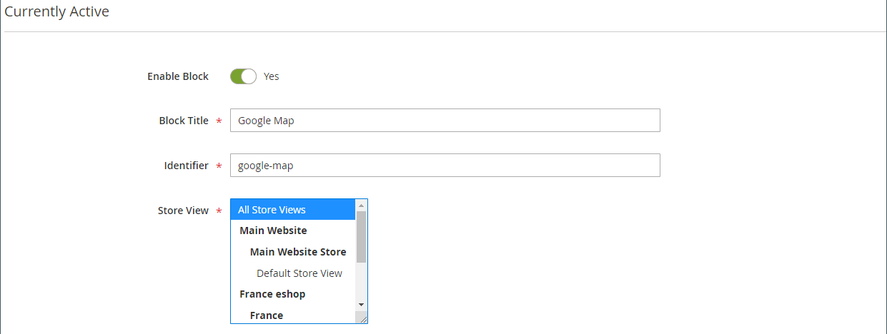

# [!DNL Page Builder]逐步解說第2部分：區塊

下列練習說明[簡單區塊](../content-design/blocks.md)與[動態區塊](dynamic-block.md)之間的差異，以及如何使用[!DNL Page Builder]建立每個區塊型別。

>[!NOTE]
>
>[!DNL Page Builder]有一個名為&#x200B;_橫幅_&#x200B;的新內容型別，此型別在第一個逐步解說練習中特別顯示，與先前的橫幅功能無關。 先前在[內容功能表](../content-design/content-menu.md)中的橫幅選項現在是&#x200B;_動態區塊_。

店面中的{width="700" zoomable="yes"}

本練習假設您已完成[第1部分：簡易頁面](1-simple-page.md)，包括先決條件和[下載的範例檔案](./assets/simple-page-assets.zip)。 依序依照此逐步解說練習的部分進行。

>[!NOTE]
>
>這些逐步解說練習已更新，以反映2.4.1版本中[!DNL Page Builder]工作區的近期變更。 如果您使用舊版Adobe Commerce，請使用[[!DNL Commerce] 2.3使用手冊](https://docs.magento.com/user-guide/v2.3/cms/page-builder-learn.html)中的[!DNL Page Builder]練習。

## 第1部分：建立簡單區塊

在這個逐步解說練習中，您使用[!DNL Google Maps]中的內容建立一個簡單區塊。 簡單區塊有時稱為&#x200B;_CMS區塊_&#x200B;或&#x200B;_靜態區塊_，因為內容不會變更。 簡單區塊適用於您可能想要重複使用的內容。

### 步驟1：建立區塊

1. 在&#x200B;_管理員_&#x200B;側邊欄上，移至&#x200B;**[!UICONTROL Content]** > _[!UICONTROL Elements]_>**[!UICONTROL Blocks]**。

1. 按一下右上角的&#x200B;**[!UICONTROL Add New Block]**。

1. 針對&#x200B;**[!UICONTROL Block Title]**，輸入`Google Map`。

1. 針對&#x200B;**[!UICONTROL Identifier]**，輸入`google-map`。

1. 選擇要提供區塊的&#x200B;**[!UICONTROL Store View]**。

   {width="600" zoomable="yes"}

1. 按一下右上角的&#x200B;**[!UICONTROL Save]**。

### 步驟2：新增[!DNL Google Map]

1. 向下捲動至[!DNL Page Builder]內容預覽（目前空白），然後按一下&#x200B;**[!UICONTROL Edit with Page Builder]**。

1. 在[!DNL Page Builder]面板中，展開&#x200B;**[!UICONTROL Media]**&#x200B;並將&#x200B;**[!UICONTROL Map]**&#x200B;預留位置拖曳到舞台。

   {width="600" zoomable="yes"}

   如果為商店設定[!DNL Google Maps]，則會顯示商店位置的地圖。

   {width="600" zoomable="yes"}

   如果尚未為您的存放區設定[!DNL Google Maps]，則會顯示預留位置對應。

   ![[!DNL Google Maps]預留位置](./assets/pb-tutorial2-media-map-not-configured.png){width="600" zoomable="yes"}

1. 在舞台的右上角，按一下&#x200B;_關閉全熒幕_ （）圖示。

   按一下此圖示會返回區塊的&#x200B;_[!UICONTROL Content]_區段，並顯示預覽。

1. 在右上角，按一下&#x200B;**[!UICONTROL Save]**&#x200B;箭頭並選擇&#x200B;**[!UICONTROL Save & Close]**。

### 步驟3：設定[!DNL Google Maps]

如果已經為您的存放區設定[!DNL Google Maps]，您可以略過此步驟並繼續下一步。

1. 前往[Google Cloud平台主控台](https://console.cloud.google.com/google/maps-apis/overview)。

1. 按一下專案下拉式清單，然後選取或建立您要新增API金鑰的專案。

1. 若要設定您的API認證，請依照[!DNL Google Maps]檔案中的[指示][1]操作。

1. 將API金鑰複製到剪貼簿。

1. 返回[!DNL Commerce]管理員並移至&#x200B;**[!UICONTROL Stores]** > _[!UICONTROL Settings]_>**[!UICONTROL Configuration]**。

1. 在左側面板的&#x200B;_[!UICONTROL General]_下，選擇&#x200B;**[!UICONTROL Content Management]**。

1. 展開 **[!UICONTROL Advanced Content Tools]**。

   {width="600" zoomable="yes"}

   如需[!UICONTROL Content Management Advanced Tools]組態選項的詳細資訊，請參閱&#x200B;[_組態參考指南_](../configuration-reference/general/content-management.md)。

1. 針對&#x200B;**[!UICONTROL Google Maps API Key]**，貼上您複製的金鑰。

1. 按一下&#x200B;**[!UICONTROL Test Key]**。

   如果您的金鑰發生問題，請返回[!DNL Google Maps]平台網站以解決問題。 然後再試一次。

1. 在驗證您的金鑰之後，按一下&#x200B;**[!UICONTROL Save Config]**。

### 步驟4：將區塊新增至頁面

1. 在&#x200B;_管理員_&#x200B;側邊欄上，移至&#x200B;**[!UICONTROL Content]** > _[!UICONTROL Elements]_>**[!UICONTROL Pages]**。

1. 在格線中，尋找您在第一個教學課程中建立的&#x200B;_[!UICONTROL Simple Page]_，並在_[!UICONTROL Action]_&#x200B;欄中選取&#x200B;**[!UICONTROL Edit]**。

1. 展開 **[!UICONTROL Content]**&#x200B;區段，然後按一下&#x200B;**[!UICONTROL Edit with Page Builder]**&#x200B;或內容預覽區域內。

1. 在&#x200B;_[!UICONTROL Layout]_下方的[!DNL Page Builder]面板中，將&#x200B;**[!UICONTROL Row]**預留位置拖曳到舞台頂端。

   {width="600" zoomable="yes"}

1. 在[!DNL Page Builder]面板中，展開&#x200B;**[!UICONTROL Add Content]**&#x200B;並將&#x200B;**[!UICONTROL Block]**&#x200B;預留位置拖曳到新列。

1. 將滑鼠懸停在空白的區塊容器上以顯示工具箱，然後選擇&#x200B;_設定_ （{width="20"} ）圖示。

   {width="600" zoomable="yes"}

1. 在編輯區塊頁面上，按一下&#x200B;**[!UICONTROL Select Block]**。

   {width="600" zoomable="yes"}

1. 在搜尋方塊中，輸入`map`並按Enter/Return鍵以尋找您建立的區塊。

   {width="600" zoomable="yes"}

1. 在格線中，按一下&#x200B;**[!UICONTROL Select]**&#x200B;以選擇[!DNL Google Maps]區塊。

1. 在右上角，按一下&#x200B;**[!UICONTROL Save]**&#x200B;以儲存設定並返回[!DNL Page Builder]工作區。

1. 在舞台的右上角，按一下&#x200B;_關閉全熒幕_ （）圖示。

   按一下此圖示會返回頁面的&#x200B;_[!UICONTROL Content]_區段，並顯示預覽。

1. 在右上角，按一下&#x200B;**[!UICONTROL Save]**&#x200B;箭頭並選擇&#x200B;**[!UICONTROL Save & Close]**。

**恭喜！**&#x200B;您已完成「區塊」練習的第一部分。 請務必保留您的工作以作參考。

## 第2部分：建立動態區塊

動態區塊所包含的邏輯會判斷區塊出現的位置、時間以及對象。 在此逐步解說練習中，您可以針對符合價格規則條件時所觸發的促銷，建立動態區塊，此區塊只會顯示給特定客戶區段。 此範例的結果類似於第一個練習中建立的橫幅，但有邏輯控制其出現在店面中的時間。

{width="600" zoomable="yes"}

### 步驟1：建立新的動態區塊

1. 在&#x200B;_管理員_&#x200B;側邊欄上，移至&#x200B;**[!UICONTROL Content]** > _[!UICONTROL Elements]_>**[!UICONTROL Dynamic Blocks]**。

   {width="700" zoomable="yes"}

1. 按一下右上角的&#x200B;**[!UICONTROL Add Dynamic Block]**。

   {width="600" zoomable="yes"}

1. 完成新動態區塊的基本設定：

   - 將&#x200B;**[!UICONTROL Enable Dynamic Block]**&#x200B;設為`Yes`。

   - 針對&#x200B;**[!UICONTROL Dynamic Block Name]**，輸入`Tee Shirt Promo`。

   - 將&#x200B;**[!UICONTROL Dynamic Block Type]**&#x200B;設為`Content Area`並按一下&#x200B;**[!UICONTROL Done]**。

     動態區塊型別決定區塊在[頁面配置](../content-design/page-layout.md)中的放置位置。 為商店設定動態區塊時，請同時考慮頁面配置和[佈景主題](../content-design/themes.md)，好讓您可以善用可用空間。 有些存放區具有限定為固定寬度的作用中內容區域，有些則延伸熒幕的完整寬度。

     {width="600" zoomable="yes"}

   - 針對&#x200B;**[!UICONTROL Customer Segment]**，選取您要套用至動態區塊之每個區段的核取方塊，然後按一下&#x200B;**完成**&#x200B;以儲存區段清單。

     在下列範例中，有兩個依性別識別註冊客戶的[客戶區段](../customers/customer-segments.md)。 此動態區塊僅會顯示在註冊女性客戶在您的商店購物時登入其帳戶中。

     {width="600" zoomable="yes"}

### 步驟2：完成設定

向下捲動至&#x200B;_[!UICONTROL Content]_區段（顯示空白的[!DNL Page Builder]內容預覽），然後按一下&#x200B;**[!UICONTROL Edit with Page Builder]**。 接著，完成下列作業：

**工作1：**&#x200B;新增背景影像

1. 將滑鼠懸停在列容器上以顯示工具箱，然後選擇&#x200B;_設定_ （{width="20"} ）圖示。

1. 在&#x200B;_[!UICONTROL Appearance]_底下，選擇&#x200B;**[!UICONTROL Full Bleed]**。

1. 針對&#x200B;**[!UICONTROL Minimum Height]**，輸入`400px`。

1. 捲動至「_[!UICONTROL Background]_」區段，並按一下「**[!UICONTROL Select from Gallery]**」並選擇第一個教學課程中上傳的`wide-banner-background.png`影像以設定&#x200B;**[!UICONTROL Background Image]**。

1. 在右上角，按一下&#x200B;**[!UICONTROL Save]**&#x200B;以套用設定並返回[!DNL Page Builder]工作區。

   含有影像的{width="600" zoomable="yes"}

**工作2：**&#x200B;新增欄

在&#x200B;_[!UICONTROL Layout]_下方的[!DNL Page Builder]面板中，將&#x200B;**[!UICONTROL Column]**預留位置拖曳至列。

{width="600" zoomable="yes"}

該列現在分成兩個寬度相等的欄。

**工作3：**&#x200B;新增文字

1. 在[!DNL Page Builder]面板中，展開&#x200B;**[!UICONTROL Elements]**&#x200B;並將&#x200B;**文字**&#x200B;預留位置拖曳到第二欄。

   {width="600" zoomable="yes"}

1. 在編輯器中輸入下列三行文字：

   `Even more ways to mix and match.`

   `Buy 3 Luma tees and get a 4th free.`

   `Shop Tees >`

   {width="600" zoomable="yes"}

1. 選取全部三行文字，並使用工具列將&#x200B;**行高**&#x200B;設定為`40px`。

   {width="600" zoomable="yes"}

1. 設定每行的&#x200B;**[!UICONTROL Font Size]**，如下所示：

   | 折線圖 | 字型大小 |
   |-----| ---------- |
   | 第1行： | `28px` |
   | 第2行： | `24px` |
   | 第3行： | `18px` |

   由於此區塊可放置在頁面上的任何位置，因此請使用預設的段落樣式，而不是標題層級。 此外，也無須擔心欄中的文字尚未正確換行。  

   {width="600" zoomable="yes"}

**工作4：**&#x200B;新增連結

在第一個練習中，您已瞭解如何使用[Button](buttons.md)內容型別來建立連結。 此範例說明如何從編輯器工具列插入連結。

1. 在另一個瀏覽器標籤中，開啟店面並導覽至將成為連結目標目的地的頁面。

   您可以使用完整限定的URL或省略商店網域參照的相對URL。

   完整URL
： `https://mystore.com/women/tops-women/tees-women.html`

   相對URL
： `../women/tops-women/tees-women.html`

1. 返回[!DNL Page Builder]工作區索引標籤與文字編輯器，選取第三行中的`Shop Tees >`文字，然後在編輯器工具列中選擇&#x200B;**粗體** （）。

1. 若仍在選取第三行的`Shop Tees >`文字，請在編輯器工具列中選擇&#x200B;**插入/編輯連結** （）。

   {width="600" zoomable="yes"}

1. 針對&#x200B;**[!UICONTROL URL]**，輸入您準備的相對連結。

1. 將&#x200B;**[!UICONTROL Target]**&#x200B;設為`None`。

   此設定會在相同的瀏覽器視窗中開啟頁面，而非開啟新標籤。

1. 針對&#x200B;**[!UICONTROL Title]**，輸入`Shop Tees`。

   有些瀏覽器會將「標題」連結屬性當做工具提示使用。

1. 若要儲存連結並返回[!DNL Page Builder]工作區，請按一下&#x200B;**[!UICONTROL OK]**。

   {width="600" zoomable="yes"}

1. 在舞台的右上角，按一下&#x200B;_關閉全熒幕_ （）圖示。

   按一下此圖示會返回動態區塊的&#x200B;_[!UICONTROL Content]_區段，並顯示預覽。

1. 按一下右上角的&#x200B;**[!UICONTROL Save]**。

### 步驟3：新增價格規則

1. 在編輯模式中再次開啟&#x200B;_T恤促銷活動_&#x200B;動態區塊。

1. 展開 **[!UICONTROL Related Promotions]**&#x200B;區段，然後按一下&#x200B;**[!UICONTROL Add Cart Price Rules]**。

   {width="600" zoomable="yes"}

1. 在&#x200B;_新增相關購物車價格規則_&#x200B;頁面上，選取&#x200B;_購買3件T恤衫的核取方塊並取得第4個免費_&#x200B;價格規則，然後按一下&#x200B;**[!UICONTROL Add Selected]**。

   {width="600" zoomable="yes"}

   價格規則會顯示在&#x200B;_相關購物車價格規則_&#x200B;下的&#x200B;_相關促銷活動_&#x200B;區段中。 您可以將多個價格規則與動態區塊產生關聯。 不過，這個簡單的範例只使用一個。

   {width="600" zoomable="yes"}

1. 按一下右上角的&#x200B;**[!UICONTROL Save]**。

### 步驟4：將動態區塊新增至頁面

1. 在&#x200B;_管理員_&#x200B;側邊欄中，移至&#x200B;**[!UICONTROL Content]** > _[!UICONTROL Elements]_>**[!UICONTROL Pages]**

1. 尋找您在[第一個逐步解說練習](1-simple-page.md)中建立的&#x200B;_簡單頁面_，並以編輯模式開啟。

1. 展開 **[!UICONTROL Content]**&#x200B;區段，然後按一下&#x200B;**[!UICONTROL Edit with Page Builder]**。

1. 將滑鼠停留在頂端列，其影像與動態區塊相同，以顯示工具箱和&#x200B;_移除_ （ {width="20"} ）圖示。

   若要確認從頁面中移除該列，請按一下「**[!UICONTROL OK]**」。

1. 在&#x200B;_[!UICONTROL Layout]_下方的[!DNL Page Builder]面板中，將新的&#x200B;**[!UICONTROL Row]**預留位置拖曳到舞台頂端。

1. 在[!DNL Page Builder]面板中，展開&#x200B;**[!UICONTROL Add Content]**&#x200B;並將&#x200B;**[!UICONTROL Dynamic Block]**&#x200B;預留位置拖曳到新列。

   {width="600" zoomable="yes"}

1. 將游標停留在動態區塊容器上以顯示工具箱，然後選擇&#x200B;_設定_ （ {width="20"} ）圖示。

   {width="600" zoomable="yes"}

1. 在&#x200B;_[!UICONTROL Edit Dynamic Block]_頁面上，按一下&#x200B;**[!UICONTROL Select Dynamic Block]**。

   {width="600" zoomable="yes"}

1. 尋找您建立的&#x200B;_[!DNL Tee Shirt Promo]_動態區塊，然後按一下&#x200B;**[!UICONTROL Select]**。

   動態區塊資訊的摘要會顯示於下方。

   {width="600" zoomable="yes"}

1. 接受預設&#x200B;**[!UICONTROL Template]**，`Dynamic Block Block Template`。

1. 完成後，按一下&#x200B;**[!UICONTROL Save]**&#x200B;儲存設定並返回[!DNL Page Builder]工作區。

   頁面預覽中的{width="600" zoomable="yes"}

1. 在舞台的右上角，按一下&#x200B;_關閉全熒幕_ （）圖示。

   按一下此圖示會返回頁面的&#x200B;_[!UICONTROL Content]_區段，並顯示預覽。

1. 在右上角，按一下&#x200B;**[!UICONTROL Save]**&#x200B;箭頭並選擇&#x200B;**[!UICONTROL Save & Close]**。

您已完成「區塊」練習的第二部分。 請務必保留您的工作以作參考。

## 第3部分：更新動態區塊

在本練習的最後一部分，您會在頁面在您的存放區中上線時，編輯動態區塊。 然後，以客戶區段成員的身分登入存放區，讓區塊出現。

{width="600" zoomable="yes"}

### 步驟1：編輯動態區塊

1. 在&#x200B;_管理員_&#x200B;側邊欄中，移至&#x200B;**[!UICONTROL Content]** > _[!UICONTROL Elements]_>**[!UICONTROL Dynamic Blocks]**。

1. 在格線中尋找您的&#x200B;_[!DNL Tee Shirt Promo]_動態區塊，並以編輯模式開啟。

1. 展開 **[!UICONTROL Content]**&#x200B;區段，然後按一下&#x200B;**[!UICONTROL Edit with Page Builder]**。

1. 變更欄寬：

   - 將游標停留在兩欄之間的邊框上。

   - 按住滑鼠鍵，並將邊框向左拖曳兩個區段。

     {width="600" zoomable="yes"}

     第一欄現在是12 (4/12)個網格分割槽中的4個分割槽，第二欄是12 (8/12)個分割槽中的8個分割槽。

     {width="600" zoomable="yes"}

1. 變更文字色彩：

   - 選取前兩行文字。

   - 在編輯器工具列上，選擇&#x200B;**[!UICONTROL Text Color]**&#x200B;並按一下&#x200B;**[!UICONTROL White]**&#x200B;色票。

   {width="600" zoomable="yes"}

1. 在舞台的右上角，按一下&#x200B;_關閉全熒幕_ （）圖示。

   按一下此圖示會返回動態區塊的&#x200B;_[!UICONTROL Content]_區段，並顯示預覽。

1. 按一下右上角的&#x200B;**[!UICONTROL Save]**。

### 步驟2：檢視動態區塊

由於此動態區塊僅對特定客戶區段的成員可見，因此您必須以客戶區段成員的客戶身分登入，才能檢視促銷活動。 在此範例中，區塊僅對女性客戶顯示。

1. 開啟瀏覽器視窗到您的店面。

1. 若要檢視範例頁面，請修改網址列中的URL，如下所示：

   mystore.com/sample-page

   如果您的存放區設定為包含html尾碼，請依照以下方式包含尾碼：

   mystore.com/sample-page.html

1. 以女性客戶身分登入：

   - 按一下首頁的右上角&#x200B;**[!UICONTROL Sign In]**。

   - 如果您的系統上已安裝範例Luma資料，請使用以下憑證：

     **[!UICONTROL Email]** - `roni_cost@example.com`

     **[!UICONTROL Password]** - `roni_cost3@example.com`

   - 按一下&#x200B;**[!UICONTROL Sign In]**。

   - 返回範例頁面，以檢視您以T恤促銷活動建立的動態區塊。

   已針對客戶區段顯示{width="700" zoomable="yes"}

您已完成「區塊」練習。 請務必保留您的工作以作參考。

準備就緒後，請繼續進行[第3部分：目錄內容](3-catalog-content.md)

[1]: https://developers.google.com/maps/documentation/javascript/get-api-key
