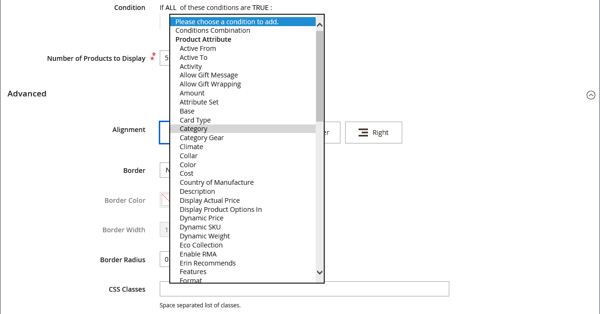

# [!DNL Page Builder]逐步解說第3部分：目錄內容

此練習示範將產品清單新增至頁面、自訂產品頁面，以及建立將[!DNL Page Builder]工作區新增至產品屬性集的自訂屬性是多麼容易。

{width="600" zoomable="yes"}

本練習假設您已完成[第1部分：簡單頁面](1-simple-page.md)及[第2部分：區塊](2-blocks.md)，包括必要條件和下載的範例檔案。 依序依照本練習的三個部分操作。

## 第1部分：新增產品清單

[!DNL Page Builder]可讓您輕鬆將產品清單新增至階段。 在此範例中，產品清單會直接新增至頁面。

### 步驟1：將產品清單新增至階段

1. 在&#x200B;_管理員_&#x200B;側邊欄上，移至&#x200B;**[!UICONTROL Content]** > _[!UICONTROL Elements]_>**[!UICONTROL Pages]**。

1. 尋找您在第一個練習中建立並在第二個練習中修改的&#x200B;_簡單頁面_，並在&#x200B;_[!UICONTROL Action]_&#x200B;欄中選取&#x200B;**[!UICONTROL Edit]**。

1. 展開 **[!UICONTROL Content]**&#x200B;區段，然後按一下&#x200B;**[!UICONTROL Edit with Page Builder]**&#x200B;或內容預覽區域內。

1. 在&#x200B;_[!UICONTROL Layout]_&#x200B;下方的[!DNL Page Builder]面板中，將&#x200B;**[!UICONTROL Row]**&#x200B;拖曳到舞台頂端。

1. 在[!DNL Page Builder]面板中，展開&#x200B;**[!UICONTROL Add Content]**&#x200B;並將&#x200B;**[!UICONTROL Products]**&#x200B;預留位置拖曳到新列。

   {width="600" zoomable="yes"}

### 步驟2：撰寫條件

1. 將滑鼠懸停在空的產品容器上以顯示工具箱，然後選擇&#x200B;_設定_ （ {width="20"} ）圖示。

   {width="600" zoomable="yes"}

1. 針對&#x200B;**[!UICONTROL Select Products By]**，請選擇`Condition`。

1. 新增條件：

   - 按一下&#x200B;_新增_ （）圖示。

   - 在&#x200B;_[!UICONTROL Product Attribute]_&#x200B;底下，選擇&#x200B;**[!UICONTROL Category]**。

     {width="600" zoomable="yes"}

   - 按一下「更多(...)」圖示，然後按一下「_選擇器_」（）圖示，完成條件的&#x200B;_[!UICONTROL Category is]..._&#x200B;部分。

     {width="600" zoomable="yes"}

   - 在類別樹狀結構中，向下展開至&#x200B;**女性> Tops**&#x200B;類別，並選取&#x200B;**Tees**&#x200B;核取方塊。

     {width="600" zoomable="yes"}

   - 按一下核取記號（）圖示。

     對應的類別ID會顯示在欄位中，以完成條件。

### 步驟3：完成設定

1. 輸入&#x200B;**[!UICONTROL Number of Products to Display]**。

   依預設，清單會顯示五個產品。

1. 視需要完成其餘的設定。

   如有需要，請使用[新增內容 — 產品](products.md)頁面結尾的欄位說明作為參考。

1. 完成後，按一下&#x200B;**[!UICONTROL Save]**&#x200B;儲存設定並返回[!DNL Page Builder]工作區。

   {width="600" zoomable="yes"}

1. 在舞台的右上角，按一下&#x200B;_關閉全熒幕_ （ {width="20"} ）圖示。

   按一下此圖示會返回頁面的&#x200B;_[!UICONTROL Content]_&#x200B;區段，並顯示預覽。

1. 在右上角，按一下&#x200B;**[!UICONTROL Save]**&#x200B;箭頭並選擇&#x200B;**[!UICONTROL Save & Close]**。

## 第2部分：自訂產品頁面

>[!NOTE]
>
>管理員使用者必須擁有其[角色範圍](../systems/permissions-user-roles.md)的[!UICONTROL Content]許可權，才能看到[!UICONTROL Edit with Page Builder]按鈕並能夠使用頁面產生器。

在本練習的這一部分，您將瞭解將影片放在產品頁面的一組索引標籤下方，以自訂產品頁面是多麼容易。 更新[類別頁面](../catalog/categories-content-settings.md)內容的程式基本相同。

1. 在&#x200B;_管理員_&#x200B;側邊欄上，移至&#x200B;**[!UICONTROL Catalog]** > **[!UICONTROL Products]**。

1. 尋找可用於此範例的簡單產品，並在編輯模式下開啟它。

1. 向下捲動並展開 **[!UICONTROL Content]**&#x200B;區段。

1. 在&#x200B;_[!UICONTROL Description]_&#x200B;旁邊，按一下&#x200B;**[!UICONTROL Edit with Page Builder]**。

   {width="600" zoomable="yes"}

   如果之前輸入的產品說明沒有[!DNL Page Builder]，則目前的說明會顯示為[HTML代碼](html-code.md)容器中的HTML。 使用Luma佈景主題時，產品說明會出現在「詳細資訊」標籤上。

1. 在&#x200B;_[!UICONTROL Layout]_&#x200B;下方的[!DNL Page Builder]面板中，將&#x200B;**[!UICONTROL Row]**&#x200B;拖曳到舞台上，放置在HTML程式碼容器下方。

   當列位於正確位置時，請尋找要顯示的紅色建議。

   {width="600" zoomable="yes"}

1. 在[!DNL Page Builder]面板中，展開&#x200B;**[!UICONTROL Media]**&#x200B;並將&#x200B;**[!UICONTROL Video]**&#x200B;預留位置拖曳到新列。

   {width="600" zoomable="yes"}中的視訊預留位置

1. 將滑鼠懸停在空白的視訊容器上以顯示工具箱，然後選擇&#x200B;_設定_ （ {width="20"} ）圖示。

   {width="500" zoomable="yes"}

1. 輸入&#x200B;**[!UICONTROL Video URL]**。

   視訊可以託管於[YouTube][1]或[Vimeo][2]。 此範例中的影片可從YouTube的以下URL找到：

   `https://www.youtube.com/watch?v=ZpFrNyD4100`

   {width="500" zoomable="yes"}

1. 輸入視訊顯示的&#x200B;**[!UICONTROL Maximum Width]**&#x200B;畫素。

   如果將此選項保留為空白，視訊會填滿可用空間。

1. 按一下&#x200B;**[!UICONTROL Save]**&#x200B;儲存設定並返回[!DNL Page Builder]工作區。

   {width="600" zoomable="yes"}

1. 在舞台的右上角，按一下&#x200B;_關閉全熒幕_ （ {width="20"} ）圖示。

   按一下此圖示會返回頁面的&#x200B;_[!UICONTROL Content]_&#x200B;區段，並顯示預覽。

1. 在右上角，按一下&#x200B;**[!UICONTROL Save]**&#x200B;箭頭並選擇&#x200B;**[!UICONTROL Save & Close]**。

在店面中，影片會顯示在標籤組的下方。 若要檢視頁面在行動裝置上的外觀，您可以調整視窗大小。

產品頁面上顯示的{width="600" zoomable="yes"}

**恭喜！**&#x200B;您已完成目錄內容教學課程的第二部分。 保留您建立的工作，以便稍後參考。

## 第3部分：新增自訂屬性

使用[!DNL Page Builder]自訂屬性將完整運作的[!DNL Page Builder]工作區新增至產品頁面，您可以使用該工作區建立吸引人的內容。 在這部分練習中，您將瞭解如何使用[!DNL Page Builder]輸入型別建立自訂屬性，並將其套用至目錄中的產品頁面。 如需這些屬性的詳細資訊，請參閱[產品屬性](../catalog/product-attributes.md)。

### 步驟1：建立產品

為避免您的即時商店發生變更，請使用所述的屬性建立產品。

1. 在&#x200B;_管理員_&#x200B;側邊欄上，移至&#x200B;**[!UICONTROL Catalog]** > **[!UICONTROL Products]**。

1. 按一下右上角的&#x200B;**[!UICONTROL Add Product]**。

1. 建立具有以下屬性的產品：

   - &#x200B;

     [!UICONTROL 屬性集]: Default
   - [!UICONTROL Product Name]：我的產品
   - &#x200B;

     [!UICONTROL SKU]: Tutorial
   - &#x200B;

     [!UICONTROL Price]: 75.00
   - &#x200B;

     [!UICONTROL Quantity]: 100
   - [!UICONTROL Stock Status]：有貨
   - &#x200B;

     [!UICONTROL Weight]: 1
   - [!UICONTROL Categories]：女性>上衣>T恤

1. 在右上角，按一下&#x200B;**[!UICONTROL Save]**&#x200B;箭頭並選擇&#x200B;**[!UICONTROL Save & Close]**。

### 步驟2：建立自訂屬性

在此步驟中，您建立兩個新的自訂屬性，以顯示如何使用[!DNL Page Builder]和文字編輯器輸入型別。

1. 在&#x200B;_管理員_&#x200B;側邊欄上，移至&#x200B;**[!UICONTROL Stores]** > _[!UICONTROL Attributes]_>**[!UICONTROL Product]**。

1. 按一下右上角的&#x200B;**[!UICONTROL Add New Attribute]**。

1. 輸入屬性的&#x200B;**[!UICONTROL Default Label]**。

   在此範例中，使用`My Page Builder Attribute`作為標籤。

1. 將&#x200B;**[!UICONTROL Catalog Input Type for Store Owner]**&#x200B;設為`Page Builder`。

   建立自訂屬性時，您可以將最適合應用程式的編輯器指定為`Page Builder`或標準WYSIWYG `Text Editor`。

   ![[!DNL Page Builder]輸入型別](./assets/pb-attribute-page-builder.png){width="600" zoomable="yes"}

1. 展開 **[!UICONTROL Advanced Attribute Properties]**&#x200B;區段，並進行下列設定：

   - [!UICONTROL Attribute Code]：以小寫字元輸入屬性代碼，使用連字型大小而非空格。 在此範例中，使用`my_page_builder_attribute`。
   - [!UICONTROL Scope]：接受預設值`Store View`。
   - [!UICONTROL Default Value]：輸入屬性的預設值。
   - &#x200B;

     [!UICONTROL Unique Value]: `No`
   - &#x200B;

     [!UICONTROL Add to Column Options]: `No`
   - &#x200B;

     [!UICONTROL Use in Filter Options]: `Yes`

1. 在左側的&#x200B;_[!UICONTROL Attribute Information]_&#x200B;面板中，選擇&#x200B;**[!UICONTROL Storefront Properties]**&#x200B;並進行下列設定：

   - &#x200B;

     [!UICONTROL Use for Promo Rule Conditions]: `Yes`
   - &#x200B;

     [!UICONTROL Visible on Catalog Pages on Storefront]: `Yes`
   - &#x200B;

     [!UICONTROL Used in Product Listing]: `Yes`

1. 完成時，按一下&#x200B;**[!UICONTROL Save Attribute]**。

1. 重複上述步驟，以建立具有相同基本屬性，但文字編輯器輸入型別的第二個屬性，如下所示：

   - [!UICONTROL Default Label]：我的文字編輯器屬性
   - [!UICONTROL Catalog Input Type for Store Owner]：文字編輯器
   - &#x200B;

     [!UICONTROL 屬性代碼]: `my_text_editor_attribute`

### 步驟3：更新產品屬性集

1. 在&#x200B;_管理員_&#x200B;側邊欄上，移至&#x200B;**[!UICONTROL Stores]** > _[!UICONTROL Attributes]_>**[!UICONTROL Attribute Set]**。

   在此範例中，您暫時將新屬性新增到`default`屬性集。 在本練習結束時，請從屬性集中移除屬性，以免影響您的目錄。

   >[!NOTE]
   >
   >如果您不想要變更您的即時商店，您可以跟著而不更新屬性集。

1. 在清單中尋找&#x200B;_[!UICONTROL Default]_&#x200B;屬性集，然後按兩下以編輯模式開啟它。

1. 在&#x200B;_未指派的屬性_&#x200B;清單中，尋找您建立的新屬性，並將每個屬性拖曳至&#x200B;**[!UICONTROL Content]**&#x200B;下的&#x200B;_[!UICONTROL Groups]_&#x200B;欄。

   屬性在[!UICONTROL Groups]欄中的位置決定了它出現在頁面上的位置。

   {width="600" zoomable="yes"}

1. 按一下&#x200B;**[!UICONTROL Save]**&#x200B;以返回「屬性集」清單。

1. 出現提示時，請按一下頁面頂端的&#x200B;**[!UICONTROL Cache Management]**&#x200B;連結，然後重新整理任何無效的快取。

### 步驟4：更新產品

1. 在&#x200B;_管理員_&#x200B;側邊欄上，移至&#x200B;**[!UICONTROL Catalog]** > **[!UICONTROL Products]**。

1. 在「產品」格線中，尋找&#x200B;_我的產品_，並以編輯模式開啟。

1. 向下捲動並展開 **[!UICONTROL Content]**&#x200B;區段。

   在區段頂端，有兩個產品內容的標準屬性：

   - _簡短描述_，使用標準WYSIWYG [編輯器](../content-design/editor.md)。
   - 顯示[!DNL Page Builder]預覽的&#x200B;_描述_。

   {width="600" zoomable="yes"}

   當您捲動到區段的下半部時，您會建立並指派兩個屬性：

   - 顯示[!DNL Page Builder]預覽的&#x200B;_我的[!DNL Page Builder]屬性_。
   - _我的文字編輯器屬性_，使用標準的WYSIWYG編輯器。

   {width="600" zoomable="yes"}

1. 在&#x200B;**我的文字編輯器屬性**&#x200B;編輯器中，輸入`Text Editor Attribute placeholder text`。

   - 在右上角，按一下&#x200B;**[!UICONTROL Save]**&#x200B;箭頭並選擇&#x200B;**[!UICONTROL Save & Close]**。

1. 針對&#x200B;**我的頁面產生器屬性**，按一下&#x200B;**[!UICONTROL Edit with Page Builder]**&#x200B;並新增說明文字：

   - 在[!DNL Page Builder]面板中，展開&#x200B;**[!UICONTROL Elements]**&#x200B;並將&#x200B;**[!UICONTROL Text object]**&#x200B;拖曳到舞台。

   - 輸入`Page Builder attribute placeholder text`。

   - 在舞台的右上角，按一下&#x200B;_關閉全熒幕_ （ {width="20"} ）圖示。

     {width="600" zoomable="yes"}

1. 向上捲動到&#x200B;**[!UICONTROL Description]**，按一下&#x200B;**[!UICONTROL Edit with Page Builder]**，然後使用與上一個步驟相同的方法新增您喜歡的任何文字。

1. 在產品頁面的右上角，按一下&#x200B;**[!UICONTROL Save]**&#x200B;箭頭，然後選擇&#x200B;**[!UICONTROL Save & Close]**。

1. 如果出現提示，請按一下頁面頂端訊息中的&#x200B;**[!UICONTROL Cache Management]**&#x200B;連結，並重新整理任何無效的快取。

### 步驟5：檢視結果

1. 導覽至店面的範例產品頁面。

   在此範例中，產品位於頂端導覽列中的「女性>頂端>T恤」下。

1. 向下捲動至&#x200B;_我的頁面產生器屬性_&#x200B;資訊。

   屬性在產品頁面上的位置由主題決定。 在Luma主題中，新屬性位於產品說明後面。

   店面中的![[!DNL Page Builder]和文字編輯器屬性](./assets/pb-storefront-product-attribute.png){width="600" zoomable="yes"}

您已完成[!DNL Page Builder]目錄內容練習。 保留您建立的工作，以便稍後參考。

[1]: https://www.youtube.com/
[2]: https://vimeo.com/
