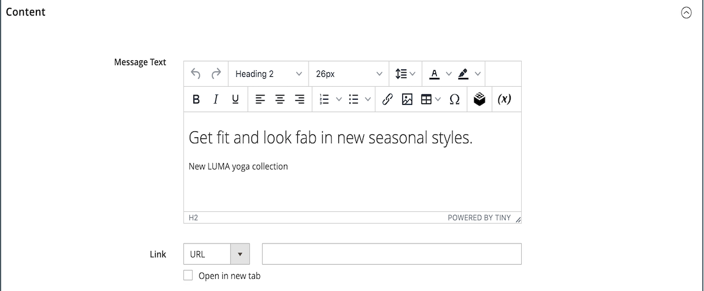
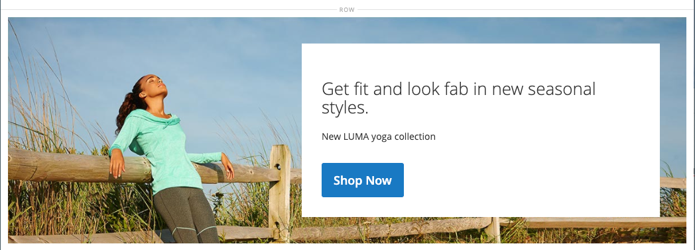

# 媒體 — 橫幅

使用 _橫幅_ 內容型別，以新增圖解式的互動式元件，讓使用者參與 [[!DNL Page Builder] 階段](workspace.md#stage).

>[!NOTE]
>
>先前的 _橫幅_ 「內容」功能表中的選項現在為 [動態區塊](../content-design/dynamic-blocks.md).

{width="700" zoomable="yes"}

{{$include /help/_includes/page-builder-save-timeout.md}}

## 橫幅工具箱

當您將滑鼠停留在橫幅容器上時，橫幅工具箱就會出現。

{width="600" zoomable="yes"}

| 工具 | 圖示 | 說明 |
|--- |--- |--- |
| 移動 | {width="25"} | 將橫幅移至舞台上的另一個位置。 |
| （標籤） | 橫幅 | 將目前的內容容器識別為橫幅。 將滑鼠停留在容器上可檢視工具箱。 |
| 設定 | {width="25"} | 開啟「編輯橫幅」頁面，您可在此變更橫幅和容器的屬性。 |
| 隱藏 | {width="25"} | 隱藏目前的橫幅。 |
| 顯示 | {width="25"} | 顯示隱藏的橫幅。 |
| 複製 | {width="25"} | 製作橫幅的副本。 |
| 移除 | {width="25"} | 從舞台刪除橫幅。 |
| [!UICONTROL Upload New Image] |  | 將影像從您的本機檔案系統上傳至橫幅背景的收藏館。 |
| [!UICONTROL Select from Gallery] |  | 將圖片庫中的現有影像用於橫幅背景。 |

{style="table-layout:auto"}

{{$include /help/_includes/page-builder-hidden-element-note.md}}

## 新增橫幅

1. 在 [!DNL Page Builder] 面板，展開 **[!UICONTROL Media]** 並拖曳 **[!UICONTROL Banner]** 舞台的預留位置。

   {width="600" zoomable="yes"}

   此 _[!UICONTROL Upload Image]_和_[!UICONTROL Select from Gallery]_ 按鈕已納入，因此您可以直接從「舞台」快速變更橫幅內容。 您也可以變更以下專案上的內容： _[!UICONTROL Edit Banner]_頁面。

1. 按一下橫幅預留位置，以顯示 [文字編輯器](../content-design/editor.md) 並輸入橫幅的內容。

   您也可以使用包含更複雜的橫幅內容 [內容](#content) 設定。

## 變更橫幅設定

1. 將滑鼠懸停在橫幅容器上以顯示工具箱，然後選擇 _設定_ ()圖示。

1. 請於下列章節中取得有關更新可用設定的詳細資訊：

   - [[!UICONTROL Appearance]](#appearance)
   - [[!UICONTROL Content]](#content)
   - [[!UICONTROL Background]](#background)
   - [[!UICONTROL Advanced]](#advanced)

1. 完成後，按一下 **[!UICONTROL Save]** 右上角的「 」以關閉 _[!UICONTROL Edit Banner]_頁面。

1. 在右上角，按一下 **[!UICONTROL Save]** 以套用設定並返回 [!DNL Page Builder] 工作區。

## [!UICONTROL Appearance]

橫幅是以下述四種預先定義的範本之一為基礎，因此可輕鬆設定及維護。

- 選擇下列其中一個橫幅版位型別：

  | 位置 | 說明 |
  | --------- | ----------- |
  | [!UICONTROL Poster] | 將內容與橫幅上的按鈕置中對齊。 覆蓋圖（若已使用）可延伸橫幅的完整寬度。 |
  | [!UICONTROL Collage Left] | 將內容和按鈕放置在橫幅左側的已定義區域中。 覆蓋圖（若使用）只會覆蓋定義的區域。 |
  | [!UICONTROL Collage Center] | 將內容和按鈕放置在橫幅中央的已定義區域中。 覆蓋圖（若使用）只會覆蓋定義的區域。 |
  | [!UICONTROL Collage Right] | 將內容和按鈕放置在橫幅右側的已定義區域中。 覆蓋圖（若使用）只會覆蓋定義的區域。 |

  {style="table-layout:auto"}

  {width="600" zoomable="yes"}

- （選擇性）輸入 **[!UICONTROL Minimum Height]** 用於該列。

  最小高度可以是具有任何有效CSS單位的數字(例如 `100px`， `50%`， `50em`， `100vh`)或計算式(例如 `100vh - 237px`)。

  例如，您可以將橫幅的最低高度設定為延伸頁面的完整高度，讓全頁背景影像和視訊的選項引人注目。

## [!UICONTROL Background]

定義橫幅的背景顯示時，有許多選項可供選擇。 您可以套用簡單的顏色或背景影像，並管理更複雜的效果。

### [!UICONTROL Background Color]

選擇色票、按一下檢色器，或輸入有效的顏色名稱或對應的十六進位值，以指定背景顏色。 此設定決定列的背景顏色。 您也可以調整顏色的不透明度。

{width="200"}

您可以透過下列三種方式之一設定值：

- 預先定義的顏色名稱，例如 `White`
- 顏色的十六進位顏色值，例如 `#ffffff`
- 顏色的rgba值（含不透明度百分比），例如 `rgba(255, 255, 255, 0.75)`

如果要選擇顏色，請按一下 _無色彩_ 方塊。

{width="600" zoomable="yes"}

如果您按一下顏色方塊來再次開啟檢色器，滑桿下方的方塊會顯示目前的紅色、綠色、藍色和Alpha值(rgba)。 最後一個數字以小數表示目前的不透明度百分比。 您可以使用滑桿來調整不透明度，或輸入所需的十進位值。

{width="600" zoomable="yes"}

>[!NOTE]
>
>[!DNL Page Builder] 也支援透明圖層，或 _Alpha色版_，在背景影像中，這些影像可用來建立具有不同不透明度的背景。

### [!UICONTROL Background Type]

背景型別可以是影像或視訊。 [!DNL Page Builder] 預設為 `Image` 和會顯示各種影像設定。 如果您選取 `Video`， [!DNL Page Builder] 將影像設定與視訊設定交換。 以下各節將說明兩種背景型別設定。

{width="200"}

### 影像型別設定

如果您設定 _背景型別_ 至 `Image`，使用下列設定來定義背景影像顯示。

{width="600" zoomable="yes"}

- **[!UICONTROL Background Image]**  — 如有需要，請使用提供的工具選擇要套用至橫幅的背景影像：

  | 工具 | 說明 |
  | ---- | ----------- |
  | [!UICONTROL Upload] | 將影像檔案從本機電腦上傳到相簿，然後將其套用為橫幅的背景影像。 |
  | [!UICONTROL Select from Gallery] | 提示您從相簿中選擇現有影像作為橫幅的背景影像。 |
  | {width="25"} | 可讓您將影像拖曳至相機圖磚，或瀏覽至本機檔案系統中的影像。 |

  {style="table-layout:auto"}

- **[!UICONTROL Background Mobile Image]**  — 如有需要，請使用相同的工具，選擇不同的背景影像以便在行動裝置上顯示。

- **[!UICONTROL Background Size]**  — 設定此選項以決定背景影像相對於橫幅寬度的縮放方式：

  | 選項 | 說明 |
  | ------ | ----------- |
  | `Cover` | 背景影像涵蓋橫幅的整個寬度。 |
  | `Contain` | 背景影像僅限於內容區域的寬度。 |
  | `Auto` | 套用目前樣式表的大小。 |

  {style="table-layout:auto"}

  {width="200"}

- **[!UICONTROL Background Position]**  — 設定此選項以判斷背景影像相對於橫幅錨定的方式：

  | 錨點 | 位置 |
  | ------ | ----------- |
  | `Top` | 左/中/右 |
  | `Center` | 左/中/右 |
  | `Bottom` | 左/中/右 |

  {style="table-layout:auto"}

  錨點就像推送圖釘，會將影像附加至指定背景位置的橫幅上。

- **[!UICONTROL Background Attachment]**  — 設定附件型別，以決定背景影像相對於捲動頁面的移動方式：

  | 選項 | 說明 |
  | ------ | ----------- |
  | `Scroll` | 當頁面捲動時，附加的背景影像會同步處理為向下移動。 |
  | `Fixed` | （不適用於行動裝置）當容器捲動影像時，背景影像不會移動，且會固定在指定的背景位置。 |

  {style="table-layout:auto"}

- **[!UICONTROL Background Repeat]**  — 如果要重複背景影像以填滿空間，請變更此設定 `Yes`.

### 視訊型別設定

如果您設定 _[!UICONTROL Background Type]_至 `Video`，使用下列設定來定義背景影像顯示。

- **[!UICONTROL Video URL]**  — 輸入有效的視訊URL。 有效的視訊URL可以連結至：

   - YouTube影片： `https://youtu.be/CoDhMRUUjeI`
   - Vimeo影片： `https://vimeo.com/190156113`
   - 有效的視訊檔案(`.mp4` 建議使用)： `https://myvideos.com/spiral.mp4`

  {width="200"}

- **[!UICONTROL Overlay Color]**  — 選取色彩以套用透明色調至視訊。

- **[!UICONTROL Infinite Loop]**  — 設為 `No` 讓視訊播放一次並停止。 當它設定為 `Yes` （預設），視訊會在無限回圈中重複。

- **[!UICONTROL Lazy Load]**  — 設為 `No` 以使用頁面載入視訊，即使視訊不可見亦然。 當它設定為 `Yes` （預設），視訊只有在熒幕上顯示時，才會從來源載入。

- **[!UICONTROL Play Only When Visible]**  — 設為 `No` 讓影片在載入後立即開始播放，無論影片是否可見。 當它設定為 `Yes` （預設），視訊只有在可見時才會開始播放。

- **[!UICONTROL Fallback Image]**  — 如有需要，在視訊載入前，如果視訊因某項原因未載入，請指定要在畫面上顯示的影像。

## [!UICONTROL Content]

您可以直接在舞台上修改橫幅內容，或在變更設定時修改橫幅內容。 這些設定提供更複雜的內容功能，例如橫幅連結和按鈕以及覆蓋。 內容的位置會反映 [外觀](#appearance) 位置設定。

### 舞台上的簡單內容

1. 按一下預留位置文字，然後輸入要出現在橫幅上的文字。

   編輯器工具列會顯示在文字方塊上方。

   {width="600" zoomable="yes"}

1. 使用編輯器工具列來輸入和格式化文字，以及插入元素，例如連結、影像和Widget。

   {width="600" zoomable="yes"}

### 設定中的複雜內容

1. 將滑鼠懸停在橫幅容器上以顯示工具箱，然後選擇 _設定_ ( {width="25"} )圖示。

1. 向下捲動至 _[!UICONTROL Content]_區段並使用&#x200B;**[!UICONTROL Message Text]**編輯器以輸入橫幅文字並設定其格式。

   您也可以插入元素，例如文字連結、影像和Widget。

   {width="600" zoomable="yes"}

1. 如有需要，請指定 **[!UICONTROL Link]** 以取得橫幅。

   連結是客戶按一下橫幅按鈕或區域時顯示的目的地頁面。 您可以使用下列三種連結型別之一：

   - **[!UICONTROL URL]**  — 相對或完整URL的連結。
   - **[!UICONTROL Product]**  — 根據產品名稱或SKU識別目的地頁面。 根據部分或完整名稱依名稱搜尋產品。 從搜尋結果清單中選擇產品。
   - **[!UICONTROL Category]**  — 將目的地頁面識別為類別樹狀結構中的特定類別或子類別。 根據部分或完整名稱搜尋類別。 從所顯示樹狀結構的展開區段中選擇類別。
   - **[!UICONTROL Page]**  — 將目的地頁面識別為特定內容頁面。 根據部分或完整名稱來搜尋頁面。 從搜尋結果清單中選擇頁面。

   >[!NOTE]
   >
   >從2.4.1版開始， [!DNL Page Builder] 由於店面顯示的問題，不再支援連結橫幅和巢狀文字內的連結。 如果您使用「 」中的 _[!UICONTROL Message Text]_，您無法設定_[!UICONTROL Link]_ 選項。 如果您偏好將單一連結用於整個橫幅，您可以從文字中移除所有連結。 
   >
   >{width="200"}

1. 如有需要，可新增按鈕以提示客戶追隨連結。

   橫幅「外觀」設定會在文字下方放置單一連結或按鈕。 完成您要新增之連結或按鈕的屬性。

   {width="600" zoomable="yes"}

   >[!NOTE]
   >
   >您也可以透過新增 [區塊](block.md) 至橫幅。 為避免衝突，請將所有連結或按鈕保留在單獨的區塊中，並且不要將連結或按鈕直接新增到橫幅中。

   - 設定 **[!UICONTROL Show Button]** 變更為下列其中一項：

     | 選項 | 說明 |
     | ------ | ----------- |
     | `Always` | 橫幅上永遠都會顯示按鈕。 |
     | `On Hover` | 只有在暫留時，橫幅上才會顯示按鈕。 |
     | `Never Show` | 橫幅上絕不會出現按鈕。 |

     {style="table-layout:auto"}

   - 輸入 **[!UICONTROL Button Text]** 以顯示在按鈕上。

   - 設定 **[!UICONTROL Button Type]** 變更為下列其中一項：

     | 選項 | 說明 |
     | ------ | ----------- |
     | `Primary` | 從目前的樣式表套用主要按鈕樣式。 |
     | `Secondary` | 套用目前樣式表中的次要按鈕樣式（如果適用）。 |
     | `Link` | 建立超連結而非按鈕。 |

     {style="table-layout:auto"}

     目前主題的按鈕樣式決定按鈕格式。 通常，主要按鈕的背景顏色會比次要按鈕更突出。

1. 設定 **[!UICONTROL Show Overlay]** 變更為下列其中一項：

   | 選項 | 說明 |
   | ------ | ----------- |
   | `Always` | 覆蓋圖一律可見。 |
   | `On Hover` | 覆蓋圖只會出現在游標暫留上。 |
   | `Never Show` | 覆蓋圖不可見。 |

   {style="table-layout:auto"}

   您可以使用覆蓋將背景顏色套用至由定義的作用中內容區域。 [!UICONTROL Appearance] 設定。 橫幅背景影像在橫幅的整個寬度內仍可見。

   如果您選擇顯示覆蓋，請設定 **[!UICONTROL Overlay Color]**：

   - 按一下 **無色彩** 色票，然後選擇色票。
   - 在 **無色彩** 欄位，輸入有效的顏色名稱或十六進位值。

   {width="600" zoomable="yes"}

1. 在右上角，按一下 **[!UICONTROL Save]** 以套用設定並返回 [!DNL Page Builder] 工作區。

   {width="600" zoomable="yes"}

## [!UICONTROL Search Engine Optimization] {#seo}

搜尋引擎可以看到這些設定的文字，並改善頁面編制索引的方式。

- 的 **[!UICONTROL Alternative Text]**，輸入 _alt_ 要顯示之數位協助工具的文字說明。

  替代文字的使用是協助工具的最佳實務，在某些地區是法律所要求。 在HTML中， `alt` 屬性是 `image` 標籤： `<image title="tooltip" alt="description" src="image.jpg">`.

- 的 **[!UICONTROL Title Attribute]**，輸入要在滑鼠懸停時作為工具提示顯示的文字。

  最佳實務是選擇描述性、關鍵字豐富的標題，以改進搜尋引擎為影像編制索引的方式。 在HTML中， `title` 屬性是 `image` 標籤： `<image title="tooltip" alt="description" src="image.jpg">`.

## [!UICONTROL Advanced]

1. 若要控制新增至橫幅的內容容器的水平位置，請選擇 **[!UICONTROL Alignment]**：

   | 選項 | 說明 |
   | ------ | ----------- |
   | `Default` | 套用目前佈景主題樣式表中指定的對齊預設設定。 |
   | `Left` | 將內容容器沿橫幅容器的左邊框對齊，並允許指定的任何邊框間距。 |
   | `Center` | 將內容容器對齊橫幅容器的中央，並允許指定的任何邊框間距。 |
   | `Right` | 沿著橫幅容器的右邊框對齊內容容器，並允許指定的任何邊框間距。 |

   {style="table-layout:auto"}

1. 設定 **[!UICONTROL Border]** 套用至橫幅容器所有四個邊的樣式：

   | 選項 | 說明 |
   | ------ | ----------- |
   | `Default` | 套用關聯樣式表所指定的預設邊框樣式。 |
   | `None` | 未提供任何容器框線的可見指示。 |
   | `Dotted` | 容器邊框會以虛線顯示。 |
   | `Dashed` | 容器邊框會以虛線顯示。 |
   | `Solid` | 容器邊框會以實線顯示。 |
   | `Double` | 容器邊框會以雙線顯示。 |
   | `Groove` | 容器框線會顯示為槽線。 |
   | `Ridge` | 容器框線會顯示為脊線。 |
   | `Inset` | 容器框線會顯示為內嵌線。 |
   | `Outset` | 容器邊框會顯示為外線。 |

   {style="table-layout:auto"}

1. 如果您設定的邊框樣式不是 `None`，完成邊框顯示選項：

   - **[!UICONTROL Border Color]**  — 選擇色票、按一下檢色器，或輸入有效的顏色名稱或相等的十六進位值，以指定顏色。

     {width="600" zoomable="yes"}

   - **[!UICONTROL Border Width]**  — 輸入框線寬度的畫素數。

   - **[!UICONTROL Border Radius]**  — 輸入畫素數目，以定義用來將邊框每個角落倒圓角的半徑大小。

1. （選擇性）指定下列專案的名稱： **[!UICONTROL CSS classes]** 從目前的樣式表套用至橫幅容器。

   以空格分隔多個類別名稱。

1. 以畫素為單位，輸入 **[!UICONTROL Margins and Padding]** 指定橫幅的外邊界和內邊距。

   在橫幅容器圖表中輸入每個對應的值。

   | 選項 | 說明 |
   | ------ | ----------- |
   | [!UICONTROL Margins] | 套用至容器所有側邊外部邊緣的空白空間量。 |
   | [!UICONTROL Padding] | 套用至容器所有邊內側邊緣的空白空間量。 |

   {style="table-layout:auto"}
